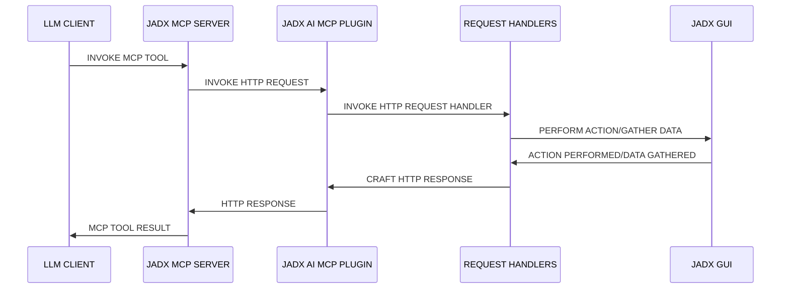

<div align="center">

# JADX-AI-MCP (Part of Zin MCP Suite)

> 🔱 **This is a fork of [zinja-coder/jadx-ai-mcp](https://github.com/zinja-coder/jadx-ai-mcp)**  
> Original project created by [@zinja-coder](https://github.com/zinja-coder). This fork adds multi-instance support and other enhancements.

⚡ Fully automated MCP server + JADX plugin built to communicate with LLM through MCP to analyze Android APKs using LLMs like Claude — uncover vulnerabilities, analyze APK, and reverse engineer effortlessly.

**👉 Original Project**: [github.com/zinja-coder/jadx-ai-mcp](https://github.com/zinja-coder/jadx-ai-mcp)

English | [简体中文](README_ZH.md)


[](http://www.apache.org/licenses/LICENSE-2.0.html)

#### ⭐ Contributors

Thanks to these wonderful people for their contributions ⭐
<table>
  <tr align="center">
    <td>
      <a href="https://github.com/badmonkey7">
        
        <br /><sub><b>badmonkey7</b></sub>
      </a>
    </td>
       <td>
      <a href="https://github.com/tiann">
        
        <br /><sub><b>tiann</b></sub>
      </a>
    </td>
    <td>
      <a href="https://github.com/ljt270864457">
        
        <br /><sub><b>ljt270864457</b></sub>
      </a>
    </td>
    <td>
      <a href="https://github.com/ZERO-A-ONE">
        
        <br /><sub><b>ZERO-A-ONE</b></sub>
      </a>
    </td>
    <td>
      <a href="https://github.com/neoz">
        
        <br /><sub><b>neoz</b></sub>
      </a>
    </td>
    <td>
      <a href="https://github.com/SamadiPour">
        
        <br /><sub><b>SamadiPour</b></sub>
      </a>
    </td>
    <td>
      <a href="https://github.com/wuseluosi">
        
        <br /><sub><b>wuseluosi</b></sub>
      </a>
    </td>
    <td>
      <a href="https://github.com/CainYzb">
        
        <br /><sub><b>CainYzb</b></sub>
      </a>
    </td>
    <td>
      <a href="https://github.com/tbodt">
        
        <br /><sub><b>tbodt</b></sub>
      </a>
    </td>
    <td>
      <a href="https://github.com/LilNick0101">
        
        <br /><sub><b>LilNick0101</b></sub>
      </a>
    </td>
    <td>
      <a href="https://github.com/lwsinclair">
        
        <br /><sub><b>lwsinclair</b></sub>
      </a>
    </td>
  </tr>
</table>


</div>

<!-- It is a still in early stage of development, so expects bugs, crashes and logical erros.-->

<!-- Standalone Plugin for [JADX](https://github.com/skylot/jadx) (Started as Fork) with Model Context Protocol (MCP) integration for AI-powered static code analysis and real-time code review and reverse engineering tasks using Claude.-->

---

## 🤖 What is JADX-AI-MCP?

**JADX-AI-MCP** is a plugin for the [JADX decompiler](https://github.com/skylot/jadx) that integrates directly with [Model Context Protocol (MCP)](https://github.com/anthropic/mcp) to provide **live reverse engineering support with LLMs like Claude**.

> 💡 This project was originally created by [@zinja-coder](https://github.com/zinja-coder). See the [original repository](https://github.com/zinja-coder/jadx-ai-mcp) for the upstream project.

Think: "Decompile → Context-Aware Code Review → AI Recommendations" — all in real time.

#### High Level Sequence Diagram



### Watch the demos!

- **Perform quick analysis**
  
https://github.com/user-attachments/assets/b65c3041-fde3-4803-8d99-45ca77dbe30a

- **Quickly find vulnerabilities**

https://github.com/user-attachments/assets/c184afae-3713-4bc0-a1d0-546c1f4eb57f

- **Multiple AI Agents Support**

https://github.com/user-attachments/assets/6342ea0f-fa8f-44e6-9b3a-4ceb8919a5b0

- **Run with your favorite LLM Client**

https://github.com/user-attachments/assets/b4a6b280-5aa9-4e76-ac72-a0abec73b809

- **Analyze The APK Resources**

https://github.com/user-attachments/assets/f42d8072-0e3e-4f03-93ea-121af4e66eb1

- **Your AI Assistant during debugging of APK using JADX**

https://github.com/user-attachments/assets/2b0bd9b1-95c1-4f32-9b0c-38b864dd6aec

It is combination of two tools:
1. JADX-AI-MCP
2. [JADX MCP SERVER](https://github.com/zinja-coder/jadx-mcp-server)

## 🤖 What is JADX-MCP-SERVER?

**JADX MCP Server** is a standalone Python server that interacts with a `JADX-AI-MCP` plugin (see: [jadx-ai-mcp](https://github.com/zinja-coder/jadx-ai-mcp)) via MCP (Model Context Protocol). It lets LLMs communicate with the decompiled Android app context live.

---

## Other projects in Zin MCP Suite
 - **[APKTool-MCP-Server](https://github.com/zinja-coder/apktool-mcp-server)**
 - **[JADX-MCP-Server](https://github.com/zinja-coder/jadx-mcp-server)**
 - **[ZIN-MCP-Client](https://github.com/zinja-coder/zin-mcp-client)**

## Current MCP Tools

The following MCP tools are available. **All tools support an optional `instance_id` parameter for multi-instance targeting.**

### Code Analysis Tools
- `fetch_current_class(instance_id?)` — Get the class name and full source of selected class
- `get_selected_text(instance_id?)` — Get currently selected text
- `get_all_classes(offset, count, instance_id?)` — List all classes in the project
- `get_class_source(class_name, instance_id?)` — Get full source of a given class
- `get_method_by_name(class_name, method_name, instance_id?)` — Fetch a method's source
- `search_method_by_name(method_name, instance_id?)` — Search method across classes
- `search_classes_by_keyword(search_term, package?, search_in?, offset?, count?, instance_id?)` — Search for classes by keyword
- `get_methods_of_class(class_name, instance_id?)` — List methods in a class
- `get_fields_of_class(class_name, instance_id?)` — List fields in a class
- `get_smali_of_class(class_name, instance_id?)` — Fetch smali of class
- `get_main_activity_class(instance_id?)` — Fetch main activity from AndroidManifest.xml
- `get_main_application_classes_code(offset?, count?, instance_id?)` — Fetch main application classes' code
- `get_main_application_classes_names(instance_id?)` — Fetch main application classes' names

### Resource Tools
- `get_android_manifest(instance_id?)` — Retrieve AndroidManifest.xml content
- `get_strings(offset?, count?, instance_id?)` — Fetch strings.xml files
- `get_all_resource_file_names(offset?, count?, instance_id?)` — List all resource file names
- `get_resource_file(resource_name, instance_id?)` — Retrieve resource file content

### Refactoring Tools
- `rename_class(class_name, new_name, instance_id?)` — Rename a class
- `rename_method(method_name, new_name, instance_id?)` — Rename a method
- `rename_field(class_name, field_name, new_name, instance_id?)` — Rename a field
- `rename_package(old_name, new_name, instance_id?)` — Rename a package

### Debug Tools
- `debug_get_stack_frames(instance_id?)` — Get stack frames from debugger
- `debug_get_threads(instance_id?)` — Get thread information from debugger
- `debug_get_variables(instance_id?)` — Get variables from debugger

### Cross-Reference Tools
- `get_xrefs_to_class(class_name, offset?, count?, instance_id?)` — Find all references to a class
- `get_xrefs_to_method(class_name, method_name, offset?, count?, instance_id?)` — Find all references to a method
- `get_xrefs_to_field(class_name, field_name, offset?, count?, instance_id?)` — Find all references to a field

### Multi-Instance Management Tools
- `list_jadx_instances()` — List all connected JADX instances
- `add_jadx_instance(host, port, name?)` — Add a new JADX instance dynamically
- `remove_jadx_instance(name)` — Remove a JADX instance
- `set_default_jadx_instance(name)` — Set the default instance for tool calls
- `get_jadx_instance_info(name)` — Get detailed info about an instance
- `health_check_jadx_instances()` — Check health of all instances

---

## 🗒️ Sample Prompts

🔍 Basic Code Understanding

    "Explain what this class does in one paragraph."

    "Summarize the responsibilities of this method."

    "Is there any obfuscation in this class?"

    "List all Android permissions this class might require."

🛡️ Vulnerability Detection

    "Are there any insecure API usages in this method?"

    "Check this class for hardcoded secrets or credentials."

    "Does this method sanitize user input before using it?"

    "What security vulnerabilities might be introduced by this code?"

🛠️ Reverse Engineering Helpers

    "Deobfuscate and rename the classes and methods to something readable."

    "Can you infer the original purpose of this smali method?"

    "What libraries or SDKs does this class appear to be part of?"

    "Tell me which classes contains code related to 'encryption'?"

📦 Static Analysis

    "List all network-related API calls in this class."

    "Identify file I/O operations and their potential risks."

    "Does this method leak device info or PII?"

🤖 AI Code Modification

    "Refactor this method to improve readability."

    "Add comments to this code explaining each step."

    "Rewrite this Java method in Python for analysis."

📄 Documentation & Metadata

    "Generate Javadoc-style comments for all methods."

    "What package or app component does this class likely belong to?"

    "Can you identify the Android component type (Activity, Service, etc.)?"

🐞 Debugger Assistant
```
   "Fetch stack frames, varirables and threads from debugger and provide summary"

   "Based the stack frames from debugger, explain the execution flow of the application"

   "Based on the state of variables, is there security threat?"
```

---

## 2. Manual Installation

```bash
# Download both files from releases
https://github.com/xjoker/jadx-ai-mcp/releases

# Install plugin via command line
jadx plugins --install "github:xjoker:jadx-ai-mcp"

# Or install via JADX GUI:
# Plugins → Install Plugin → Select the downloaded JAR file

# Navigate to jadx-mcp-server directory
cd jadx-mcp-server

# Install uv (if not installed)
curl -LsSf https://astral.sh/uv/install.sh | sh

# Run the MCP server
uv run jadx_mcp_server.py
```


## 🤖 2. Use Claude Desktop

Make sure Claude Desktop is running with MCP enabled.

For instance, I have used following for Kali Linux: https://github.com/aaddrick/claude-desktop-debian

Configure and add MCP server to LLM file:
```bash
nano ~/.config/Claude/claude_desktop_config.json
```

For:
   - Windows: `%APPDATA%\Claude\claude_desktop_config.json`
   - macOS: `~/Library/Application Support/Claude/claude_desktop_config.json`
   
And following content in it:
```json
{
    "mcpServers": {
        "jadx-mcp-server": {
            "command": "/<path>/<to>/uv", 
            "args": [
                "--directory",
                "</PATH/TO/>jadx-mcp-server/",
                "run",
                "jadx_mcp_server.py"
            ]
        }
    }
}
```

Replace:

- `path/to/uv` with the actual path to your `uv` executable
- `path/to/jadx-mcp-server` with the absolute path to where you cloned this
repository

Then, navigate code and interact via real-time code review prompts using the built-in integration.

**OR**

or you can install the jadx_mcp_server directly as executable directly using below command:

```
uv tool install "git+https://github.com/xjoker/jadx-ai-mcp.git#subdirectory=jadx-mcp-server"
```

and then you can just provide `jadx_mcp_server` in `command` section of mcp configuration.

## 3. Use Cherry Studio

If you want to configure the MCP tool in Cherry Studio, you can refer to the following configuration.
- Type: stdio
- command: uv
- argument:
```bash
--directory
path/to/jadx-mcp-server
run
jadx_mcp_server.py
```
- `path/to/jadx-mcp-server` with the absolute path to where you cloned this
repository

## 4. Using LMStudio

You can also use JADX AI MCP Server with LM Studio by configuring it's mcp.json file. Here's the video guide.

https://github.com/user-attachments/assets/b4a6b280-5aa9-4e76-ac72-a0abec73b809

## 5. Running in HTTP Stream Mode

You can also use Jadx in HTTP Stream Mode using `--http` option with `jadx_mcp_server.py` as shown in following:

```bash
uv run jadx_mcp_server.py --http

OR

uv run jadx_mcp_server.py --http --port 9999
```

## 6. Plugin Configuration (Unified Settings Panel)

All plugin settings are now managed through a **unified Settings dialog**:

**Access**: `Plugins → JADX AI MCP Server → 设置...`

The Settings panel includes:
- **Server Configuration**: Port, bind address, auto-start options
- **Instance Settings**: Custom instance name for multi-instance scenarios
- **Authentication**: Token generation and management
- **Server Controls**: Start, stop, restart, and status check

To connect with JADX AI MCP Plugin running on custom port, the `--jadx-port` option will be used as shown in following:
```
uv run jadx_mcp_server.py --jadx-port 8652
```

The MCP Configuration for above will be as follows for claude:

```
{
  "mcpServers": {
    "jadx-mcp-server": {
      "command": "/path/to/uv",
      "args": [
        "--directory",
        "/path/to/jadx-mcp-server/",
        "run",
        "jadx_mcp_server.py",
        "--jadx-port",
        "8652"
      ]
    }
  }
}
```

## 7. 🔐 Authentication & Security

JADX AI MCP now supports **Token-based authentication** to secure your reverse engineering workflow!

### Why Use Authentication?

- ✅ **Prevent unauthorized access** when exposing plugin on internal networks
- ✅ **Secure remote analysis** scenarios
- ✅ **Enterprise security compliance**
- ✅ **Multiple user environments**

### Quick Setup

1. **Open Settings in JADX GUI**: `Plugins → JADX AI MCP Server → 设置...`
2. **Configure authentication in the "Authentication" tab**
3. **Copy the token**
4. **Add to MCP server**:

```bash
uv run jadx_mcp_server.py --auth-token "YOUR_TOKEN_HERE"
```

### Claude Desktop Configuration with Auth

```json
{
  "mcpServers": {
    "jadx-mcp-server": {
      "command": "/path/to/uv",
      "args": [
        "--directory",
        "/path/to/jadx-ai-mcp/jadx-mcp-server/",
        "run",
        "jadx_mcp_server.py",
        "--auth-token",
        "YOUR_TOKEN_HERE"
      ]
    }
  }
}
```
```


### Remote Access Configuration

Connect to JADX running on a different machine:

```bash
# MCP server connecting to remote JADX instance
uv run jadx_mcp_server.py \
  --jadx-host 192.168.1.100 \
  --jadx-port 8650 \
  --auth-token "YOUR_TOKEN_HERE"
```

Expose MCP server on network (with authentication):

```bash
# Allow external connections to MCP server
uv run jadx_mcp_server.py \
  --http \
  --host 0.0.0.0 \
  --port 8651 \
  --auth-token "YOUR_TOKEN_HERE"
```

### Command Line Options

| Option | Default | Description |
|--------|---------|-------------|
| `--jadx-host` | `127.0.0.1` | JADX plugin IP address (legacy single instance) |
| `--jadx-port` | `8650` | JADX plugin port (legacy single instance) |
| `--host` | `127.0.0.1` | MCP server bind address |
| `--port` | `8651` | MCP server port (HTTP mode) |
| `--auth-token` | None | Authentication token (shared across all instances) |
| `--http` | False | Enable HTTP stream mode |
| `--jadx-instances` | None | Multiple JADX instances: `host:port[:name],...` |

## 8. 🚀 Multi-Instance Management

JADX AI MCP now supports **connecting to multiple JADX instances simultaneously**! This is perfect for:

- ✅ **Comparing different APK versions** side by side
- ✅ **Analyzing multiple apps** in parallel
- ✅ **Team collaboration** with different analysis targets
- ✅ **A/B security testing** across app versions

### Quick Start - Multiple Instances

```bash
# Connect to multiple JADX instances at startup
uv run jadx_mcp_server.py \
  --auth-token "YOUR_TOKEN" \
  --jadx-instances "192.168.1.10:8650:app-v1,192.168.1.11:8650:app-v2,localhost:8652:dev"
```

### Instance Naming

- **Auto-naming**: If no name is provided, instances are named from APK info (e.g., `myapp-v123`)
- **Custom naming**: Specify names using `host:port:name` format

### Using Instance-Targeted Tools

All MCP tools now support the optional `instance_id` parameter:

```python
# Example: Get class source from a specific instance
get_class_source(class_name="com.example.MainActivity", instance_id="app-v2")

# Example: Compare manifests between versions
manifest_v1 = get_android_manifest(instance_id="app-v1")
manifest_v2 = get_android_manifest(instance_id="app-v2")
```

### Instance Management Tools

```python
# List all connected instances
list_jadx_instances()
# Returns: {"instances": [{"name": "app-v1", "host": "192.168.1.10", "port": 8650, ...}]}

# Add a new instance dynamically
add_jadx_instance(host="192.168.1.20", port=8650, name="app-v3")

# Set default instance (used when instance_id is not specified)
set_default_jadx_instance(name="app-v2")

# Get detailed instance info
get_jadx_instance_info(name="app-v1")
# Returns: {"name": "app-v1", "apk_info": {...}, "status": "online", ...}

# Health check all instances
health_check_jadx_instances()
# Returns: {"total": 3, "online": 2, "offline": 1, "results": [...]}

# Remove an instance
remove_jadx_instance(name="app-v3")
```

### Claude Desktop Configuration for Multi-Instance

```json
{
  "mcpServers": {
    "jadx-mcp-server": {
      "command": "/path/to/uv",
      "args": [
        "--directory",
        "/path/to/jadx-ai-mcp/jadx-mcp-server/",
        "run",
        "jadx_mcp_server.py",
        "--auth-token",
        "YOUR_TOKEN",
        "--jadx-instances",
        "192.168.1.10:8650:xhs-v8,192.168.1.11:8650:xhs-v9"
      ]
    }
  }
}
```

### Sample Multi-Instance Prompts

```
"Compare the MainActivity between xhs-v8 and xhs-v9 instances"

"List all encryption-related classes in both app versions"

"Check if the vulnerability in v8 was fixed in v9"

"Analyze the network API changes between versions"
```

### Connecting to JADX in AI Conversation

If you started the MCP server without `--jadx-instances`, you can tell the AI to connect dynamically:

**Single Instance:**
```
Please connect to JADX server at 192.168.1.100:8650

Or more specifically:
Add JADX instance at host 192.168.1.100, port 8650, name it "my-app"
```

**Multiple Instances:**
```
Please connect to the following JADX instances:
1. 192.168.1.10:8650 - name it "app-v1"
2. 192.168.1.11:8650 - name it "app-v2"
3. localhost:8652 - name it "dev"

Then set "app-v1" as the default instance.
```

**Check Connection Status:**
```
List all connected JADX instances

Check health status of all JADX instances

What APK is loaded in the "app-v1" instance?
```

---

## 9. 🐳 Docker Deployment (Headless Server)

JADX AI MCP now supports **Docker deployment with noVNC** for running on headless servers without a graphical interface!

### Quick Start

```bash
# Build the Docker image
docker build -t jadx-ai-mcp -f docker/Dockerfile .

# Run with default settings
docker run -d --name jadx-ai-mcp -p 6080:6080 -p 8650:8650 -v ./apks:/apks jadx-ai-mcp
```

**Access**:
- **noVNC Web Desktop**: http://localhost:6080/vnc.html
- **Plugin API**: http://localhost:8650

### Environment Variables

| Variable | Default | Description |
|----------|---------|-------------|
| `JADX_MCP_BIND_ADDRESS` | 127.0.0.1 | Server bind address (use `0.0.0.0` for Docker) |
| `JADX_MCP_PORT` | 8650 | Plugin HTTP API port |
| `JADX_MCP_AUTH_TOKEN` | (auto-generated) | Authentication token |
| `JADX_MCP_AUTH_ENABLED` | false | Enable authentication (`true`/`false`) |

### Example with Authentication

```bash
docker run -d --name jadx-ai-mcp \
  -p 6080:6080 -p 8650:8650 \
  -e JADX_MCP_BIND_ADDRESS=0.0.0.0 \
  -e JADX_MCP_AUTH_ENABLED=true \
  -e JADX_MCP_AUTH_TOKEN=your-secret-token-here \
  -v $(pwd)/apks:/apks \
  jadx-ai-mcp
```

### Auto-load APK

Place a file named `target.apk` in your mounted `/apks` directory, and jadx-gui will automatically load it on startup.

### Container Features

- **xterm**: Open a terminal in the desktop for shell access
- **btop**: System monitor for viewing container performance
- **fluxbox**: Lightweight window manager

For detailed Docker documentation, see [docker/README.md](docker/README.md).

---


## Troubleshooting

If you encounter issues:
1. Ensure JADX GUI is running with an APK loaded
2. Verify the plugin is installed and enabled
3. Check that the MCP server is running
4. If using authentication, ensure tokens match
5. For network issues, verify firewall settings


## NOTE For Contributors

 - The files related to JADX-AI-MCP can be found under this repo.

 - The files related to **jadx-mcp-server** can be found [here](https://github.com/xjoker/jadx-ai-mcp/tree/jadx-ai/jadx-mcp-server).

## To report bugs, issues, feature suggestion, Performance issue, general question, Documentation issue.
 - Kindly open an issue with respective template.

 - Tested on Claude Desktop Client, support for other AI will be tested soon!

## 🙏 Credits

This project is a plugin for JADX, an amazing open-source Android decompiler created and maintained by [@skylot](https://github.com/skylot). All core decompilation logic belongs to them. I have only extended it to support my MCP server with AI capabilities.

This project is a fork of [jadx-ai-mcp](https://github.com/zinja-coder/jadx-ai-mcp) created by [zinja-coder](https://github.com/zinja-coder). Huge thanks for their original work!

[📎 Original README (JADX)](https://github.com/skylot/jadx)

The original README.md from jadx is included here in this repository for reference and credit.

This MCP server is made possible by the extensibility of JADX-GUI and the amazing Android reverse engineering community.

Also huge thanks to [@aaddrick](https://github.com/aaddrick) for developing Claude desktop for Debian based linux.

And in last thanks to [@anthropics](https://github.com/anthropics) for developing the Model Context Protocol and [@FastMCP](https://github.com/modelcontextprotocol/python-sdk) team

Apart from this, huge thanks to all open source projects which serve as a dependencies for this project and which made this possible.

### Dependencies

This project uses following awesome libraries.

- Plugin - Java
  - Javalin     - https://javalin.io/ - Apache 2.0 License
  - SLF4J       - https://slf4j.org/  - MIT License
  - org.w3c.dom - https://mvnrepository.com/artifact/org.w3c.dom - W3C Software and Document License

- MCP Server - Python
  - FastMCP - https://github.com/jlowin/fastmcp - Apache 2.0 License
  - httpx   - https://www.python-httpx.org      - BSD-3-Clause (“BSD licensed”) 

## 📄 License

JADX-AI-MCP and all related projects inherits the Apache 2.0 License from the original JADX repository.

## ⚖️ Legal Warning

**Disclaimer**

The tools `jadx-ai-mcp` and `jadx_mcp_server` are intended strictly for educational, research, and ethical security assessment purposes. They are provided "as-is" without any warranties, expressed or implied. Users are solely responsible for ensuring that their use of these tools complies with all applicable laws, regulations, and ethical guidelines.

By using `jadx-ai-mcp` or `jadx_mcp_server`, you agree to use them only in environments you are authorized to test, such as applications you own or have explicit permission to analyze. Any misuse of these tools for unauthorized reverse engineering, infringement of intellectual property rights, or malicious activity is strictly prohibited.

The developers of `jadx-ai-mcp` and `jadx_mcp_server` shall not be held liable for any damage, data loss, legal consequences, or other consequences resulting from the use or misuse of these tools. Users assume full responsibility for their actions and any impact caused by their usage.

Use responsibly. Respect intellectual property. Follow ethical hacking practices.

---

## 🙌 Contribute or Support

- Found it useful? Give it a ⭐️
- Got ideas? Open an [issue](https://github.com/xjoker/jadx-ai-mcp/issues) or submit a PR
- Built something on top? DM me or mention me — I’ll add it to the README!
- Do you like my work and keep it going? Sponsor this project.
  
---

Built with ❤️ for the reverse engineering and AI communities.
