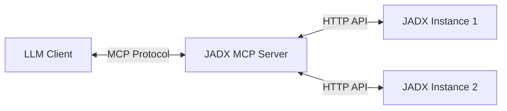

<div align="center">

# JADX-AI-MCP

> 🔱 **This is a fork of [zinja-coder/jadx-ai-mcp](https://github.com/zinja-coder/jadx-ai-mcp)**  
> Original project created by [@zinja-coder](https://github.com/zinja-coder). This fork adds multi-instance support and other enhancements.

**👉 Original Project**: [github.com/zinja-coder/jadx-ai-mcp](https://github.com/zinja-coder/jadx-ai-mcp)

---

> **A powerful JADX plugin and MCP Server for AI-assisted Reverse Engineering**
> 
> Leverages [Model Context Protocol (MCP)](https://github.com/anthropic/mcp) to connect LLMs (like Claude) directly to JADX for real-time, context-aware APK analysis.


[](http://www.apache.org/licenses/LICENSE-2.0.html)

</div>

## 📖 Overview

**JADX-AI-MCP** transforms static analysis into an interactive dialogue. Instead of manually searching and copying code, you can ask your AI assistant to "Analyze the login flow in MainActivity" or "Check for hardcoded secrets in resource strings".

The system consists of two components:
1.  **JADX Plugin**: Embedded Java plugin that exposes JADX's internal state via HTTP.
2.  **MCP Server**: A Python server that acts as a bridge, implementing the MCP protocol to orchestrate one or more JADX instances.

### Key Capabilities

*   **Multi-Instance Management**: Connect to and analyze multiple APKs simultaneously (e.g., compare `v1.0` vs `v2.0`).
*   **Context-Aware Analysis**: Retrieve class code, methods, fields, and cross-references (xrefs) on demand.
*   **Resource Inspection**: Search and read `AndroidManifest.xml`, `strings.xml`, and other resource files.
*   **Safe Execution**: Built-in concurrency controls ensure JADX stability during parallel AI requests.
*   **User Isolation**: Supports multi-user environments where dynamic instances are private to their creator.

---

## 🏗️ Architecture & Design

### Server-Plugin Architecture



This decoupled architecture allows the MCP Server to run independently (e.g., in Docker) while managing connections to multiple JADX GUI instances running on different machines or ports.

### Concurrency Control (Serialized Lock)
JADX's decompilation engine is computationally intensive and not fully thread-safe for all operations. To prevent crashes and data corruption:
*   **InstanceBusyTracker**: The server implements a strict locking mechanism. When an operation (like `search_code`) is running, the instance is marked as `BUSY`.
*   **Fast-Fail**: Concurrent requests to a busy instance receive an immediate structured error (`INSTANCE_BUSY`), allowing the AI client to decide whether to wait or retry.

### User Isolation Model
Designed for shared environments:
*   **Static Instances**: Defined in `config.toml`, visible to all users (Shared).
*   **Dynamic Instances**: Added at runtime via `add_jadx_instance`. Visible **only** to the user who created them (Private by Default).
*   **Admin Access**: Admin users have visibility and control over all instances.

---

## 📚 MCP Tools Reference

All tools support an optional `instance_id` parameter to target a specific JADX instance. If omitted, the default instance is used.

### 1. Class Analysis
| Tool | Description | Key Parameters |
|------|-------------|----------------|
| `fetch_current_class` | Get code of the class currently open in JADX GUI | `instance_id` |
| `get_class_source` | Get full Java source of a class | `class_name` |
| `batch_get_class_source` | **Batch** retrieve sources (max 20) | `class_names` (list) |
| `get_class_info` | Get inheritance, interfaces, and member counts | `class_name` |
| `get_methods_of_class` | List all method signatures in a class | `class_name` |
| `get_fields_of_class` | List all fields in a class | `class_name` |
| `get_smali_of_class` | Get Smali (Dalvik bytecode) representation | `class_name` |

### 2. Code Search (Advanced)
| Tool | Description | Key Parameters |
|------|-------------|----------------|
| `search_classes_by_keyword` | **Recommended**. Powerful filtered search. | `search_term`, `search_in` (code, class, method, field, comment), `exclude` (pkg prefix), `package` |
| `search_method_by_name` | Global method search (resource intensive) | `method_name`, `offset`, `count` |
| `get_method_by_name` | Get source of specific method | `class_name`, `method_name` |
| `batch_get_method_by_name` | **Batch** get methods (max 20) | `methods` (list of "class:method") |
| `get_method_signature` | Get structured parameters/return types | `class_name`, `method_name` |
| `get_method_callees` | Analyze method calls (pattern-based) | `class_name`, `method_name` |

### 3. Resource Analysis
| Tool | Description | Key Parameters |
|------|-------------|----------------|
| `get_strings` | **Powerful** string analysis tool | `mode` ("summary"\|"list"\|"search"\|"get"), `query`, `locale`, `limit` |
| `get_android_manifest` | Read AndroidManifest.xml | `instance_id` |
| `get_resource_file` | Read raw resource content | `resource_name` (e.g., "res/layout/main.xml") |
| `get_all_resource_file_names`| List all files in APK resources | `offset`, `count` |

### 4. Cross-References (XRefs)
| Tool | Description | Key Parameters |
|------|-------------|----------------|
| `get_xrefs_to_class` | Find references to a class | `class_name`, `offset`, `count` |
| `get_xrefs_to_method` | Find callers of a method | `class_name`, `method_name`, `offset`, `count` |
| `get_xrefs_to_field` | Find usages of a field | `class_name`, `field_name`, `offset`, `count` |
| `batch_get_xrefs` | **Batch** xrefs query | `targets` (list of "type:class[:member]") |

### 5. Instance Management
| Tool | Description | Key Parameters |
|------|-------------|----------------|
| `list_jadx_instances` | List available instances | None |
| `add_jadx_instance` | Connect to a new JADX instance | `host`, `port`, `name`, `token` |
| `remove_jadx_instance` | Remove an instance | `name` |
| `set_default_jadx_instance`| Set active instance context | `name` |
| `check_instance_status` | Check if specific instance is busy | `instance_name` |
| `health_check_jadx_instances`| Run health checks on all instances | None |

---

## ⚙️ Configuration

The server is configured via `jadx-config.toml`.

```toml
[server]
host = "0.0.0.0"
port = 8651

[security]
allow_dynamic_instances = true  # Allow AI to add new instances

[[users]]
name = "admin"
token = "secret-admin-token"
is_admin = true

[[jadx_instances]]
name = "static-analysis-v1"
host = "192.168.1.10"
port = 8650
enabled = true
```

### Environment Variables
| Variable | Description | Default |
|----------|-------------|---------|
| `JADX_MCP_AUTH_TOKEN` | Default token for JADX Plugin auth | Empty |
| `JADX_MCP_SERVER_PORT` | Port for MCP Server | 8651 |
| `JADX_HOST` / `JADX_PORT` | Default JADX instance to connect | 127.0.0.1:8650 |

---

## 🚀 Quick Start

### Docker (Recommended)

```bash
# Run MCP Server
docker run -d -p 8651:8651 \
  -v $(pwd)/config:/app/data/config \
  xjoker/jadx-mcp-server:latest
```

### Local Development

```bash
# Install dependencies
uv tool install .

# Run server
jadx_mcp_server --http --config ./data/config/jadx-config.toml
```

---

## 🙌 Credits

This project is built upon the giants of the reverse engineering community:

*   **[JADX](https://github.com/skylot/jadx)**: The core decompiler engine by **@skylot**.
*   **[jadx-ai-mcp](https://github.com/zinja-coder/jadx-ai-mcp)**: The original MCP implementation concept by **@zinja-coder**.

The multi-instance architecture and server refinements in this repository are maintained by **@xjoker** and the community.

## ⚖️ Legal & License

**License**: Apache 2.0  
**Disclaimer**: This tool is for educational and security research purposes only. Use responsibly and legally.
