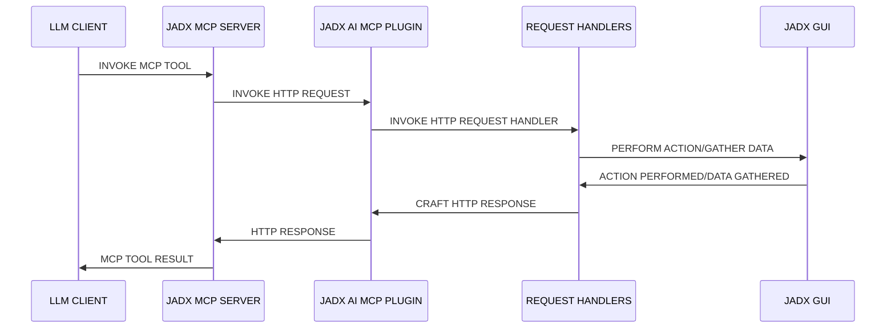
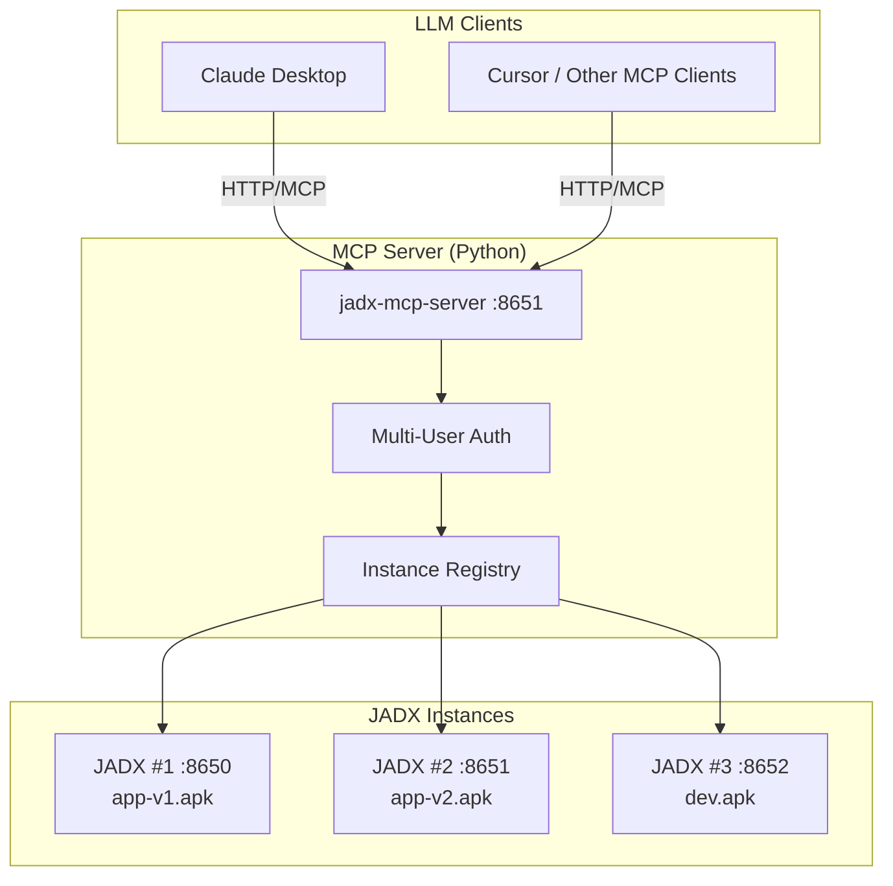
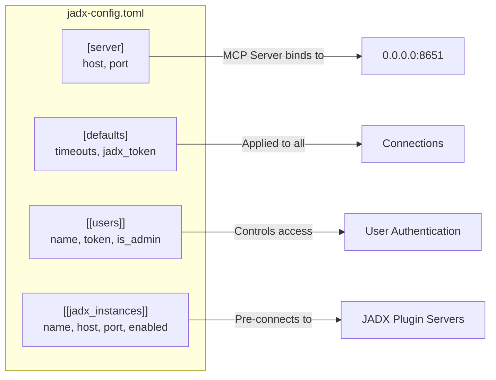
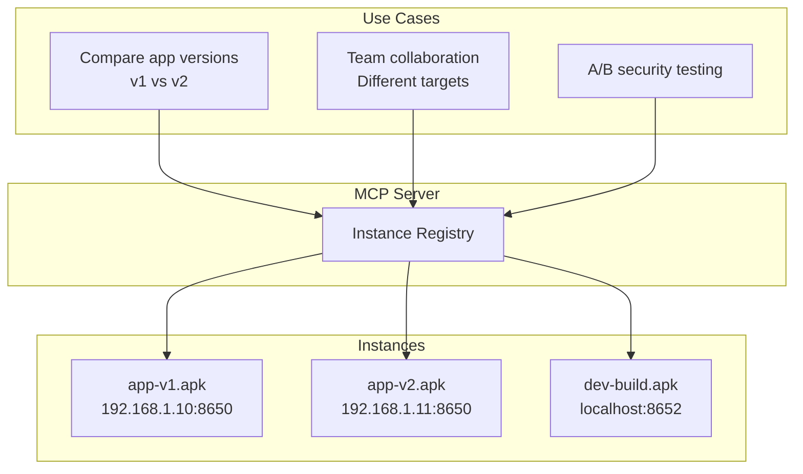
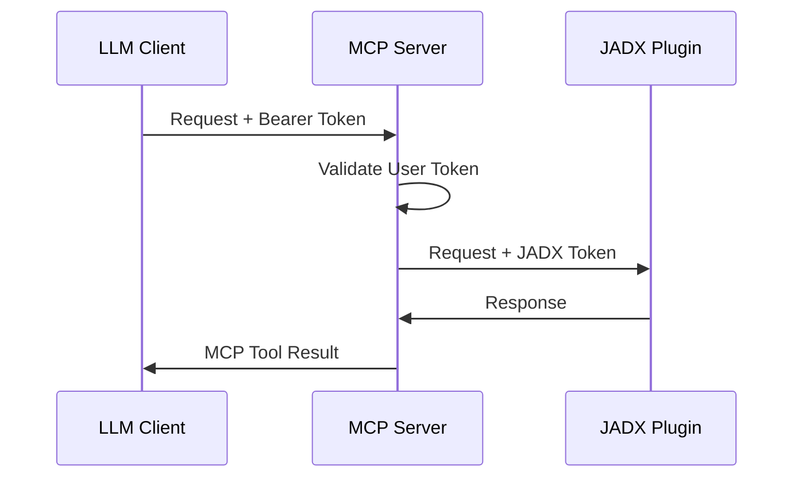

<div align="center">

# JADX-AI-MCP (Part of Zin MCP Suite)

> 🔱 **This is a fork of [zinja-coder/jadx-ai-mcp](https://github.com/zinja-coder/jadx-ai-mcp)**  
> Original project created by [@zinja-coder](https://github.com/zinja-coder). This fork adds multi-instance support and other enhancements.

⚡ Fully automated MCP server + JADX plugin built to communicate with LLM through MCP to analyze Android APKs using LLMs like Claude — uncover vulnerabilities, analyze APK, and reverse engineer effortlessly.

**👉 Original Project**: [github.com/zinja-coder/jadx-ai-mcp](https://github.com/zinja-coder/jadx-ai-mcp)

English | [简体中文](README_ZH.md)


[](http://www.apache.org/licenses/LICENSE-2.0.html)

#### ⭐ Contributors

Thanks to these wonderful people for their contributions ⭐
<table>
  <tr align="center">
    <td>
      <a href="https://github.com/badmonkey7">
        
        <br /><sub><b>badmonkey7</b></sub>
      </a>
    </td>
       <td>
      <a href="https://github.com/tiann">
        
        <br /><sub><b>tiann</b></sub>
      </a>
    </td>
    <td>
      <a href="https://github.com/ljt270864457">
        
        <br /><sub><b>ljt270864457</b></sub>
      </a>
    </td>
    <td>
      <a href="https://github.com/ZERO-A-ONE">
        
        <br /><sub><b>ZERO-A-ONE</b></sub>
      </a>
    </td>
    <td>
      <a href="https://github.com/neoz">
        
        <br /><sub><b>neoz</b></sub>
      </a>
    </td>
    <td>
      <a href="https://github.com/SamadiPour">
        
        <br /><sub><b>SamadiPour</b></sub>
      </a>
    </td>
    <td>
      <a href="https://github.com/wuseluosi">
        
        <br /><sub><b>wuseluosi</b></sub>
      </a>
    </td>
    <td>
      <a href="https://github.com/CainYzb">
        
        <br /><sub><b>CainYzb</b></sub>
      </a>
    </td>
    <td>
      <a href="https://github.com/tbodt">
        
        <br /><sub><b>tbodt</b></sub>
      </a>
    </td>
    <td>
      <a href="https://github.com/LilNick0101">
        
        <br /><sub><b>LilNick0101</b></sub>
      </a>
    </td>
    <td>
      <a href="https://github.com/lwsinclair">
        
        <br /><sub><b>lwsinclair</b></sub>
      </a>
    </td>
  </tr>
</table>


</div>

<!-- It is a still in early stage of development, so expects bugs, crashes and logical erros.-->

<!-- Standalone Plugin for [JADX](https://github.com/skylot/jadx) (Started as Fork) with Model Context Protocol (MCP) integration for AI-powered static code analysis and real-time code review and reverse engineering tasks using Claude.-->

---

## 🤖 What is JADX-AI-MCP?

**JADX-AI-MCP** is a plugin for the [JADX decompiler](https://github.com/skylot/jadx) that integrates directly with [Model Context Protocol (MCP)](https://github.com/anthropic/mcp) to provide **live reverse engineering support with LLMs like Claude**.

> 💡 This project was originally created by [@zinja-coder](https://github.com/zinja-coder). See the [original repository](https://github.com/zinja-coder/jadx-ai-mcp) for the upstream project.

Think: "Decompile → Context-Aware Code Review → AI Recommendations" — all in real time.

#### High Level Sequence Diagram



### Watch the demos!

- **Perform quick analysis**
  
https://github.com/user-attachments/assets/b65c3041-fde3-4803-8d99-45ca77dbe30a

- **Quickly find vulnerabilities**

https://github.com/user-attachments/assets/c184afae-3713-4bc0-a1d0-546c1f4eb57f

- **Multiple AI Agents Support**

https://github.com/user-attachments/assets/6342ea0f-fa8f-44e6-9b3a-4ceb8919a5b0

- **Run with your favorite LLM Client**

https://github.com/user-attachments/assets/b4a6b280-5aa9-4e76-ac72-a0abec73b809

- **Analyze The APK Resources**

https://github.com/user-attachments/assets/f42d8072-0e3e-4f03-93ea-121af4e66eb1

- **Your AI Assistant during debugging of APK using JADX**

https://github.com/user-attachments/assets/2b0bd9b1-95c1-4f32-9b0c-38b864dd6aec

It is combination of two tools:
1. JADX-AI-MCP
2. [JADX MCP SERVER](https://github.com/zinja-coder/jadx-mcp-server)

## 🤖 What is JADX-MCP-SERVER?

**JADX MCP Server** is a standalone Python server that interacts with a `JADX-AI-MCP` plugin (see: [jadx-ai-mcp](https://github.com/zinja-coder/jadx-ai-mcp)) via MCP (Model Context Protocol). It lets LLMs communicate with the decompiled Android app context live.

---

## Other projects in Zin MCP Suite
 - **[APKTool-MCP-Server](https://github.com/zinja-coder/apktool-mcp-server)**
 - **[JADX-MCP-Server](https://github.com/zinja-coder/jadx-mcp-server)**
 - **[ZIN-MCP-Client](https://github.com/zinja-coder/zin-mcp-client)**

## Current MCP Tools

The following MCP tools are available. **All tools support an optional `instance_id` parameter for multi-instance targeting.**

### Code Analysis Tools
- `fetch_current_class(instance_id?)` — Get the class name and full source of selected class
- `get_selected_text(instance_id?)` — Get currently selected text
- `get_all_classes(offset, count, instance_id?)` — List all classes in the project
- `get_class_source(class_name, instance_id?)` — Get full source of a given class
- `batch_get_class_source(class_names, instance_id?)` — **Batch retrieve multiple class sources (max 20)**
- `get_class_info(class_name, instance_id?)` — **Get class structure (inheritance, interfaces, member counts)**
- `get_method_by_name(class_name, method_name, instance_id?)` — Fetch a method's source
- `batch_get_method_by_name(methods, instance_id?)` — **Batch retrieve multiple methods (format: class:method, max 20)**
- `get_method_signature(class_name, method_name, instance_id?)` — **Get structured method signature (return type, params)**
- `get_method_callees(class_name, method_name, instance_id?)` — **Get methods called by this method**
- `search_method_by_name(method_name, instance_id?)` — Search method across classes
- `search_classes_by_keyword(search_term, package?, exclude?, search_in?, offset?, count?, instance_id?)` — Search with optional exclusion filter
- `get_methods_of_class(class_name, instance_id?)` — List methods in a class
- `get_fields_of_class(class_name, instance_id?)` — List fields in a class
- `get_smali_of_class(class_name, instance_id?)` — Fetch smali of class
- `get_main_activity_class(instance_id?)` — Fetch main activity from AndroidManifest.xml
- `get_main_application_classes_code(offset?, count?, instance_id?)` — Fetch main application classes' code
- `get_main_application_classes_names(instance_id?)` — Fetch main application classes' names

### Resource Tools
- `get_android_manifest(instance_id?)` — Retrieve AndroidManifest.xml content
- `get_strings(offset?, count?, instance_id?)` — Fetch strings.xml files
- `get_all_resource_file_names(offset?, count?, instance_id?)` — List all resource file names
- `get_resource_file(resource_name, instance_id?)` — Retrieve resource file content

### Refactoring Tools
- `rename_class(class_name, new_name, instance_id?)` — Rename a class
- `rename_method(method_name, new_name, instance_id?)` — Rename a method
- `rename_field(class_name, field_name, new_name, instance_id?)` — Rename a field
- `rename_package(old_name, new_name, instance_id?)` — Rename a package

### Debug Tools
- `debug_get_stack_frames(instance_id?)` — Get stack frames from debugger
- `debug_get_threads(instance_id?)` — Get thread information from debugger
- `debug_get_variables(instance_id?)` — Get variables from debugger

### Cross-Reference Tools
- `get_xrefs_to_class(class_name, offset?, count?, instance_id?)` — Find all references to a class
- `get_xrefs_to_method(class_name, method_name, offset?, count?, instance_id?)` — Find all references to a method
- `get_xrefs_to_field(class_name, field_name, offset?, count?, instance_id?)` — Find all references to a field
- `batch_get_xrefs(targets, instance_id?)` — **Batch query xrefs for multiple targets (max 10)**

### Multi-Instance Management Tools
- `list_jadx_instances()` — List all connected JADX instances
- `add_jadx_instance(host, port, name?)` — Add a new JADX instance dynamically
- `remove_jadx_instance(name)` — Remove a JADX instance
- `set_default_jadx_instance(name)` — Set the default instance for tool calls
- `get_jadx_instance_info(name)` — Get detailed info about an instance
- `health_check_jadx_instances()` — Check health of all instances
- `check_instance_status(instance_name?)` — **Check if instance is busy processing**

---

## 🧭 MCP Prompts (AI Guidance)

Built-in prompts to guide AI for effective reverse engineering workflows:

| Prompt | Description |
|--------|-------------|
| `analyze-activity` | Step-by-step guide for analyzing Android Activities from Manifest |
| `search-code` | Efficient code search strategy to avoid timeouts on large APKs |
| `trace-method` | Method tracing workflow: implementation → callers → callees |

**Usage Example:**

```
Use the analyze-activity prompt to analyze MainActivity
```

---

## 🗒️ Sample Prompts

🔍 Basic Code Understanding

    "Explain what this class does in one paragraph."

    "Summarize the responsibilities of this method."

    "Is there any obfuscation in this class?"

    "List all Android permissions this class might require."

🛡️ Vulnerability Detection

    "Are there any insecure API usages in this method?"

    "Check this class for hardcoded secrets or credentials."

    "Does this method sanitize user input before using it?"

    "What security vulnerabilities might be introduced by this code?"

🛠️ Reverse Engineering Helpers

    "Deobfuscate and rename the classes and methods to something readable."

    "Can you infer the original purpose of this smali method?"

    "What libraries or SDKs does this class appear to be part of?"

    "Tell me which classes contains code related to 'encryption'?"

📦 Static Analysis

    "List all network-related API calls in this class."

    "Identify file I/O operations and their potential risks."

    "Does this method leak device info or PII?"

🤖 AI Code Modification

    "Refactor this method to improve readability."

    "Add comments to this code explaining each step."

    "Rewrite this Java method in Python for analysis."

📄 Documentation & Metadata

    "Generate Javadoc-style comments for all methods."

    "What package or app component does this class likely belong to?"

    "Can you identify the Android component type (Activity, Service, etc.)?"

🐞 Debugger Assistant
```
   "Fetch stack frames, varirables and threads from debugger and provide summary"

   "Based the stack frames from debugger, explain the execution flow of the application"

   "Based on the state of variables, is there security threat?"
```

---

## 🚀 Quick Start

### Architecture Overview



### Step 1: Install JADX Plugin

```bash
jadx plugins --install "github:xjoker:jadx-ai-mcp"
```

### Step 2: Start MCP Server

**Option A: Docker (Recommended)**

```bash
# All-in-One: JADX GUI + MCP Server
docker run -d -p 6080:6080 -p 8651:8651 xjoker/jadx-ai-mcp:latest

# Standalone MCP Server only
docker run -d -p 8651:8651 xjoker/jadx-mcp-server:latest
```

**Option B: Local Installation**

```bash
# Install uv package manager
curl -LsSf https://astral.sh/uv/install.sh | sh

# Run MCP Server
uv tool install "git+https://github.com/xjoker/jadx-ai-mcp#subdirectory=jadx-mcp-server"
jadx_mcp_server --http --host 0.0.0.0 --port 8651
```

### Step 3: Connect LLM Client

```bash
# Claude CLI - Connect to HTTP MCP Server
claude mcp add --transport http jadx http://localhost:8651/mcp
```

Or configure `claude_desktop_config.json`:

```json
{
  "mcpServers": {
    "jadx": {
      "type": "http",
      "url": "http://localhost:8651/mcp"
    }
  }
}
```

---

## 📦 Docker Deployment

Two Docker images are available:

| Image | Description | Size | Use Case |
|-------|-------------|------|----------|
| `xjoker/jadx-ai-mcp` | JADX GUI + noVNC + MCP Server | ~800MB | Quick start, single APK |
| `xjoker/jadx-mcp-server` | MCP Server only | ~100MB | Production, multi-instance |

### All-in-One Container

```bash
docker run -d --name jadx \
  -p 6080:6080 \
  -p 8650:8650 \
  -p 8651:8651 \
  -v $(pwd)/apks:/apks \
  xjoker/jadx-ai-mcp:latest
```

**Access:**
- 🌐 **noVNC Desktop**: http://localhost:6080
- 🔌 **Plugin API**: http://localhost:8650
- 🤖 **MCP Server**: http://localhost:8651

### Standalone MCP Server

For production environments with multiple JADX instances:

```bash
docker run -d --name mcp-server \
  -p 8651:8651 \
  -v $(pwd)/config:/app/data/config \
  xjoker/jadx-mcp-server:latest \
  /usr/local/bin/uv run jadx_mcp_server --http --config /app/data/config/jadx-config.toml
```

---

## ⚙️ Configuration File

Create `jadx-config.toml` for advanced configuration:

### Complete Configuration Reference

```toml
# =============================================================================
# Server Configuration
# =============================================================================
[server]
host = "0.0.0.0"          # Bind address (0.0.0.0 for Docker)
port = 8651               # MCP Server port

# =============================================================================
# Default Settings
# =============================================================================
[defaults]
request_timeout = 120     # HTTP request timeout (seconds)
busy_timeout = 300        # Max busy wait time (seconds)
jadx_token = ""           # Default JADX plugin auth token (or set JADX_MCP_AUTH_TOKEN env var)
health_check_interval = 30  # Background health check interval (seconds)

# =============================================================================
# Security Settings
# =============================================================================
[security]
allow_dynamic_instances = false  # Allow users to add instances via AI commands

# =============================================================================
# Multi-User Authentication
# =============================================================================
# Each user gets a unique token for MCP client authentication
# Dynamic instances created by a user are only visible to that user

[[users]]
name = "alice"
token = "token-alice-xxxxx"

[[users]]
name = "bob"
token = "token-bob-yyyyy"

[[users]]
name = "admin"
token = "token-admin-zzzzz"
is_admin = true           # Admin can see all users' instances
can_add_instances = true  # Explicitly grant instance addition permission

# =============================================================================
# Pre-configured JADX Instances
# =============================================================================
# These instances are shared and visible to all users

[[jadx_instances]]
name = "app-v1"
host = "192.168.1.10"
port = 8650
enabled = true
token = ""                # Instance-specific token (optional)

[[jadx_instances]]
name = "app-v2"
host = "192.168.1.11"
port = 8650
enabled = true

[[jadx_instances]]
name = "local-dev"
host = "127.0.0.1"
port = 8650
enabled = false           # Disabled, won't connect
```

### Configuration Options Explained



| Section | Key | Description |
|---------|-----|-------------|
| `[server]` | `host` | MCP Server bind address |
| `[server]` | `port` | MCP Server port |
| `[defaults]` | `request_timeout` | HTTP timeout for JADX requests |
| `[defaults]` | `busy_timeout` | Max busy wait time for instance lock |
| `[defaults]` | `jadx_token` | Default auth token for JADX plugins |
| `[defaults]` | `health_check_interval` | Background health check interval (seconds) |
| `[security]` | `allow_dynamic_instances` | Allow users to add instances via AI |
| `[[users]]` | `name` | Username for identification |
| `[[users]]` | `token` | Bearer token for MCP client auth |
| `[[users]]` | `is_admin` | Can see all users' dynamic instances |
| `[[users]]` | `can_add_instances` | Override permission to add instances |
| `[[jadx_instances]]` | `name` | Instance identifier |
| `[[jadx_instances]]` | `host` | JADX plugin IP address |
| `[[jadx_instances]]` | `port` | JADX plugin port |
| `[[jadx_instances]]` | `enabled` | Whether to connect on startup |

---

## 🔗 Multi-Instance Management

### Why Multiple Instances?



### Connect via Configuration

```toml
[[jadx_instances]]
name = "xhs-v8"
host = "192.168.1.10"
port = 8650

[[jadx_instances]]
name = "xhs-v9"
host = "192.168.1.11"
port = 8650
```

### Connect via AI Command

```
Please connect to JADX at 192.168.1.100:8650, name it "my-app"

Or multiple:
Connect to these JADX instances:
1. 192.168.1.10:8650 as "app-v1"
2. 192.168.1.11:8650 as "app-v2"
```

### Target Specific Instance

All MCP tools support `instance_id` parameter:

```
Get the MainActivity from app-v1

Compare the encryption methods between app-v1 and app-v2

Check if the vulnerability in v1 was fixed in v2
```

---

## 🔐 Authentication

### Authentication Flow



### User Isolation

| Instance Type | Visibility |
|---------------|------------|
| **Config Instances** | All users (shared) |
| **Dynamic Instances** | Owner only |
| **Admin User** | All instances |

### Connect with Authentication

```bash
# Claude CLI with Bearer token
claude mcp add --transport http jadx http://server:8651/mcp \
  --header "Authorization: Bearer token-alice-xxxxx"
```

```json
// claude_desktop_config.json
{
  "mcpServers": {
    "jadx": {
      "type": "http",
      "url": "http://server:8651/mcp",
      "headers": {
        "Authorization": "Bearer token-alice-xxxxx"
      }
    }
  }
}
```

---

## 🛠️ Command Line Reference

```bash
jadx_mcp_server [OPTIONS]
```

| Option | Default | Description |
|--------|---------|-------------|
| `--config FILE` | None | TOML configuration file path |
| `--http` | False | Enable HTTP mode (required for remote) |
| `--host HOST` | 127.0.0.1 | MCP Server bind address |
| `--port PORT` | 8651 | MCP Server port |
| `--jadx-host HOST` | 127.0.0.1 | Single JADX instance host |
| `--jadx-port PORT` | 8650 | Single JADX instance port |
| `--jadx-instances LIST` | None | Multiple instances: `host:port:name,...` |
| `--auth-token TOKEN` | None | JADX plugin auth token |
| `--mcp-auth-token TOKEN` | None | MCP server auth token (single user) |

### Examples

```bash
# Simple local setup
jadx_mcp_server

# HTTP mode for remote access
jadx_mcp_server --http --host 0.0.0.0

# With configuration file
jadx_mcp_server --http --config jadx-config.toml

# Multiple instances via CLI
jadx_mcp_server --http --jadx-instances "192.168.1.10:8650:v1,192.168.1.11:8650:v2"
```

---

## 🔌 JADX Plugin Settings

In JADX GUI: `Plugins → JADX AI MCP Server → 设置...`

| Setting | Description |
|---------|-------------|
| **Port** | Plugin HTTP API port (default: 8650) |
| **Bind Address** | Use `0.0.0.0` for network access |
| **Auto Start** | Start server when JADX opens |
| **Auth Token** | Token for MCP Server authentication |

---

## Troubleshooting

If you encounter issues:
1. Ensure JADX GUI is running with an APK loaded
2. Verify the plugin is installed and enabled
3. Check that the MCP server is running
4. If using authentication, ensure tokens match
5. For network issues, verify firewall settings

---

## 🙏 Credits

This project is a plugin for JADX, an amazing open-source Android decompiler created and maintained by [@skylot](https://github.com/skylot). This project is a fork of [jadx-ai-mcp](https://github.com/zinja-coder/jadx-ai-mcp) created by [zinja-coder](https://github.com/zinja-coder). Huge thanks for their original work!

[📎 Original README (JADX)](https://github.com/skylot/jadx)

### Dependencies

- Plugin - Java
  - Javalin     - https://javalin.io/ - Apache 2.0 License
  - SLF4J       - https://slf4j.org/  - MIT License

- MCP Server - Python
  - FastMCP - https://github.com/jlowin/fastmcp - Apache 2.0 License
  - httpx   - https://www.python-httpx.org      - BSD-3-Clause

## 📄 License

JADX-AI-MCP inherits the Apache 2.0 License from the original JADX repository.

## ⚖️ Legal Warning

The tools `jadx-ai-mcp` and `jadx_mcp_server` are intended strictly for educational, research, and ethical security assessment purposes. Users are solely responsible for ensuring compliance with all applicable laws.

---

## 🙌 Contribute or Support

- Found it useful? Give it a ⭐️
- Got ideas? Open an [issue](https://github.com/xjoker/jadx-ai-mcp/issues) or submit a PR

---

Built with ❤️ for the reverse engineering and AI communities.
