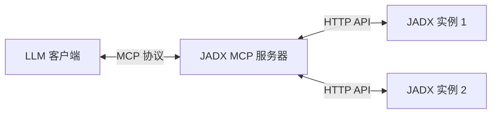

<div align="center">

# JADX-AI-MCP

> 🔱 **本项目 Fork 自 [zinja-coder/jadx-ai-mcp](https://github.com/zinja-coder/jadx-ai-mcp)**  
> 原项目由 [@zinja-coder](https://github.com/zinja-coder) 创建。本 Fork 新增了多实例支持等增强功能。

**👉 原始项目**: [github.com/zinja-coder/jadx-ai-mcp](https://github.com/zinja-coder/jadx-ai-mcp)

---

> **强大的 JADX 插件与 MCP 服务器，用于 AI 辅助逆向工程**
> 
> 利用 [Model Context Protocol (MCP)](https://github.com/anthropic/mcp) 将 LLM（如 Claude）直接连接到 JADX，实现实时、上下文感知的 APK 分析。


[](http://www.apache.org/licenses/LICENSE-2.0.html)

</div>

## 📖 概述

**JADX-AI-MCP** 将静态分析转变为交互式对话。您不再需要手动搜索和复制代码，而是可以直接让 AI 助手"分析 MainActivity 中的登录流程"或"检查资源字符串中的硬编码密钥"。

系统由两个组件组成：
1.  **JADX 插件**：嵌入式 Java 插件，通过 HTTP 暴露 JADX 的内部状态。
2.  **MCP 服务器**：Python 服务器，作为桥梁实现 MCP 协议，编排一个或多个 JADX 实例。

### 核心能力

*   **多实例管理**：同时连接和分析多个 APK（例如，比较 `v1.0` 与 `v2.0`）。
*   **上下文感知分析**：按需检索类代码、方法、字段和交叉引用（xrefs）。
*   **资源检查**：搜索和读取 `AndroidManifest.xml`、`strings.xml` 及其他资源文件。
*   **安全执行**：内置并发控制确保并行 AI 请求时 JADX 的稳定性。
*   **用户隔离**：支持多用户环境，动态实例对其创建者私有。

---

## 🏗️ 架构与设计

### Server-Plugin 架构



这种解耦架构允许 MCP 服务器独立运行（例如在 Docker 中），同时管理运行在不同机器或端口上的多个 JADX GUI 实例。

### 并发控制（串行锁）
JADX 的反编译引擎计算密集型且对所有操作并非完全线程安全。为防止崩溃和数据损坏：
*   **InstanceBusyTracker**：服务器实现了严格的锁机制。当操作（如 `search_code`）运行时，实例被标记为 `BUSY`。
*   **快速失败**：对繁忙实例的并发请求会立即收到结构化错误（`INSTANCE_BUSY`），允许 AI 客户端决定是等待还是重试。

### 用户隔离模型
专为共享环境设计：
*   **静态实例**：在 `config.toml` 中定义，对所有用户可见（共享）。
*   **动态实例**：通过 `add_jadx_instance` 在运行时添加。**仅**对创建者可见（默认私有）。
*   **管理员访问**：管理员用户对所有实例拥有可见性和控制权。

---

## 📚 MCP 工具参考

所有工具都支持可选的 `instance_id` 参数来指定目标 JADX 实例。如果省略，则使用默认实例。

### 1. 类分析
| 工具 | 描述 | 关键参数 |
|------|------|----------|
| `fetch_current_class` | 获取 JADX GUI 中当前打开的类代码 | `instance_id` |
| `get_class_source` | 获取类的完整 Java 源码 | `class_name` |
| `batch_get_class_source` | **批量**获取源码（最多 20 个） | `class_names` (列表) |
| `get_class_info` | 获取继承关系、接口和成员计数 | `class_name` |
| `get_methods_of_class` | 列出类中所有方法签名 | `class_name` |
| `get_fields_of_class` | 列出类中所有字段 | `class_name` |
| `get_smali_of_class` | 获取 Smali（Dalvik 字节码）表示 | `class_name` |

### 2. 代码搜索（高级）
| 工具 | 描述 | 关键参数 |
|------|------|----------|
| `search_classes_by_keyword` | **推荐**。强大的过滤搜索。 | `search_term`, `search_in` (code, class, method, field, comment), `exclude` (包前缀), `package` |
| `search_method_by_name` | 全局方法搜索（资源密集） | `method_name`, `offset`, `count` |
| `get_method_by_name` | 获取特定方法的源码 | `class_name`, `method_name` |
| `batch_get_method_by_name` | **批量**获取方法（最多 20 个） | `methods` ("class:method" 格式列表) |
| `get_method_signature` | 获取结构化参数/返回类型 | `class_name`, `method_name` |
| `get_method_callees` | 分析方法调用（基于模式） | `class_name`, `method_name` |

### 3. 资源分析
| 工具 | 描述 | 关键参数 |
|------|------|----------|
| `get_strings` | **强大的**字符串分析工具 | `mode` ("summary"\|"list"\|"search"\|"get"), `query`, `locale`, `limit` |
| `get_android_manifest` | 读取 AndroidManifest.xml | `instance_id` |
| `get_resource_file` | 读取原始资源内容 | `resource_name` (如 "res/layout/main.xml") |
| `get_all_resource_file_names`| 列出 APK 资源中的所有文件 | `offset`, `count` |

### 4. 交叉引用（XRefs）
| 工具 | 描述 | 关键参数 |
|------|------|----------|
| `get_xrefs_to_class` | 查找对类的引用 | `class_name`, `offset`, `count` |
| `get_xrefs_to_method` | 查找方法的调用者 | `class_name`, `method_name`, `offset`, `count` |
| `get_xrefs_to_field` | 查找字段的使用 | `class_name`, `field_name`, `offset`, `count` |
| `batch_get_xrefs` | **批量** xrefs 查询 | `targets` ("type:class[:member]" 格式列表) |

### 5. 实例管理
| 工具 | 描述 | 关键参数 |
|------|------|----------|
| `list_jadx_instances` | 列出可用实例 | 无 |
| `add_jadx_instance` | 连接到新的 JADX 实例 | `host`, `port`, `name`, `token` |
| `remove_jadx_instance` | 移除实例 | `name` |
| `set_default_jadx_instance`| 设置活动实例上下文 | `name` |
| `check_instance_status` | 检查特定实例是否繁忙 | `instance_name` |
| `health_check_jadx_instances`| 对所有实例运行健康检查 | 无 |

---

## ⚙️ 配置

服务器通过 `jadx-config.toml` 配置。

```toml
[server]
host = "0.0.0.0"
port = 8651

[security]
allow_dynamic_instances = true  # 允许 AI 添加新实例

[[users]]
name = "admin"
token = "secret-admin-token"
is_admin = true

[[jadx_instances]]
name = "static-analysis-v1"
host = "192.168.1.10"
port = 8650
enabled = true
```

### 环境变量
| 变量 | 描述 | 默认值 |
|------|------|--------|
| `JADX_MCP_AUTH_TOKEN` | JADX 插件认证的默认令牌 | 空 |
| `JADX_MCP_SERVER_PORT` | MCP 服务器端口 | 8651 |
| `JADX_HOST` / `JADX_PORT` | 要连接的默认 JADX 实例 | 127.0.0.1:8650 |

---

## 🚀 快速开始

### Docker（推荐）

```bash
# 运行 MCP 服务器
docker run -d -p 8651:8651 \
  -v $(pwd)/config:/app/data/config \
  xjoker/jadx-mcp-server:latest
```

### 本地开发

```bash
# 安装依赖
uv tool install .

# 运行服务器
jadx_mcp_server --http --config ./data/config/jadx-config.toml
```

---

## 🙌 致谢

本项目建立在逆向工程社区巨人的肩膀上：

*   **[JADX](https://github.com/skylot/jadx)**：核心反编译引擎，作者 **@skylot**。
*   **[jadx-ai-mcp](https://github.com/zinja-coder/jadx-ai-mcp)**：原始 MCP 实现概念，作者 **@zinja-coder**。

本仓库中的多实例架构和服务器改进由 **@xjoker** 和社区维护。

## ⚖️ 法律与许可

**许可证**：Apache 2.0  
**免责声明**：本工具仅用于教育和安全研究目的。请负责任且合法地使用。
