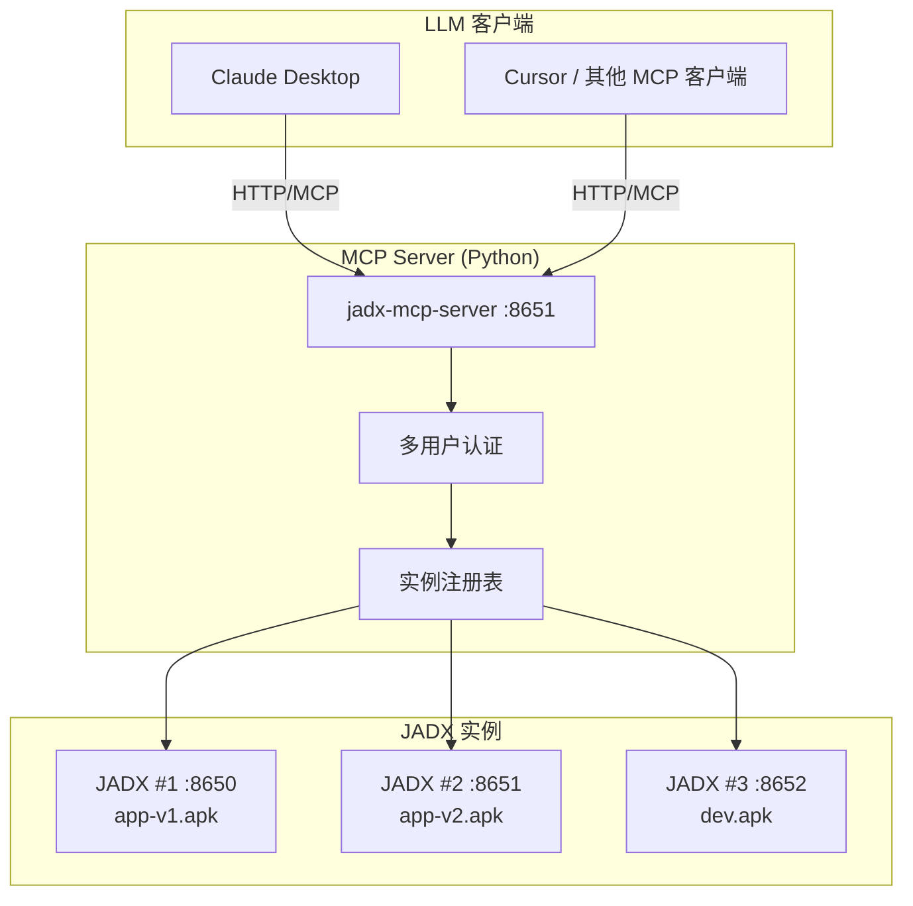
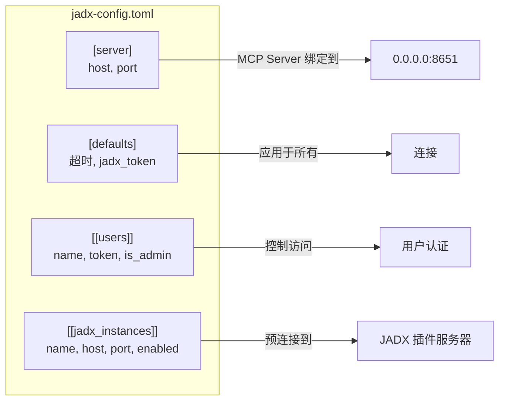
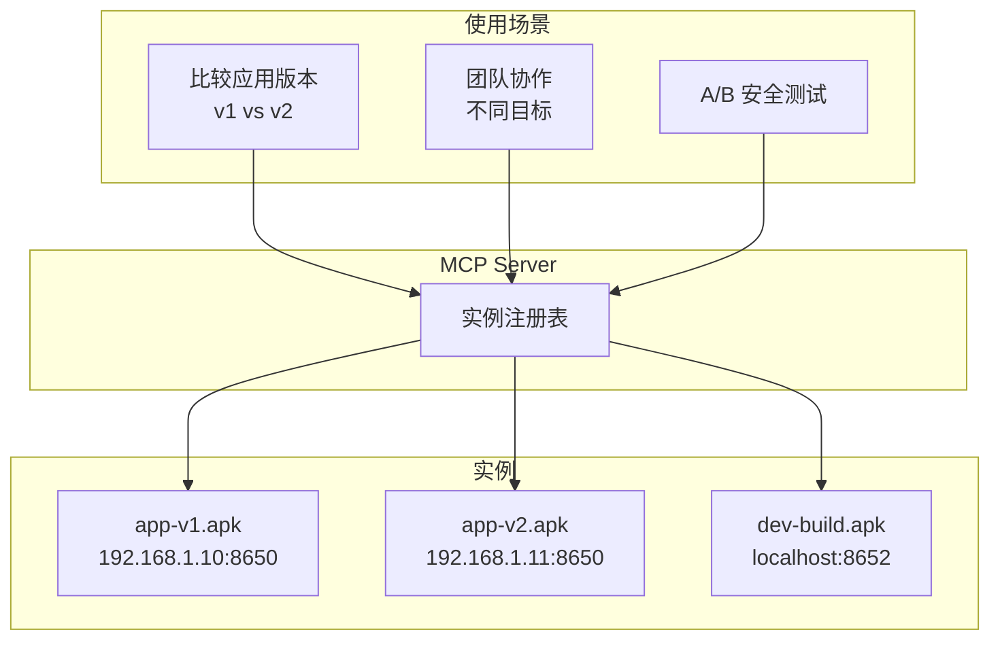
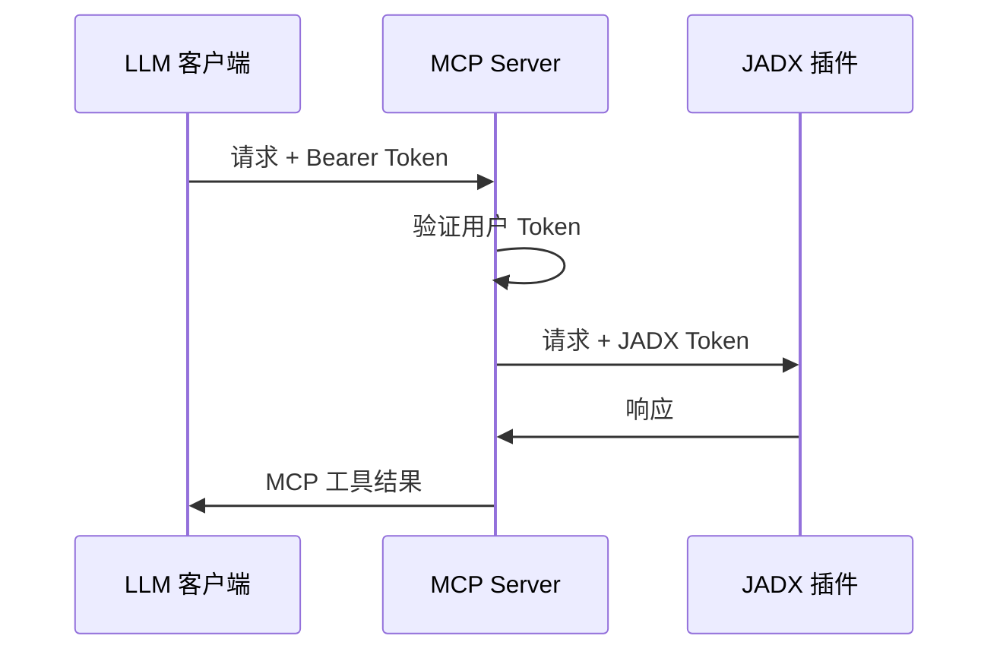
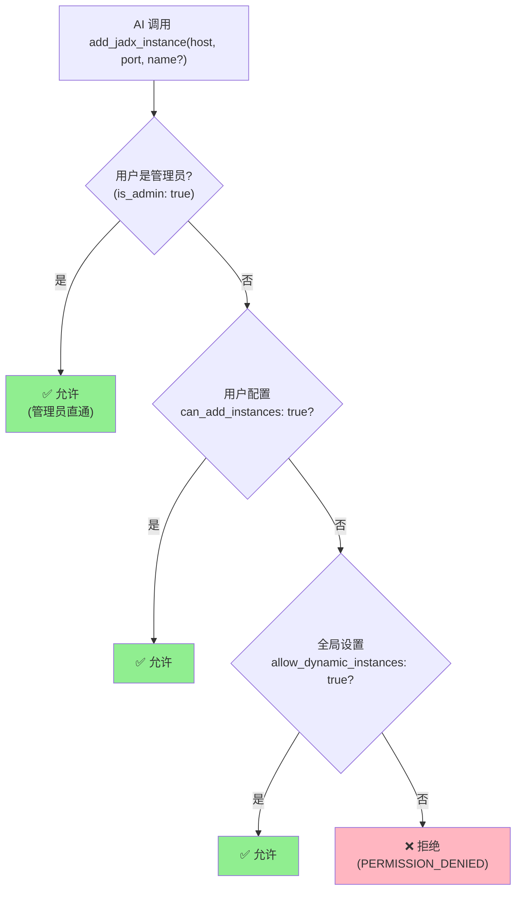

<div align="center">

# JADX-AI-MCP (Zin MCP Suite 的一部分)

> 🔱 **这是 [zinja-coder/jadx-ai-mcp](https://github.com/zinja-coder/jadx-ai-mcp) 的 Fork 版本**  
> 原始项目由 [@zinja-coder](https://github.com/zinja-coder) 创建。本 Fork 添加了多实例支持、多用户认证等增强功能。

⚡ 全自动化 MCP 服务器 + JADX 插件，通过 MCP 协议与 LLM 通信，使用 Claude 等大语言模型分析 Android APK——轻松发现漏洞、分析 APK、逆向工程。

**👉 原始项目**: [github.com/zinja-coder/jadx-ai-mcp](https://github.com/zinja-coder/jadx-ai-mcp)

[English](README.md) | 简体中文


[](http://www.apache.org/licenses/LICENSE-2.0.html)

</div>

---

## 🎯 项目定位

**JADX-AI-MCP** 是 **JADX 与 AI/LLM 之间的 MCP 协议桥接层**。

**这是：**
- ✅ 让 Claude/ChatGPT 等 AI 能直接调用 JADX 反编译能力
- ✅ 支持多实例、多用户的远程协作分析
- ✅ 提供开箱即用的 Docker 部署方案

**这不是：**
- ❌ 替代 JADX GUI 的独立工具
- ❌ 生产级安全服务（无审计日志、无细粒度 RBAC）
- ❌ 完整的自动化逆向框架

> 📖 安全相关说明请参阅 [SECURITY.md](SECURITY.md)

---

## 🤖 什么是 JADX-AI-MCP？

**JADX-AI-MCP** 是 [JADX 反编译器](https://github.com/skylot/jadx)的插件，直接与 [Model Context Protocol (MCP)](https://github.com/anthropic/mcp) 集成，为 **Claude 等 LLM 提供实时逆向工程支持**。

核心理念：**反编译 → 上下文感知代码审查 → AI 建议** — 全部实时完成。

---

## 🚀 快速开始

### 架构概览



### 步骤 1: 安装 JADX 插件

```bash
jadx plugins --install "github:xjoker:jadx-ai-mcp"
```

### 步骤 2: 启动 MCP Server

**方式 A: Docker（推荐）**

```bash
# All-in-One: JADX GUI + MCP Server
docker run -d -p 6080:6080 -p 8651:8651 xjoker/jadx-ai-mcp:latest

# 仅 MCP Server
docker run -d -p 8651:8651 xjoker/jadx-mcp-server:latest
```

**方式 B: 本地安装**

```bash
# 1. 安装 uv 包管理器
curl -LsSf https://astral.sh/uv/install.sh | sh

# 2. 安装 MCP Server
uv tool install "git+https://github.com/xjoker/jadx-ai-mcp#subdirectory=jadx-mcp-server"

# 3. 运行 MCP Server（选择其一）

# 简单模式 - 连接本地 JADX
jadx_mcp_server --http --host 0.0.0.0 --port 8651

# 指定 JADX 实例
jadx_mcp_server --http --host 0.0.0.0 --jadx-host 192.168.1.10 --jadx-port 8650

# 使用配置文件
jadx_mcp_server --http --config jadx-config.toml

# 多实例模式
jadx_mcp_server --http --jadx-instances "192.168.1.10:8650:app-v1,192.168.1.11:8650:app-v2"
```

**环境变量：**

| 变量 | 描述 |
|------|------|
| `JADX_HOST` | JADX 插件地址（默认：127.0.0.1）|
| `JADX_PORT` | JADX 插件端口（默认：8650）|
| `JADX_MCP_AUTH_TOKEN` | JADX 插件认证 Token |
| `JADX_MCP_SERVER_PORT` | MCP Server 端口（默认：8651）|

### 步骤 3: 连接 LLM 客户端

```bash
# Claude CLI - 连接到 HTTP MCP Server
claude mcp add --transport http jadx http://localhost:8651/mcp
```

或配置 `claude_desktop_config.json`:

```json
{
  "mcpServers": {
    "jadx": {
      "type": "http",
      "url": "http://localhost:8651/mcp"
    }
  }
}
```

---

## 📦 Docker 部署

提供两种 Docker 镜像：

| 镜像 | 描述 | 大小 | 适用场景 |
|------|------|------|----------|
| `xjoker/jadx-ai-mcp` | JADX GUI + noVNC + MCP Server | ~800MB | 快速上手、单 APK |
| `xjoker/jadx-mcp-server` | 仅 MCP Server | ~100MB | 生产环境、多实例 |

### 🚀 Docker Compose（推荐）

**一键启动 1 MCP + 3 JADX 多实例环境：**

```bash
cd docker
docker compose up -d
```

**访问地址：**

| 服务 | 地址 | 说明 |
|:-----|:-----|:-----|
| MCP Server | http://localhost:8651/mcp | 连接 Claude/LLM |
| JADX #1 | http://localhost:6080 | noVNC 桌面 |
| JADX #2 | http://localhost:6081 | noVNC 桌面 |
| JADX #3 | http://localhost:6082 | noVNC 桌面 |

**自动加载 APK：**

将 APK 文件命名为 `target.apk` 放入对应目录，JADX 启动时会自动加载：

```bash
docker/apks/jadx-1/target.apk  → JADX #1 自动打开
docker/apks/jadx-2/target.apk  → JADX #2 自动打开
docker/apks/jadx-3/target.apk  → JADX #3 自动打开
```

> 📖 详细使用说明见 [docker/QUICK_START.md](docker/QUICK_START.md)

### All-in-One 容器

**基本用法：**

```bash
docker run -d --name jadx \
  -p 6080:6080 \
  -p 8650:8650 \
  -p 8651:8651 \
  -v $(pwd)/apks:/apks \
  xjoker/jadx-ai-mcp:latest
```

**推荐配置（含缓存和配置文件）：**

```bash
docker run -d --name jadx \
  -p 6080:6080 \
  -p 8650:8650 \
  -p 8651:8651 \
  -v $(pwd)/apks:/apks \
  -v $(pwd)/config:/app/data/config \
  -v jadx-cache:/root/.cache \
  -v jadx-gui-cache:/root/.jadx-gui \
  xjoker/jadx-ai-mcp:latest
```

**访问方式：**
- 🌐 **noVNC 桌面**: http://localhost:6080
- 🔌 **插件 API**: http://localhost:8650
- 🤖 **MCP Server**: http://localhost:8651

### 卷挂载参考

| 卷 | 路径 | 用途 |
|----|------|------|
| APK 文件 | `/apks` | 挂载 APK 文件进行分析 |
| 配置 | `/app/data/config` | 配置文件 (jadx-config.toml) |
| 缓存 | `/root/.cache` | JADX 反编译缓存（加速 10-50 倍）|
| GUI 设置 | `/root/.jadx-gui` | GUI 首选项持久化 |

> **提示**：大型 APK 首次代码搜索会触发反编译（较慢）。后续搜索因缓存而快速。

### 独立 MCP Server

用于生产环境，连接外部 JADX 实例：

**方式 1：使用配置文件**

```bash
# 创建配置目录和文件
mkdir -p config
cat > config/jadx-config.toml << 'EOF'
[server]
host = "0.0.0.0"
port = 8651

[[jadx_instances]]
name = "jadx-1"
host = "192.168.1.10"
port = 8650
enabled = true
EOF

# 运行容器
docker run -d --name mcp-server \
  -p 8651:8651 \
  -v $(pwd)/config:/app/data/config \
  xjoker/jadx-mcp-server:latest
```

**方式 2：使用环境变量**

```bash
docker run -d --name mcp-server \
  -p 8651:8651 \
  -e JADX_HOST=192.168.1.10 \
  -e JADX_PORT=8650 \
  -e JADX_MCP_AUTH_TOKEN=your-token \
  xjoker/jadx-mcp-server:latest
```

**方式 3：使用命令行参数**

```bash
docker run -d --name mcp-server \
  -p 8651:8651 \
  xjoker/jadx-mcp-server:latest \
  jadx_mcp_server --http --host 0.0.0.0 \
    --jadx-instances "192.168.1.10:8650:app-v1,192.168.1.11:8650:app-v2"
```

---

## 🚦 搜索行为

### 并发搜索处理

搜索操作使用**串行锁**防止 JADX 内部状态冲突：

| 场景 | 响应 | AI 动作 |
|------|------|---------|
| 搜索可用 | `200 OK` + 结果 | 正常处理 |
| 搜索忙碌 | `200 OK` + `{"error": "INSTANCE_BUSY", ...}` | 等待后重试（默认超时 300 秒）|

**为什么串行化？**
- JADX 反编译不是线程安全的
- 并发代码搜索可能导致不一致结果
- 锁确保正确性优先于速度

### 搜索模式性能

| 模式 | 速度 | 是否触发反编译 |
|------|------|----------------|
| `search_in="class"` | 快 | 否 |
| `search_in="method"` | 快 | 否 |
| `search_in="field"` | 快 | 否 |
| `search_in="code"` | 慢 | 是（每个类一次）|

> **最佳实践**：先使用 `class`/`method`/`field` 搜索。使用 `search_in="code"` 时配合 package 过滤器进行精准全文搜索。

---

## 🗂️ 类缓存与自动失效

为提升性能，批量操作（`batch_get_class_source`、`batch_get_method_by_name`、`batch_get_xrefs`）使用 **ClassCacheManager**：

| 特性 | 描述 |
|------|------|
| **懒加载** | 缓存在首次批量调用时填充。初始可能返回 `LOADING` 状态。|
| **自动失效** | 任何重命名操作（`rename_class`、`rename_method`、`rename_field`、`rename_package`）都会自动清除缓存。|
| **30秒全局冷却** | 缓存清除操作有 30 秒的防抖冷却期，以防止过度重新加载。|

> **注意**：如果怀疑 JADX 端修改后数据过期，可使用 `clear_class_cache()` 手动清除。

---

## ⚡ 工具性能提示

部分工具在大型 APK 上可能超时，请使用以下最佳实践：

| 工具 | 警告 | 建议 |
|:-----|:-----|:-----|
| `get_class_source` | 超大类（如含 10000+ 字段的 R.class）可能超时 | 使用 `get_method_by_name` 获取特定方法 |
| `batch_get_class_source` | 包含大类可能导致超时 | 先用 `get_class_info` 检查大小 |
| `get_main_application_classes_code` | `count=0`（全部）可能超时 | 使用 `count=1-5` 分页获取 |
| `get_resource_file` | 混淆 APK 可能重命名资源 | 先用 `get_all_resource_file_names` 检查 |
| `search_classes_by_keyword` | `search_in="code"` 速度慢 | 优先使用 `search_in="class"` 或 `"method"` |

---

## ⚙️ 配置文件

创建 `jadx-config.toml` 进行高级配置：

### 完整配置参考

```toml
# =============================================================================
# 服务器配置
# =============================================================================
[server]
host = "0.0.0.0"          # 绑定地址（Docker 使用 0.0.0.0）
port = 8651               # MCP Server 端口

# =============================================================================
# 默认设置
# =============================================================================
[defaults]
request_timeout = 120     # HTTP 请求超时（秒）
busy_timeout = 300        # 最大等待时间（秒）
jadx_token = ""           # 默认 JADX 插件认证 Token（或设置 JADX_MCP_AUTH_TOKEN 环境变量）
health_check_interval = 30  # 后台健康检查间隔（秒）

# =============================================================================
# 安全设置
# =============================================================================
[security]
allow_dynamic_instances = false  # 允许用户通过 AI 添加实例

# =============================================================================
# 多用户认证
# =============================================================================
# 每个用户获得唯一 Token 用于 MCP 客户端认证
# 用户创建的动态实例仅对该用户可见

[[users]]
name = "alice"
token = "token-alice-xxxxx"

[[users]]
name = "bob"
token = "token-bob-yyyyy"

[[users]]
name = "admin"
token = "token-admin-zzzzz"
is_admin = true           # 管理员可查看所有用户的实例
can_add_instances = true  # 显式授予添加实例权限

# =============================================================================
# 预配置 JADX 实例
# =============================================================================
# 这些实例是共享的，对所有用户可见

[[jadx_instances]]
name = "app-v1"
host = "192.168.1.10"
port = 8650
enabled = true
token = ""                # 实例专用 Token（可选）

[[jadx_instances]]
name = "app-v2"
host = "192.168.1.11"
port = 8650
enabled = true

[[jadx_instances]]
name = "local-dev"
host = "127.0.0.1"
port = 8650
enabled = false           # 禁用，不会连接
```

### 配置选项说明



**`[server]`** - 服务器绑定

| 键 | 描述 |
|-----|------|
| `host` | MCP Server 绑定地址 |
| `port` | MCP Server 端口 |

**`[defaults]`** - 默认设置

| 键 | 描述 |
|-----|------|
| `request_timeout` | JADX 请求的 HTTP 超时 |
| `busy_timeout` | 实例锁最大等待时间 |
| `jadx_token` | JADX 插件的默认认证 Token |
| `health_check_interval` | 后台健康检查间隔（秒）|

**`[security]`** - 安全选项

| 键 | 描述 |
|-----|------|
| `allow_dynamic_instances` | 允许用户通过 AI 添加实例 |

**`[[users]]`** - 用户认证（可重复）

| 键 | 描述 |
|-----|------|
| `name` | 用户名（用于标识）|
| `token` | MCP 客户端认证的 Bearer Token |
| `is_admin` | 可查看所有用户的动态实例 |
| `can_add_instances` | 覆盖添加实例权限 |

**`[[jadx_instances]]`** - 预配置实例（可重复）

| 键 | 描述 |
|-----|------|
| `name` | 实例标识符 |
| `host` | JADX 插件 IP 地址 |
| `port` | JADX 插件端口 |
| `enabled` | 是否在启动时连接 |

---

## 🔗 多实例管理

### 为什么需要多实例？



### 通过配置连接

```toml
[[jadx_instances]]
name = "xhs-v8"
host = "192.168.1.10"
port = 8650

[[jadx_instances]]
name = "xhs-v9"
host = "192.168.1.11"
port = 8650
```

### 通过 AI 命令连接

```
请连接到 JADX 192.168.1.100:8650，命名为 "my-app"

或多个：
连接以下 JADX 实例：
1. 192.168.1.10:8650 命名为 "app-v1"
2. 192.168.1.11:8650 命名为 "app-v2"
```

### 定向特定实例

所有 MCP 工具都支持 `instance_id` 参数：

```
获取 app-v1 的 MainActivity

比较 app-v1 和 app-v2 的加密方法

检查 v1 中的漏洞在 v2 中是否已修复
```

---

## 🔐 认证

### 认证流程



### 用户隔离与权限

**实例可见性规则：**

| 用户类型 | 配置实例 | 自己的动态实例 | 他人的动态实例 |
|:---------|:--------:|:-------------:|:-------------:|
| 普通用户 | ✅ 可见 | ✅ 可见 / 删除 | ❌ 隐藏 |
| 管理员 (`is_admin: true`) | ✅ 可见 | ✅ 可见 / 删除 | ✅ 可见 / 删除 |

**管理员权限 (`is_admin: true`)：**
- 查看所有实例（包括其他用户创建的动态实例）
- 删除任何用户的动态实例
- 设置任意实例为默认
- 访问所有 MCP 工具，无所有者限制

### 动态实例创建

**`security.allow_dynamic_instances` 权限检查逻辑：**



**启用动态实例：**

```toml
# 方式 1: 为所有用户启用
[security]
allow_dynamic_instances = true

# 方式 2: 为特定用户授权
[[users]]
name = "alice"
token = "token-alice-xxxxx"
can_add_instances = true  # 覆盖全局设置
```

### AI 实例管理命令

**添加实例：**
```
连接到 JADX 192.168.1.100:8650
# → add_jadx_instance(host="192.168.1.100", port=8650)

连接到 JADX 10.0.0.5:8650 并命名为 "payment-module"
# → add_jadx_instance(host="10.0.0.5", port=8650, name="payment-module")
```

**列出实例：**
```
列出所有 JADX 实例
# → list_jadx_instances() — 根据用户权限返回可见实例
```

**删除实例：**
```
删除 payment-module 实例
# → remove_jadx_instance(name="payment-module")
# 需要所有者权限或管理员权限
```

**设置默认：**
```
设置 xhs-v9 为默认实例
# → set_default_jadx_instance(name="xhs-v9")
```

### 带认证连接

```bash
# Claude CLI 使用 Bearer token
claude mcp add --transport http jadx http://server:8651/mcp \
  --header "Authorization: Bearer token-alice-xxxxx"
```

```json
// claude_desktop_config.json
{
  "mcpServers": {
    "jadx": {
      "type": "http",
      "url": "http://server:8651/mcp",
      "headers": {
        "Authorization": "Bearer token-alice-xxxxx"
      }
    }
  }
}
```

---

## 🛠️ 命令行参考

```bash
jadx_mcp_server [选项]
```

| 选项 | 默认值 | 描述 |
|------|--------|------|
| `--config FILE` | None | TOML 配置文件路径 |
| `--http` | False | 启用 HTTP 模式（远程访问必需）|
| `--host HOST` | 127.0.0.1 | MCP Server 绑定地址 |
| `--port PORT` | 8651 | MCP Server 端口 |
| `--jadx-host HOST` | 127.0.0.1 | 单个 JADX 实例地址 |
| `--jadx-port PORT` | 8650 | 单个 JADX 实例端口 |
| `--jadx-instances LIST` | None | 多个实例：`host:port:name,...` |
| `--auth-token TOKEN` | None | JADX 插件认证 Token |
| `--mcp-auth-token TOKEN` | None | MCP 服务器认证 Token（单用户）|

### 示例

```bash
# 简单本地设置
jadx_mcp_server

# HTTP 模式用于远程访问
jadx_mcp_server --http --host 0.0.0.0

# 使用配置文件
jadx_mcp_server --http --config jadx-config.toml

# 通过 CLI 连接多个实例
jadx_mcp_server --http --jadx-instances "192.168.1.10:8650:v1,192.168.1.11:8650:v2"
```

---

## 🔌 JADX 插件设置

在 JADX GUI 中：`插件 → JADX AI MCP Server → 设置...`

| 设置 | 描述 |
|------|------|
| **端口** | 插件 HTTP API 端口（默认：8650）|
| **绑定地址** | 网络访问使用 `0.0.0.0` |
| **自动启动** | JADX 启动时启动服务器 |
| **认证 Token** | MCP Server 认证用的 Token |

---

## 🧭 MCP Prompts（AI 引导）

内置 prompts 引导 AI 进行高效逆向工程：

| Prompt | 描述 |
|--------|------|
| `analyze-activity` | 从 Manifest 开始分析 Android Activity 的工作流 |
| `search-code` | 高效代码搜索策略，避免大型 APK 超时 |
| `trace-method` | 方法追踪工作流：实现 → 调用者 → 被调用者 |
| `warm-up-package` | 预热反编译缓存，加速后续分析 |
| `batch-operations` | 批量操作最佳实践，减少交互开销 |

**使用示例：**

```
使用 analyze-activity prompt 分析 MainActivity
```

---

## 📝 MCP 工具列表

所有工具都支持可选的 `instance_id` 参数用于多实例定向。

### 代码分析工具
- `fetch_current_class(instance_id?)` — 获取当前选中类的源码
- `get_selected_text(instance_id?)` — 获取当前选中的文本
- `get_all_classes(offset=0, count=0, instance_id?)` — 列出项目中所有类（分页）
- `get_class_source(class_name, instance_id?)` — 获取指定类的完整源码
- `batch_get_class_source(class_names, instance_id?)` — **批量获取多个类的源码（最多 20 个）**
- `get_class_info(class_name, instance_id?)` — **获取类结构（继承、接口、成员数量）**
- `get_method_by_name(class_name, method_name, instance_id?)` — 获取方法的源码
- `batch_get_method_by_name(methods, instance_id?)` — **批量获取多个方法（格式：class:method，最多 20 个）**
- `get_method_signature(class_name, method_name, instance_id?)` — **获取方法签名（返回类型、参数）**
- `get_method_callees(class_name, method_name, instance_id?)` — **获取该方法调用的其他方法**
- `search_method_by_name(method_name, offset=0, count=50, instance_id?)` — 跨类搜索方法（分页）
- `search_classes_by_keyword(search_term, package="", exclude="", search_in="code", offset=0, count=20, instance_id?)` — 按关键字搜索（支持排除过滤）
- `get_methods_of_class(class_name, instance_id?)` — 列出类中的方法
- `get_fields_of_class(class_name, instance_id?)` — 列出类中的字段
- `get_smali_of_class(class_name, instance_id?)` — 获取类的 smali 代码
- `get_main_activity_class(instance_id?)` — 从 AndroidManifest.xml 获取主 Activity
- `get_main_application_classes_code(offset=0, count=0, instance_id?)` — 获取主应用类的代码
- `get_main_application_classes_names(instance_id?)` — 获取主应用类的名称

### 资源工具
- `get_android_manifest(instance_id?)` — 获取 AndroidManifest.xml
- `get_strings(mode="summary", query?, key?, locale="values", offset=0, limit=50, instance_id?)` — **AI 友好的字符串分析**（模式：summary, list, search, get）
- `get_all_resource_file_names(offset=0, count=0, instance_id?)` — 列出所有资源文件名
- `get_resource_file(resource_name, instance_id?)` — 获取资源文件内容

### 重构工具
- `rename_class(class_name, new_name, instance_id?)` — 重命名类
- `rename_method(method_name, new_name, instance_id?)` — 重命名方法
- `rename_field(class_name, field_name, new_name, instance_id?)` — 重命名字段
- `rename_package(old_name, new_name, instance_id?)` — 重命名包

### 调试工具
- `debug_get_stack_frames(instance_id?)` — 获取调试器的栈帧
- `debug_get_threads(instance_id?)` — 获取调试器的线程信息
- `debug_get_variables(instance_id?)` — 获取调试器的变量

### 交叉引用工具
- `get_xrefs_to_class(class_name, offset=0, count=20, instance_id?)` — 查找类的所有引用
- `get_xrefs_to_method(class_name, method_name, offset=0, count=20, instance_id?)` — 查找方法的所有引用
- `get_xrefs_to_field(class_name, field_name, offset=0, count=20, instance_id?)` — 查找字段的所有引用
- `batch_get_xrefs(targets, instance_id?)` — **批量查询交叉引用（最多 10 个）**（targets: "type:class:member" 格式列表）

### 多实例管理工具
- `list_jadx_instances()` — 列出所有已连接的实例
- `add_jadx_instance(host, port, name?, token?)` — 动态添加新实例
- `remove_jadx_instance(name)` — 移除实例
- `set_default_jadx_instance(name)` — 设置默认实例
- `get_jadx_instance_info(name)` — 获取实例详细信息
- `health_check_jadx_instances()` — 检查所有实例健康状态
- `check_instance_status(instance_name?)` — **检查实例是否忙碌**
- `clear_class_cache(instance_id?)` — **清除 ClassCacheManager 缓存（30秒全局冷却）**

---

## 故障排除

如果遇到问题：
1. 确保 JADX GUI 正在运行并已加载 APK
2. 验证插件已安装并启用
3. 检查 MCP Server 正在运行
4. 如果使用认证，确保 Token 匹配
5. 对于网络问题，检查防火墙设置

---

## 🙏 致谢

本项目是 JADX 的插件，JADX 是由 [@skylot](https://github.com/skylot) 创建的开源 Android 反编译器。本项目是 [jadx-ai-mcp](https://github.com/zinja-coder/jadx-ai-mcp) 的 Fork 版本，原作者是 [zinja-coder](https://github.com/zinja-coder)。

### 依赖

- 插件 - Java: Javalin, SLF4J
- MCP Server - Python: FastMCP, httpx

## 📄 许可证

JADX-AI-MCP 继承了原始 JADX 仓库的 Apache 2.0 许可证。

## ⚖️ 法律警告

工具 `jadx-ai-mcp` 和 `jadx_mcp_server` 严格用于教育、研究和道德安全评估目的。用户自行负责确保其使用符合所有适用的法律。

---

## 🙌 贡献或支持

- 觉得有用？给个 ⭐️
- 有想法？开一个 [issue](https://github.com/xjoker/jadx-ai-mcp/issues) 或提交 PR

---

为逆向工程和 AI 社区倾心打造 ❤️
