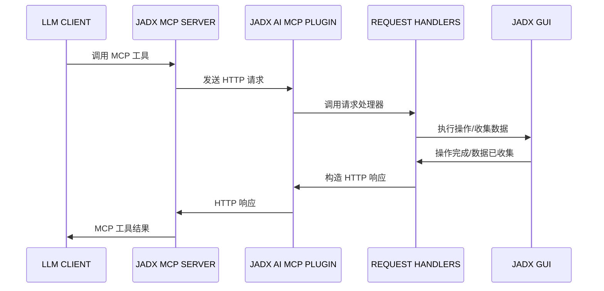

<div align="center">

# JADX-AI-MCP (Zin MCP Suite 的一部分)

⚡ 全自动化 MCP 服务器 + JADX 插件，通过 MCP 协议与 LLM 通信，使用 Claude 等大语言模型分析 Android APK——轻松发现漏洞、分析 APK、逆向工程。

[English](README.md) | 简体中文


[](http://www.apache.org/licenses/LICENSE-2.0.html)

#### ⭐ 贡献者

感谢这些优秀的贡献者 ⭐
<table>
  <tr align="center">
    <td>
      <a href="https://github.com/badmonkey7">
        
        <br /><sub><b>badmonkey7</b></sub>
      </a>
    </td>
       <td>
      <a href="https://github.com/tiann">
        
        <br /><sub><b>tiann</b></sub>
      </a>
    </td>
    <td>
      <a href="https://github.com/ljt270864457">
        
        <br /><sub><b>ljt270864457</b></sub>
      </a>
    </td>
    <td>
      <a href="https://github.com/ZERO-A-ONE">
        
        <br /><sub><b>ZERO-A-ONE</b></sub>
      </a>
    </td>
    <td>
      <a href="https://github.com/neoz">
        
        <br /><sub><b>neoz</b></sub>
      </a>
    </td>
    <td>
      <a href="https://github.com/SamadiPour">
        
        <br /><sub><b>SamadiPour</b></sub>
      </a>
    </td>
    <td>
      <a href="https://github.com/wuseluosi">
        
        <br /><sub><b>wuseluosi</b></sub>
      </a>
    </td>
    <td>
      <a href="https://github.com/CainYzb">
        
        <br /><sub><b>CainYzb</b></sub>
      </a>
    </td>
    <td>
      <a href="https://github.com/tbodt">
        
        <br /><sub><b>tbodt</b></sub>
      </a>
    </td>
    <td>
      <a href="https://github.com/LilNick0101">
        
        <br /><sub><b>LilNick0101</b></sub>
      </a>
    </td>
    <td>
      <a href="https://github.com/lwsinclair">
        
        <br /><sub><b>lwsinclair</b></sub>
      </a>
    </td>
  </tr>
</table>

</div>

<div align="center">
    
</div>

#### 阅读文档
- 在线文档：https://jadx-ai-mcp.readthedocs.io/en/latest/

---

## 🤖 什么是 JADX-AI-MCP？

**JADX-AI-MCP** 是 [JADX 反编译器](https://github.com/skylot/jadx)的插件，直接与 [Model Context Protocol (MCP)](https://github.com/anthropic/mcp) 集成，为 **Claude 等 LLM 提供实时逆向工程支持**。

核心理念："反编译 → 上下文感知代码审查 → AI 建议" — 全部实时完成。

#### 高层序列图



### 观看演示视频！

- **快速分析**

https://github.com/user-attachments/assets/b65c3041-fde3-4803-8d99-45ca77dbe30a

- **快速发现漏洞**

https://github.com/user-attachments/assets/c184afae-3713-4bc0-a1d0-546c1f4eb57f

- **多 AI 代理支持**

https://github.com/user-attachments/assets/6342ea0f-fa8f-44e6-9b3a-4ceb8919a5b0

- **在你喜欢的 LLM 客户端中运行**

https://github.com/user-attachments/assets/b4a6b280-5aa9-4e76-ac72-a0abec73b809

- **分析 APK 资源**

https://github.com/user-attachments/assets/f42d8072-0e3e-4f03-93ea-121af4e66eb1

- **使用 JADX 调试 APK 时的 AI 助手**

https://github.com/user-attachments/assets/2b0bd9b1-95c1-4f32-9b0c-38b864dd6aec

这是两个工具的组合：
1. JADX-AI-MCP
2. [JADX MCP SERVER](https://github.com/zinja-coder/jadx-mcp-server)

## 🤖 什么是 JADX-MCP-SERVER？

**JADX MCP Server** 是一个独立的 Python 服务器，通过 MCP（Model Context Protocol）与 `JADX-AI-MCP` 插件交互（参见：[jadx-ai-mcp](https://github.com/zinja-coder/jadx-ai-mcp)）。它让 LLM 能够实时与反编译的 Android 应用上下文通信。

---

## Zin MCP Suite 中的其他项目
- **[APKTool-MCP-Server](https://github.com/zinja-coder/apktool-mcp-server)**
- **[JADX-MCP-Server](https://github.com/zinja-coder/jadx-mcp-server)**
- **[ZIN-MCP-Client](https://github.com/zinja-coder/zin-mcp-client)**

## 当前 MCP 工具

以下 MCP 工具可用：

- `fetch_current_class()` — 获取当前选中类的名称和完整源码
- `get_selected_text()` — 获取当前选中的文本
- `get_all_classes()` — 列出项目中的所有类
- `get_class_source()` — 获取指定类的完整源码
- `get_method_by_name()` — 获取方法的源码
- `search_method_by_name()` — 跨类搜索方法
- `search_classes_by_keyword()` — 搜索源代码中包含特定关键字的类（支持分页）
- `get_methods_of_class()` — 列出类中的方法
- `get_fields_of_class()` — 列出类中的字段
- `get_smali_of_class()` — 获取类的 smali 代码
- `get_main_activity_class()` — 从 AndroidManifest.xml 中获取主 Activity
- `get_main_application_classes_code()` — 根据 AndroidManifest.xml 中定义的包名获取所有主应用类的代码
- `get_main_application_classes_names()` — 根据 AndroidManifest.xml 中定义的包名获取所有主应用类的名称
- `get_android_manifest()` — 检索并返回 AndroidManifest.xml 内容
- `get_strings()` : 获取 strings.xml 文件
- `get_all_resource_file_names()` : 检索应用程序中存在的所有资源文件名
- `get_resource_file()` : 检索资源文件内容
- `rename_class()` : 重命名类名
- `rename_method()` : 重命名方法
- `rename_field()` : 重命名字段
- `rename_package()` : 重命名整个包
- `debug_get_stack_frames()` : 从 jadx 调试器获取堆栈帧
- `debug_get_threads()` : 从 jadx 调试器获取线程信息
- `debug_get_variables()` : 从 jadx 调试器获取变量
- `xrefs_to_class()` : 查找对类的所有引用（返回方法级和类级引用，支持分页）
- `xrefs_to_method()` : 查找对方法的所有引用（包括重写相关方法，支持分页）
- `xrefs_to_field()` : 查找对字段的所有引用（返回访问该字段的方法，支持分页）

---

## 🗒️ 示例提示词

🔍 基础代码理解

    "用一段话解释这个类的作用。"

    "总结这个方法的职责。"

    "这个类中有混淆吗？"

    "列出这个类可能需要的所有 Android 权限。"

🛡️ 漏洞检测

    "这个方法中有不安全的 API 使用吗？"

    "检查这个类中的硬编码密钥或凭证。"

    "这个方法在使用用户输入之前是否进行了清理？"

    "这段代码可能引入什么安全漏洞？"

🛠️ 逆向工程助手

    "反混淆并将类和方法重命名为可读的名称。"

    "你能推断出这个 smali 方法的原始用途吗？"

    "这个类似乎属于哪个库或 SDK？"

    "告诉我哪些类包含与'加密'相关的代码？"

📦 静态分析

    "列出这个类中所有与网络相关的 API 调用。"

    "识别文件 I/O 操作及其潜在风险。"

    "这个方法是否泄漏设备信息或 PII？"

🤖 AI 代码修改

    "重构这个方法以提高可读性。"

    "为这段代码添加注释，解释每个步骤。"

    "将这个 Java 方法重写为 Python 以进行分析。"

📄 文档和元数据

    "为所有方法生成 Javadoc 风格的注释。"

    "这个类可能属于哪个包或应用组件？"

    "你能识别 Android 组件类型吗（Activity、Service 等）？"

🐞 调试助手
```
   "从调试器获取堆栈帧、变量和线程并提供摘要"

   "根据调试器的堆栈帧，解释应用程序的执行流程"

   "根据变量的状态，是否存在安全威胁？"
```

---

## 🛠️ 快速开始

### 1. 从 Releases 下载：https://github.com/zinja-coder/jadx-ai-mcp/releases

> [!NOTE]
>
> 下载 `jadx-ai-mcp-<version>.jar` 和 `jadx-mcp-server-<version>.zip` 两个文件。


```bash
# 0. 下载 jadx-ai-mcp-<version>.jar 和 jadx-mcp-server-<version>.zip
https://github.com/zinja-coder/jadx-ai-mcp/releases

# 1.
unzip jadx-ai-mcp-<version>.zip

├jadx-mcp-server/
  ├── jadx_mcp.py
  ├── requirements.txt
  ├── README.md
  ├── LICENSE

├jadx-ai-mcp-<version>.jar

# 2. 安装插件

# 有两种方法：

## 1. 一行命令 - 在 shell 中执行以下命令
jadx plugins --install "github:zinja-coder:jadx-ai-mcp"

## 上面的一行代码将直接安装最新版本的插件到 jadx，无需下载 jadx-ai-mcp 的 .jar 文件。
## 2. 或者你可以使用 JADX-GUI 通过以下图片所示的方式安装：
```

<div align="center">
    
</div>

<div align="center">
    
</div>

<div align="center">
    
</div>


```bash
## 3. GUI 方法，下载 .jar 文件并按照图片中显示的步骤操作
```


```bash
# 3. 导航到 jadx-mcp-server 目录
cd jadx-mcp-server

# 4. 本项目使用 uv - https://github.com/astral-sh/uv 而不是 pip 进行依赖管理。
    ## a. 安装 uv（如果你还没有）
curl -LsSf https://astral.sh/uv/install.sh | sh
    ## b. 可选，如果由于某些原因在 jadx-mcp-server 中遇到依赖错误，设置环境
uv venv
source .venv/bin/activate  # 或在 Windows 上使用 .venv\Scripts\activate
    ## c. 可选 安装依赖
uv pip install httpx fastmcp

# jadx-ai-mcp 和 jadx_mcp_server 的设置完成。
```

## 🤖 2. 使用 Claude Desktop

确保 Claude Desktop 已启用 MCP 运行。

例如，我在 Kali Linux 上使用了以下方法：https://github.com/aaddrick/claude-desktop-debian

配置并添加 MCP 服务器到 LLM 文件：
```bash
nano ~/.config/Claude/claude_desktop_config.json
```

对于：
   - Windows: `%APPDATA%\Claude\claude_desktop_config.json`
   - macOS: `~/Library/Application Support/Claude/claude_desktop_config.json`

并在其中添加以下内容：
```json
{
    "mcpServers": {
        "jadx-mcp-server": {
            "command": "/<path>/<to>/uv",
            "args": [
                "--directory",
                "</PATH/TO/>jadx-mcp-server/",
                "run",
                "jadx_mcp_server.py"
            ]
        }
    }
}
```

替换：

- `path/to/uv` 为你的 `uv` 可执行文件的实际路径
- `path/to/jadx-mcp-server` 为你克隆此仓库的绝对路径

然后，导航代码并通过内置集成使用实时代码审查提示进行交互。

**或者**

你可以使用以下命令直接将 jadx_mcp_server 安装为可执行文件：

```bash
uv tool install git+https://github.com/zinja-coder/jadx-mcp-server
```

然后你只需在 mcp 配置的 `command` 部分提供 `jadx_mcp_server`。

## 3. 使用 Cherry Studio

如果你想在 Cherry Studio 中配置 MCP 工具，可以参考以下配置。
- 类型：stdio
- 命令：uv
- 参数：
```bash
--directory
path/to/jadx-mcp-server
run
jadx_mcp_server.py
```
- `path/to/jadx-mcp-server` 为你克隆此仓库的绝对路径

## 4. 使用 LMStudio

你也可以通过配置 mcp.json 文件在 LM Studio 中使用 JADX AI MCP Server。这是视频指南。

https://github.com/user-attachments/assets/b4a6b280-5aa9-4e76-ac72-a0abec73b809

## 5. 在 HTTP Stream 模式下运行

你也可以使用 `--http` 选项以 HTTP Stream 模式使用 Jadx，如下所示：

```bash
uv run jadx_mcp_server.py --http

或

uv run jadx_mcp_server.py --http --port 9999
```

## 6. JADX AI MCP Plugin 的自定义端口配置


1. 配置端口：配置 JADX AI MCP Plugin 监听的端口。
2. 默认端口：恢复更改并监听默认端口。
3. 重启服务器：强制重启 JADX AI MCP Plugin 服务器。
4. 服务器状态：检查 JADX AI MCP Plugin 服务器的状态。

要连接在自定义端口上运行的 JADX AI MCP Plugin，将使用 `--jadx-port` 选项，如下所示：
```bash
uv run jadx_mcp_server.py --jadx-port 8652
```

上述 claude 的 MCP 配置如下：

```json
{
  "mcpServers": {
    "jadx-mcp-server": {
      "command": "/path/to/uv",
      "args": [
        "--directory",
        "/path/to/jadx-mcp-server/",
        "run",
        "jadx_mcp_server.py",
        "--jadx-port",
        "8652"
      ]
    }
  }
}
```

## 7. 🔐 认证与安全（v6.0.0 新增）

JADX AI MCP 现在支持**基于 Token 的认证**来保护你的逆向工程工作流！

### 为什么使用认证？

- ✅ **防止未授权访问** 当在内网暴露插件时
- ✅ **安全的远程分析** 场景
- ✅ **企业安全合规**
- ✅ **多用户环境**

### 快速设置

1. **在 JADX GUI 中启用**：`插件 → JADX AI MCP Server → Authentication Settings...`
2. **复制 Token**
3. **添加到 MCP 服务器**：

```bash
uv run jadx_mcp_server.py --auth-token "YOUR_TOKEN_HERE"
```

### 带认证的 Claude Desktop 配置

```json
{
  "mcpServers": {
    "jadx-mcp-server": {
      "command": "/path/to/uv",
      "args": [
        "--directory",
        "/path/to/jadx-ai-mcp/jadx-mcp-server/",
        "run",
        "jadx_mcp_server.py",
        "--auth-token",
        "YOUR_TOKEN_HERE"
      ]
    }
  }
}
```

📖 **完整认证指南**：[jadx-mcp-server/AUTHENTICATION.md](jadx-mcp-server/AUTHENTICATION.md)

### 远程访问配置

连接到运行在不同机器上的 JADX：

```bash
# MCP 服务器连接到远程 JADX 实例
uv run jadx_mcp_server.py \
  --jadx-host 192.168.1.100 \
  --jadx-port 8650 \
  --auth-token "YOUR_TOKEN_HERE"
```

在网络上暴露 MCP 服务器（带认证）：

```bash
# 允许外部连接到 MCP 服务器
uv run jadx_mcp_server.py \
  --http \
  --host 0.0.0.0 \
  --port 8651 \
  --auth-token "YOUR_TOKEN_HERE"
```

### 命令行选项

| 选项 | 默认值 | 描述 |
|------|--------|------|
| `--jadx-host` | `127.0.0.1` | JADX 插件 IP 地址 |
| `--jadx-port` | `8650` | JADX 插件端口 |
| `--host` | `127.0.0.1` | MCP 服务器绑定地址 |
| `--port` | `8651` | MCP 服务器端口（HTTP 模式）|
| `--auth-token` | None | 认证 Token |
| `--http` | False | 启用 HTTP stream 模式 |

## 试一试

1. 运行 jadx-gui 并加载任何 .apk 文件


2. 启动 claude - 你应该看到锤子图标


3. 点击 `hammer` 图标，你应该会看到类似以下内容：


4. 运行以下提示词：
```text
获取当前选中的类并对其进行快速 SAST
```


5. 在提示时允许访问：


6. 开始逆向工程！


此插件允许完全控制 GUI 和内部项目模型，以支持更深层次的 LLM 集成，包括：

- 将选定的类导出到 MCP
- 运行自动化 Claude 分析
- 内联接收建议

---

## 故障排除

[点击这里查看](https://github.com/zinja-coder/jadx-ai-mcp/edit/jadx-ai/TROUBLESHOOTING.md)

## 贡献者须知

 - 与 JADX-AI-MCP 相关的文件可以在此仓库中找到。

 - 与 **jadx-mcp-server** 相关的文件可以在[这里](https://github.com/zinja-coder/jadx-mcp-server)找到。

## 报告 Bug、问题、功能建议、性能问题、一般问题、文档问题

 - 请使用相应的模板开启一个 issue。

 - 已在 Claude Desktop 客户端上测试，对其他 AI 的支持即将测试！

## 🙏 致谢

本项目是 JADX 的插件，JADX 是由 [@skylot](https://github.com/skylot) 创建和维护的出色开源 Android 反编译器。所有核心反编译逻辑都归功于他们。我只是扩展了它以支持我的具有 AI 功能的 MCP 服务器。

[📎 原始 README（JADX）](https://github.com/skylot/jadx)

原始 JADX 的 README.md 已包含在此仓库中以供参考和致谢。

这个 MCP 服务器之所以能够实现，归功于 JADX-GUI 的可扩展性和令人惊叹的 Android 逆向工程社区。

还要特别感谢 [@aaddrick](https://github.com/aaddrick) 为基于 Debian 的 Linux 开发 Claude desktop。

最后感谢 [@anthropics](https://github.com/anthropics) 开发了 Model Context Protocol 和 [@FastMCP](https://github.com/modelcontextprotocol/python-sdk) 团队。

除此之外，非常感谢所有作为此项目依赖项的开源项目，使这个项目成为可能。

### 依赖

本项目使用以下优秀的库。

- 插件 - Java
  - Javalin     - https://javalin.io/ - Apache 2.0 License
  - SLF4J       - https://slf4j.org/  - MIT License
  - org.w3c.dom - https://mvnrepository.com/artifact/org.w3c.dom - W3C Software and Document License

- MCP Server - Python
  - FastMCP - https://github.com/jlowin/fastmcp - Apache 2.0 License
  - httpx   - https://www.python-httpx.org      - BSD-3-Clause ("BSD licensed")

## 📄 许可证

JADX-AI-MCP 和所有相关项目继承了原始 JADX 仓库的 Apache 2.0 许可证。

## ⚖️ 法律警告

**免责声明**

工具 `jadx-ai-mcp` 和 `jadx_mcp_server` 严格用于教育、研究和道德安全评估目的。它们按"原样"提供，不提供任何明示或暗示的保证。用户自行负责确保其使用这些工具符合所有适用的法律、法规和道德准则。

通过使用 `jadx-ai-mcp` 或 `jadx_mcp_server`，你同意仅在你有权测试的环境中使用它们，例如你拥有的应用程序或你有明确许可分析的应用程序。严禁将这些工具用于未经授权的逆向工程、侵犯知识产权或恶意活动。

`jadx-ai-mcp` 和 `jadx_mcp_server` 的开发者对因使用或误用这些工具而导致的任何损害、数据丢失、法律后果或其他后果概不负责。用户对其行为以及使用所造成的任何影响承担全部责任。

负责任地使用。尊重知识产权。遵循道德黑客实践。

---

## 🙌 贡献或支持

- 觉得有用？给它一个 ⭐️
- 有想法？开启一个 [issue](https://github.com/zinja-coder/jadx-ai-mcp/issues) 或提交 PR
- 在此基础上构建了什么？DM 我或提到我 — 我会将其添加到 README！
- 喜欢我的工作并希望它继续下去？赞助此项目。

---

Built with ❤️ for the reverse engineering and AI communities.
