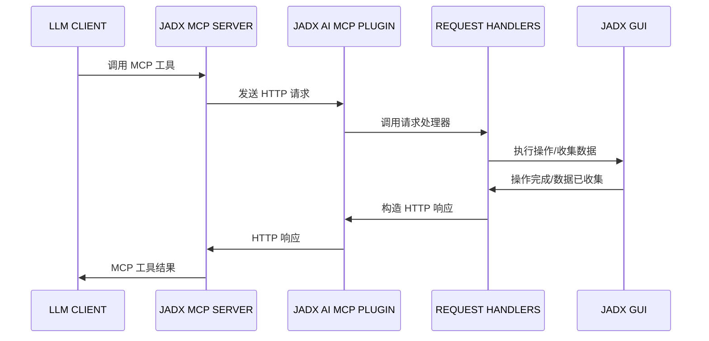

<div align="center">

# JADX-AI-MCP (Zin MCP Suite 的一部分)

> 🔱 **这是 [zinja-coder/jadx-ai-mcp](https://github.com/zinja-coder/jadx-ai-mcp) 的 Fork 版本**  
> 原始项目由 [@zinja-coder](https://github.com/zinja-coder) 创建。本 Fork 添加了多实例支持等增强功能。

⚡ 全自动化 MCP 服务器 + JADX 插件，通过 MCP 协议与 LLM 通信，使用 Claude 等大语言模型分析 Android APK——轻松发现漏洞、分析 APK、逆向工程。

**👉 原始项目**: [github.com/zinja-coder/jadx-ai-mcp](https://github.com/zinja-coder/jadx-ai-mcp)

[English](README.md) | 简体中文


[](http://www.apache.org/licenses/LICENSE-2.0.html)

#### ⭐ 贡献者

感谢这些优秀的贡献者 ⭐
<table>
  <tr align="center">
    <td>
      <a href="https://github.com/badmonkey7">
        
        <br /><sub><b>badmonkey7</b></sub>
      </a>
    </td>
       <td>
      <a href="https://github.com/tiann">
        
        <br /><sub><b>tiann</b></sub>
      </a>
    </td>
    <td>
      <a href="https://github.com/ljt270864457">
        
        <br /><sub><b>ljt270864457</b></sub>
      </a>
    </td>
    <td>
      <a href="https://github.com/ZERO-A-ONE">
        
        <br /><sub><b>ZERO-A-ONE</b></sub>
      </a>
    </td>
    <td>
      <a href="https://github.com/neoz">
        
        <br /><sub><b>neoz</b></sub>
      </a>
    </td>
    <td>
      <a href="https://github.com/SamadiPour">
        
        <br /><sub><b>SamadiPour</b></sub>
      </a>
    </td>
    <td>
      <a href="https://github.com/wuseluosi">
        
        <br /><sub><b>wuseluosi</b></sub>
      </a>
    </td>
    <td>
      <a href="https://github.com/CainYzb">
        
        <br /><sub><b>CainYzb</b></sub>
      </a>
    </td>
    <td>
      <a href="https://github.com/tbodt">
        
        <br /><sub><b>tbodt</b></sub>
      </a>
    </td>
    <td>
      <a href="https://github.com/LilNick0101">
        
        <br /><sub><b>LilNick0101</b></sub>
      </a>
    </td>
    <td>
      <a href="https://github.com/lwsinclair">
        
        <br /><sub><b>lwsinclair</b></sub>
      </a>
    </td>
  </tr>
</table>

</div>

---

## 🤖 什么是 JADX-AI-MCP？

**JADX-AI-MCP** 是 [JADX 反编译器](https://github.com/skylot/jadx)的插件，直接与 [Model Context Protocol (MCP)](https://github.com/anthropic/mcp) 集成，为 **Claude 等 LLM 提供实时逆向工程支持**。

> 💡 本项目最初由 [@zinja-coder](https://github.com/zinja-coder) 创建。查看[原始仓库](https://github.com/zinja-coder/jadx-ai-mcp)了解上游项目。

核心理念："反编译 → 上下文感知代码审查 → AI 建议" — 全部实时完成。

#### 高层序列图



### 观看演示视频！

- **快速分析**

https://github.com/user-attachments/assets/b65c3041-fde3-4803-8d99-45ca77dbe30a

- **快速发现漏洞**

https://github.com/user-attachments/assets/c184afae-3713-4bc0-a1d0-546c1f4eb57f

- **多 AI 代理支持**

https://github.com/user-attachments/assets/6342ea0f-fa8f-44e6-9b3a-4ceb8919a5b0

- **在你喜欢的 LLM 客户端中运行**

https://github.com/user-attachments/assets/b4a6b280-5aa9-4e76-ac72-a0abec73b809

- **分析 APK 资源**

https://github.com/user-attachments/assets/f42d8072-0e3e-4f03-93ea-121af4e66eb1

- **使用 JADX 调试 APK 时的 AI 助手**

https://github.com/user-attachments/assets/2b0bd9b1-95c1-4f32-9b0c-38b864dd6aec

这是两个工具的组合：
1. JADX-AI-MCP
2. [JADX MCP SERVER](https://github.com/zinja-coder/jadx-mcp-server)

## 🤖 什么是 JADX-MCP-SERVER？

**JADX MCP Server** 是一个独立的 Python 服务器，通过 MCP（Model Context Protocol）与 `JADX-AI-MCP` 插件交互（参见：[jadx-ai-mcp](https://github.com/zinja-coder/jadx-ai-mcp)）。它让 LLM 能够实时与反编译的 Android 应用上下文通信。

---

## Zin MCP Suite 中的其他项目
- **[APKTool-MCP-Server](https://github.com/zinja-coder/apktool-mcp-server)**
- **[JADX-MCP-Server](https://github.com/zinja-coder/jadx-mcp-server)**
- **[ZIN-MCP-Client](https://github.com/zinja-coder/zin-mcp-client)**

## 当前 MCP 工具

以下 MCP 工具可用。**所有工具都支持可选的 `instance_id` 参数用于多实例定向。**

### 代码分析工具
- `fetch_current_class(instance_id?)` — 获取当前选中类的名称和完整源码
- `get_selected_text(instance_id?)` — 获取当前选中的文本
- `get_all_classes(offset, count, instance_id?)` — 列出项目中的所有类
- `get_class_source(class_name, instance_id?)` — 获取指定类的完整源码
- `get_method_by_name(class_name, method_name, instance_id?)` — 获取方法的源码
- `search_method_by_name(method_name, instance_id?)` — 跨类搜索方法
- `search_classes_by_keyword(search_term, package?, search_in?, offset?, count?, instance_id?)` — 按关键字搜索类
- `get_methods_of_class(class_name, instance_id?)` — 列出类中的方法
- `get_fields_of_class(class_name, instance_id?)` — 列出类中的字段
- `get_smali_of_class(class_name, instance_id?)` — 获取类的 smali 代码
- `get_main_activity_class(instance_id?)` — 从 AndroidManifest.xml 中获取主 Activity
- `get_main_application_classes_code(offset?, count?, instance_id?)` — 获取主应用类的代码
- `get_main_application_classes_names(instance_id?)` — 获取主应用类的名称

### 资源工具
- `get_android_manifest(instance_id?)` — 检索 AndroidManifest.xml 内容
- `get_strings(offset?, count?, instance_id?)` — 获取 strings.xml 文件
- `get_all_resource_file_names(offset?, count?, instance_id?)` — 列出所有资源文件名
- `get_resource_file(resource_name, instance_id?)` — 检索资源文件内容

### 重构工具
- `rename_class(class_name, new_name, instance_id?)` — 重命名类
- `rename_method(method_name, new_name, instance_id?)` — 重命名方法
- `rename_field(class_name, field_name, new_name, instance_id?)` — 重命名字段
- `rename_package(old_name, new_name, instance_id?)` — 重命名包

### 调试工具
- `debug_get_stack_frames(instance_id?)` — 从调试器获取堆栈帧
- `debug_get_threads(instance_id?)` — 从调试器获取线程信息
- `debug_get_variables(instance_id?)` — 从调试器获取变量

### 交叉引用工具
- `get_xrefs_to_class(class_name, offset?, count?, instance_id?)` — 查找对类的所有引用
- `get_xrefs_to_method(class_name, method_name, offset?, count?, instance_id?)` — 查找对方法的所有引用
- `get_xrefs_to_field(class_name, field_name, offset?, count?, instance_id?)` — 查找对字段的所有引用

### 多实例管理工具
- `list_jadx_instances()` — 列出所有已连接的 JADX 实例
- `add_jadx_instance(host, port, name?)` — 动态添加新的 JADX 实例
- `remove_jadx_instance(name)` — 移除 JADX 实例
- `set_default_jadx_instance(name)` — 设置默认实例
- `get_jadx_instance_info(name)` — 获取实例详细信息
- `health_check_jadx_instances()` — 检查所有实例的健康状态

---

## 🗒️ 示例提示词

🔍 基础代码理解

    "用一段话解释这个类的作用。"

    "总结这个方法的职责。"

    "这个类中有混淆吗？"

    "列出这个类可能需要的所有 Android 权限。"

🛡️ 漏洞检测

    "这个方法中有不安全的 API 使用吗？"

    "检查这个类中的硬编码密钥或凭证。"

    "这个方法在使用用户输入之前是否进行了清理？"

    "这段代码可能引入什么安全漏洞？"

🛠️ 逆向工程助手

    "反混淆并将类和方法重命名为可读的名称。"

    "你能推断出这个 smali 方法的原始用途吗？"

    "这个类似乎属于哪个库或 SDK？"

    "告诉我哪些类包含与'加密'相关的代码？"

📦 静态分析

    "列出这个类中所有与网络相关的 API 调用。"

    "识别文件 I/O 操作及其潜在风险。"

    "这个方法是否泄漏设备信息或 PII？"

🤖 AI 代码修改

    "重构这个方法以提高可读性。"

    "为这段代码添加注释，解释每个步骤。"

    "将这个 Java 方法重写为 Python 以进行分析。"

📄 文档和元数据

    "为所有方法生成 Javadoc 风格的注释。"

    "这个类可能属于哪个包或应用组件？"

    "你能识别 Android 组件类型吗（Activity、Service 等）？"

🐞 调试助手
```
   "从调试器获取堆栈帧、变量和线程并提供摘要"

   "根据调试器的堆栈帧，解释应用程序的执行流程"

   "根据变量的状态，是否存在安全威胁？"
```

---

## 2. 手动安装

```bash
# 从 Releases 下载两个文件
https://github.com/xjoker/jadx-ai-mcp/releases

# 通过命令行安装插件
jadx plugins --install "github:xjoker:jadx-ai-mcp"

# 或通过 JADX GUI 安装：
# 插件 → 安装插件 → 选择下载的 JAR 文件

# 导航到 jadx-mcp-server 目录
cd jadx-mcp-server

# 安装 uv（如果未安装）
curl -LsSf https://astral.sh/uv/install.sh | sh

# 运行 MCP 服务器
uv run jadx_mcp_server.py
```


## 🤖 2. 使用 Claude Desktop

确保 Claude Desktop 已启用 MCP 运行。

例如，我在 Kali Linux 上使用了以下方法：https://github.com/aaddrick/claude-desktop-debian

配置并添加 MCP 服务器到 LLM 文件：
```bash
nano ~/.config/Claude/claude_desktop_config.json
```

对于：
   - Windows: `%APPDATA%\Claude\claude_desktop_config.json`
   - macOS: `~/Library/Application Support/Claude/claude_desktop_config.json`

并在其中添加以下内容：
```json
{
    "mcpServers": {
        "jadx-mcp-server": {
            "command": "/<path>/<to>/uv",
            "args": [
                "--directory",
                "</PATH/TO/>jadx-mcp-server/",
                "run",
                "jadx_mcp_server.py"
            ]
        }
    }
}
```

替换：

- `path/to/uv` 为你的 `uv` 可执行文件的实际路径
- `path/to/jadx-mcp-server` 为你克隆此仓库的绝对路径

然后，导航代码并通过内置集成使用实时代码审查提示进行交互。

**或者**

你可以使用以下命令直接将 jadx_mcp_server 安装为可执行文件：

```bash
uv tool install "git+https://github.com/xjoker/jadx-ai-mcp.git#subdirectory=jadx-mcp-server"
```

然后你只需在 mcp 配置的 `command` 部分提供 `jadx_mcp_server`。

## 3. 使用 Cherry Studio

如果你想在 Cherry Studio 中配置 MCP 工具，可以参考以下配置。
- 类型：stdio
- 命令：uv
- 参数：
```bash
--directory
path/to/jadx-mcp-server
run
jadx_mcp_server.py
```
- `path/to/jadx-mcp-server` 为你克隆此仓库的绝对路径

## 4. 使用 LMStudio

你也可以通过配置 mcp.json 文件在 LM Studio 中使用 JADX AI MCP Server。这是视频指南。

https://github.com/user-attachments/assets/b4a6b280-5aa9-4e76-ac72-a0abec73b809

## 5. 在 HTTP Stream 模式下运行

你也可以使用 `--http` 选项以 HTTP Stream 模式使用 Jadx，如下所示：

```bash
uv run jadx_mcp_server.py --http

或

uv run jadx_mcp_server.py --http --port 9999
```

## 6. 插件配置（统一设置面板）

所有插件设置现在通过**统一的设置对话框**管理：

**访问方式**：`插件 → JADX AI MCP Server → 设置...`

设置面板包括：
- **服务器配置**：端口、绑定地址、自动启动选项
- **实例设置**：用于多实例场景的自定义实例名称
- **认证设置**：Token 生成和管理
- **服务器控制**：启动、停止、重启和状态检查

要连接在自定义端口上运行的 JADX AI MCP Plugin，将使用 `--jadx-port` 选项，如下所示：
```bash
uv run jadx_mcp_server.py --jadx-port 8652
```

上述 claude 的 MCP 配置如下：

```json
{
  "mcpServers": {
    "jadx-mcp-server": {
      "command": "/path/to/uv",
      "args": [
        "--directory",
        "/path/to/jadx-mcp-server/",
        "run",
        "jadx_mcp_server.py",
        "--jadx-port",
        "8652"
      ]
    }
  }
}
```

## 7. 🔐 认证与安全

JADX AI MCP 现在支持**基于 Token 的认证**来保护你的逆向工程工作流！

### 为什么使用认证？

- ✅ **防止未授权访问** 当在内网暴露插件时
- ✅ **安全的远程分析** 场景
- ✅ **企业安全合规**
- ✅ **多用户环境**

### 快速设置

1. **在 JADX GUI 中打开设置**：`插件 → JADX AI MCP Server → 设置...`
2. **在“认证”选项卡中配置认证**
3. **复制 Token**
4. **添加到 MCP 服务器**：

```bash
uv run jadx_mcp_server.py --auth-token "YOUR_TOKEN_HERE"
```

### 带认证的 Claude Desktop 配置

```json
{
  "mcpServers": {
    "jadx-mcp-server": {
      "command": "/path/to/uv",
      "args": [
        "--directory",
        "/path/to/jadx-ai-mcp/jadx-mcp-server/",
        "run",
        "jadx_mcp_server.py",
        "--auth-token",
        "YOUR_TOKEN_HERE"
      ]
    }
  }
}
```
```


### 远程访问配置

连接到运行在不同机器上的 JADX：

```bash
# MCP 服务器连接到远程 JADX 实例
uv run jadx_mcp_server.py \
  --jadx-host 192.168.1.100 \
  --jadx-port 8650 \
  --auth-token "YOUR_TOKEN_HERE"
```

在网络上暴露 MCP 服务器（带认证）：

```bash
# 允许外部连接到 MCP 服务器
uv run jadx_mcp_server.py \
  --http \
  --host 0.0.0.0 \
  --port 8651 \
  --auth-token "YOUR_TOKEN_HERE"
```

### 命令行选项

| 选项 | 默认值 | 描述 |
|------|--------|------|
| `--jadx-host` | `127.0.0.1` | JADX 插件 IP 地址（传统单实例） |
| `--jadx-port` | `8650` | JADX 插件端口（传统单实例） |
| `--host` | `127.0.0.1` | MCP 服务器绑定地址 |
| `--port` | `8651` | MCP 服务器端口（HTTP 模式）|
| `--auth-token` | None | 认证 Token（所有实例共享） |
| `--http` | False | 启用 HTTP stream 模式 |
| `--jadx-instances` | None | 多个 JADX 实例：`host:port[:name],...` |

## 8. 🚀 多实例管理

JADX AI MCP 现在支持**同时连接多个 JADX 实例**！这非常适合：

- ✅ **并排比较不同 APK 版本**
- ✅ **并行分析多个应用**
- ✅ **团队协作**分析不同目标
- ✅ 跨版本的 **A/B 安全测试**

### 快速开始 - 多实例

```bash
# 启动时连接多个 JADX 实例
uv run jadx_mcp_server.py \
  --auth-token "YOUR_TOKEN" \
  --jadx-instances "192.168.1.10:8650:app-v1,192.168.1.11:8650:app-v2,localhost:8652:dev"
```

### 实例命名

- **自动命名**：如果未提供名称，实例将从 APK 信息命名（例如 `myapp-v123`）
- **自定义命名**：使用 `host:port:name` 格式指定名称

### 使用实例定向工具

所有 MCP 工具现在都支持可选的 `instance_id` 参数：

```python
# 示例：从特定实例获取类源码
get_class_source(class_name="com.example.MainActivity", instance_id="app-v2")

# 示例：比较两个版本的 Manifest
manifest_v1 = get_android_manifest(instance_id="app-v1")
manifest_v2 = get_android_manifest(instance_id="app-v2")
```

### 实例管理工具

```python
# 列出所有已连接的实例
list_jadx_instances()
# 返回: {"instances": [{"name": "app-v1", "host": "192.168.1.10", "port": 8650, ...}]}

# 动态添加新实例
add_jadx_instance(host="192.168.1.20", port=8650, name="app-v3")

# 设置默认实例（未指定 instance_id 时使用）
set_default_jadx_instance(name="app-v2")

# 获取实例详细信息
get_jadx_instance_info(name="app-v1")
# 返回: {"name": "app-v1", "apk_info": {...}, "status": "online", ...}

# 检查所有实例的健康状态
health_check_jadx_instances()
# 返回: {"total": 3, "online": 2, "offline": 1, "results": [...]}

# 移除实例
remove_jadx_instance(name="app-v3")
```

### 多实例的 Claude Desktop 配置

```json
{
  "mcpServers": {
    "jadx-mcp-server": {
      "command": "/path/to/uv",
      "args": [
        "--directory",
        "/path/to/jadx-ai-mcp/jadx-mcp-server/",
        "run",
        "jadx_mcp_server.py",
        "--auth-token",
        "YOUR_TOKEN",
        "--jadx-instances",
        "192.168.1.10:8650:xhs-v8,192.168.1.11:8650:xhs-v9"
      ]
    }
  }
}
```

### 多实例示例提示词

```
"比较 xhs-v8 和 xhs-v9 实例之间的 MainActivity"

"列出两个版本中所有与加密相关的类"

"检查 v8 中的漏洞在 v9 中是否已修复"

"分析两个版本之间的网络 API 变化"
```

---


## 故障排除

如果遇到问题：
1. 确保 JADX GUI 正在运行并已加载 APK
2. 验证插件已安装并启用
3. 检查 MCP 服务器正在运行
4. 如果使用认证，确保 Token 匹配
5. 对于网络问题，检查防火墙设置


## 贡献者须知

 - 与 JADX-AI-MCP 相关的文件可以在此仓库中找到。

 - 与 **jadx-mcp-server** 相关的文件可以在[这里](https://github.com/xjoker/jadx-ai-mcp/tree/jadx-ai/jadx-mcp-server)找到。

## 报告 Bug、问题、功能建议、性能问题、一般问题、文档问题

 - 请使用相应的模板开启一个 issue。

 - 已在 Claude Desktop 客户端上测试，对其他 AI 的支持即将测试！

## 🙏 致谢

本项目是 JADX 的插件，JADX 是由 [@skylot](https://github.com/skylot) 创建和维护的出色开源 Android 反编译器。所有核心反编译逻辑都归功于他们。我只是扩展了它以支持我的具有 AI 功能的 MCP 服务器。

本项目是 [jadx-ai-mcp](https://github.com/zinja-coder/jadx-ai-mcp) 的 Fork 版本，原作者是 [zinja-coder](https://github.com/zinja-coder)。非常感谢他们的原创工作！

[📎 原始 README（JADX）](https://github.com/skylot/jadx)

原始 JADX 的 README.md 已包含在此仓库中以供参考和致谢。

这个 MCP 服务器之所以能够实现，归功于 JADX-GUI 的可扩展性和令人惊叹的 Android 逆向工程社区。

还要特别感谢 [@aaddrick](https://github.com/aaddrick) 为基于 Debian 的 Linux 开发 Claude desktop。

最后感谢 [@anthropics](https://github.com/anthropics) 开发了 Model Context Protocol 和 [@FastMCP](https://github.com/modelcontextprotocol/python-sdk) 团队。

除此之外，非常感谢所有作为此项目依赖项的开源项目，使这个项目成为可能。

### 依赖

本项目使用以下优秀的库。

- 插件 - Java
  - Javalin     - https://javalin.io/ - Apache 2.0 License
  - SLF4J       - https://slf4j.org/  - MIT License
  - org.w3c.dom - https://mvnrepository.com/artifact/org.w3c.dom - W3C Software and Document License

- MCP Server - Python
  - FastMCP - https://github.com/jlowin/fastmcp - Apache 2.0 License
  - httpx   - https://www.python-httpx.org      - BSD-3-Clause ("BSD licensed")

## 📄 许可证

JADX-AI-MCP 和所有相关项目继承了原始 JADX 仓库的 Apache 2.0 许可证。

## ⚖️ 法律警告

**免责声明**

工具 `jadx-ai-mcp` 和 `jadx_mcp_server` 严格用于教育、研究和道德安全评估目的。它们按"原样"提供，不提供任何明示或暗示的保证。用户自行负责确保其使用这些工具符合所有适用的法律、法规和道德准则。

通过使用 `jadx-ai-mcp` 或 `jadx_mcp_server`，你同意仅在你有权测试的环境中使用它们，例如你拥有的应用程序或你有明确许可分析的应用程序。严禁将这些工具用于未经授权的逆向工程、侵犯知识产权或恶意活动。

`jadx-ai-mcp` 和 `jadx_mcp_server` 的开发者对因使用或误用这些工具而导致的任何损害、数据丢失、法律后果或其他后果概不负责。用户对其行为以及使用所造成的任何影响承担全部责任。

负责任地使用。尊重知识产权。遵循道德黑客实践。

---

## 🙌 贡献或支持

- 觉得有用？给它一个 ⭐️
- 有想法？开启一个 [issue](https://github.com/xjoker/jadx-ai-mcp/issues) 或提交 PR
- 在此基础上构建了什么？DM 我或提到我 — 我会将其添加到 README！
- 喜欢我的工作并希望它继续下去？赞助此项目。

---

Built with ❤️ for the reverse engineering and AI communities.
