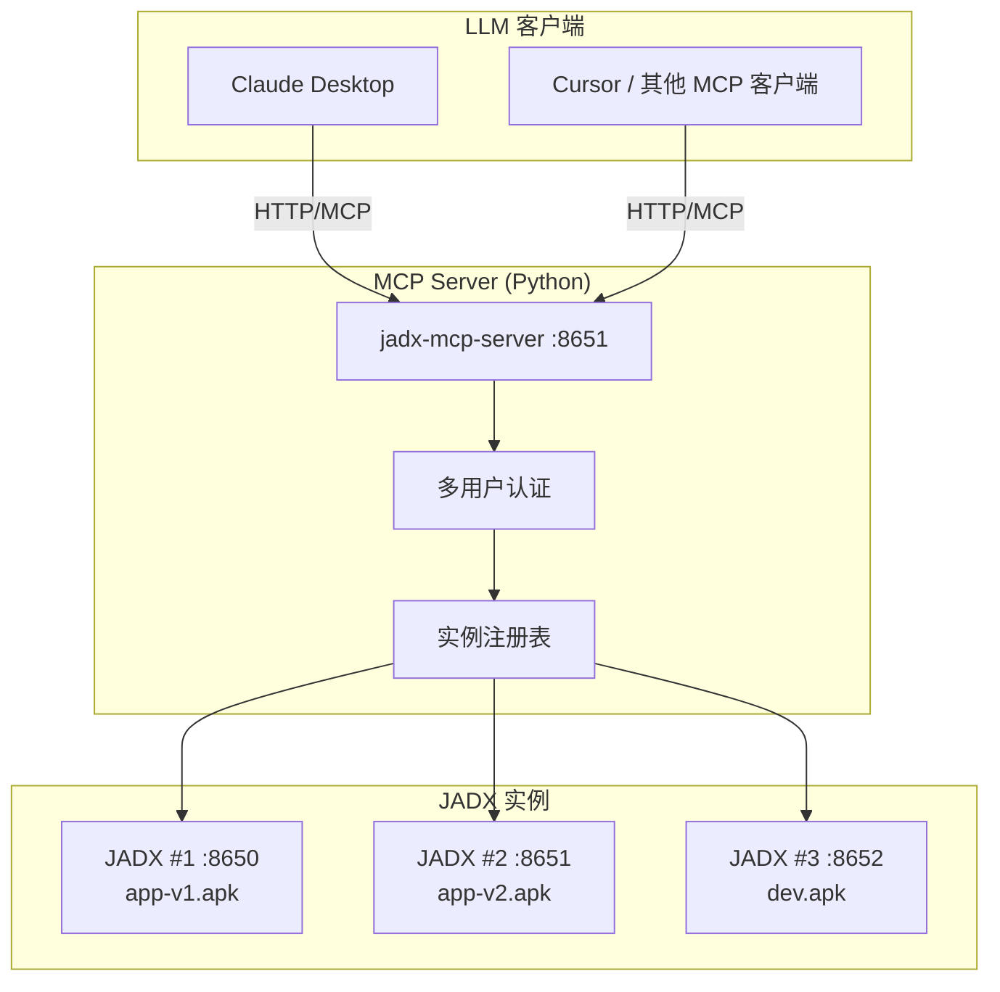
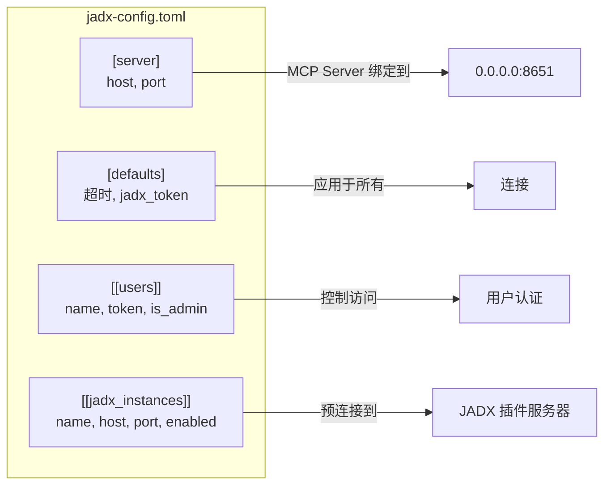
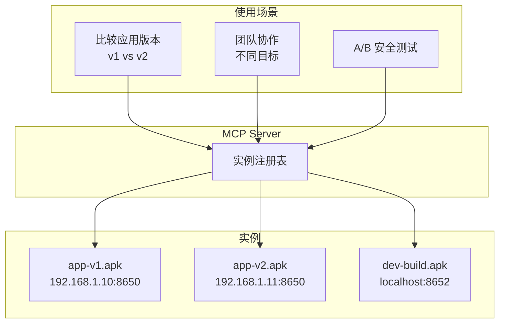
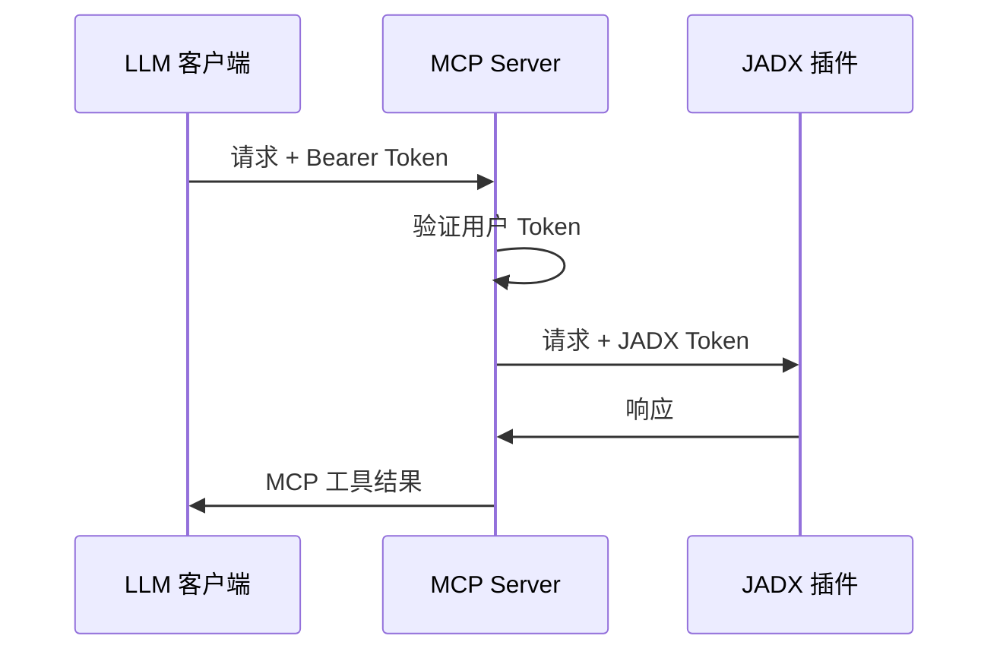

<div align="center">

# JADX-AI-MCP (Zin MCP Suite 的一部分)

> 🔱 **这是 [zinja-coder/jadx-ai-mcp](https://github.com/zinja-coder/jadx-ai-mcp) 的 Fork 版本**  
> 原始项目由 [@zinja-coder](https://github.com/zinja-coder) 创建。本 Fork 添加了多实例支持、多用户认证等增强功能。

⚡ 全自动化 MCP 服务器 + JADX 插件，通过 MCP 协议与 LLM 通信，使用 Claude 等大语言模型分析 Android APK——轻松发现漏洞、分析 APK、逆向工程。

**👉 原始项目**: [github.com/zinja-coder/jadx-ai-mcp](https://github.com/zinja-coder/jadx-ai-mcp)

[English](README.md) | 简体中文


[](http://www.apache.org/licenses/LICENSE-2.0.html)

</div>

---

## 🤖 什么是 JADX-AI-MCP？

**JADX-AI-MCP** 是 [JADX 反编译器](https://github.com/skylot/jadx)的插件，直接与 [Model Context Protocol (MCP)](https://github.com/anthropic/mcp) 集成，为 **Claude 等 LLM 提供实时逆向工程支持**。

核心理念：**反编译 → 上下文感知代码审查 → AI 建议** — 全部实时完成。

---

## 🚀 快速开始

### 架构概览



### 步骤 1: 安装 JADX 插件

```bash
jadx plugins --install "github:xjoker:jadx-ai-mcp"
```

### 步骤 2: 启动 MCP Server

**方式 A: Docker（推荐）**

```bash
# All-in-One: JADX GUI + MCP Server
docker run -d -p 6080:6080 -p 8651:8651 xjoker/jadx-ai-mcp:latest

# 仅 MCP Server
docker run -d -p 8651:8651 xjoker/jadx-mcp-server:latest
```

**方式 B: 本地安装**

```bash
# 安装 uv 包管理器
curl -LsSf https://astral.sh/uv/install.sh | sh

# 运行 MCP Server
uv tool install "git+https://github.com/xjoker/jadx-ai-mcp#subdirectory=jadx-mcp-server"
jadx_mcp_server --http --host 0.0.0.0 --port 8651
```

### 步骤 3: 连接 LLM 客户端

```bash
# Claude CLI - 连接到 HTTP MCP Server
claude mcp add --transport http jadx http://localhost:8651/mcp
```

或配置 `claude_desktop_config.json`:

```json
{
  "mcpServers": {
    "jadx": {
      "type": "http",
      "url": "http://localhost:8651/mcp"
    }
  }
}
```

---

## 📦 Docker 部署

提供两种 Docker 镜像：

| 镜像 | 描述 | 大小 | 适用场景 |
|------|------|------|----------|
| `xjoker/jadx-ai-mcp` | JADX GUI + noVNC + MCP Server | ~800MB | 快速上手、单 APK |
| `xjoker/jadx-mcp-server` | 仅 MCP Server | ~100MB | 生产环境、多实例 |

### All-in-One 容器

```bash
docker run -d --name jadx \
  -p 6080:6080 \
  -p 8650:8650 \
  -p 8651:8651 \
  -v $(pwd)/apks:/apks \
  xjoker/jadx-ai-mcp:latest
```

**访问方式：**
- 🌐 **noVNC 桌面**: http://localhost:6080
- 🔌 **插件 API**: http://localhost:8650
- 🤖 **MCP Server**: http://localhost:8651

### 独立 MCP Server

用于生产环境，连接多个 JADX 实例：

```bash
docker run -d --name mcp-server \
  -p 8651:8651 \
  -v $(pwd)/config:/app/data/config \
  xjoker/jadx-mcp-server:latest \
  /usr/local/bin/uv run jadx_mcp_server --http --config /app/data/config/jadx-config.toml
```

---

## ⚙️ 配置文件

创建 `jadx-config.toml` 进行高级配置：

### 完整配置参考

```toml
# =============================================================================
# 服务器配置
# =============================================================================
[server]
host = "0.0.0.0"          # 绑定地址（Docker 使用 0.0.0.0）
port = 8651               # MCP Server 端口

# =============================================================================
# 默认设置
# =============================================================================
[defaults]
request_timeout = 120     # HTTP 请求超时（秒）
busy_timeout = 300        # 最大等待时间（秒）
jadx_token = ""           # 默认 JADX 插件认证 Token

# =============================================================================
# 多用户认证
# =============================================================================
# 每个用户获得唯一 Token 用于 MCP 客户端认证
# 用户创建的动态实例仅对该用户可见

[[users]]
name = "alice"
token = "token-alice-xxxxx"

[[users]]
name = "bob"
token = "token-bob-yyyyy"

[[users]]
name = "admin"
token = "token-admin-zzzzz"
is_admin = true           # 管理员可查看所有用户的实例

# =============================================================================
# 预配置 JADX 实例
# =============================================================================
# 这些实例是共享的，对所有用户可见

[[jadx_instances]]
name = "app-v1"
host = "192.168.1.10"
port = 8650
enabled = true
token = ""                # 实例专用 Token（可选）

[[jadx_instances]]
name = "app-v2"
host = "192.168.1.11"
port = 8650
enabled = true

[[jadx_instances]]
name = "local-dev"
host = "127.0.0.1"
port = 8650
enabled = false           # 禁用，不会连接
```

### 配置选项说明



| 配置节 | 键 | 描述 |
|--------|-----|------|
| `[server]` | `host` | MCP Server 绑定地址 |
| `[server]` | `port` | MCP Server 端口 |
| `[defaults]` | `request_timeout` | JADX 请求的 HTTP 超时 |
| `[defaults]` | `jadx_token` | JADX 插件的默认认证 Token |
| `[[users]]` | `name` | 用户名（用于标识） |
| `[[users]]` | `token` | MCP 客户端认证的 Bearer Token |
| `[[users]]` | `is_admin` | 可查看所有用户的动态实例 |
| `[[jadx_instances]]` | `name` | 实例标识符 |
| `[[jadx_instances]]` | `host` | JADX 插件 IP 地址 |
| `[[jadx_instances]]` | `port` | JADX 插件端口 |
| `[[jadx_instances]]` | `enabled` | 是否在启动时连接 |

---

## 🔗 多实例管理

### 为什么需要多实例？



### 通过配置连接

```toml
[[jadx_instances]]
name = "xhs-v8"
host = "192.168.1.10"
port = 8650

[[jadx_instances]]
name = "xhs-v9"
host = "192.168.1.11"
port = 8650
```

### 通过 AI 命令连接

```
请连接到 JADX 192.168.1.100:8650，命名为 "my-app"

或多个：
连接以下 JADX 实例：
1. 192.168.1.10:8650 命名为 "app-v1"
2. 192.168.1.11:8650 命名为 "app-v2"
```

### 定向特定实例

所有 MCP 工具都支持 `instance_id` 参数：

```
获取 app-v1 的 MainActivity

比较 app-v1 和 app-v2 的加密方法

检查 v1 中的漏洞在 v2 中是否已修复
```

---

## 🔐 认证

### 认证流程



### 用户隔离

| 实例类型 | 可见性 |
|----------|--------|
| **配置实例** | 所有用户（共享）|
| **动态实例** | 仅所有者 |
| **管理员用户** | 所有实例 |

### 带认证连接

```bash
# Claude CLI 使用 Bearer token
claude mcp add --transport http jadx http://server:8651/mcp \
  --header "Authorization: Bearer token-alice-xxxxx"
```

```json
// claude_desktop_config.json
{
  "mcpServers": {
    "jadx": {
      "type": "http",
      "url": "http://server:8651/mcp",
      "headers": {
        "Authorization": "Bearer token-alice-xxxxx"
      }
    }
  }
}
```

---

## 🛠️ 命令行参考

```bash
jadx_mcp_server [选项]
```

| 选项 | 默认值 | 描述 |
|------|--------|------|
| `--config FILE` | None | TOML 配置文件路径 |
| `--http` | False | 启用 HTTP 模式（远程访问必需）|
| `--host HOST` | 127.0.0.1 | MCP Server 绑定地址 |
| `--port PORT` | 8651 | MCP Server 端口 |
| `--jadx-host HOST` | 127.0.0.1 | 单个 JADX 实例地址 |
| `--jadx-port PORT` | 8650 | 单个 JADX 实例端口 |
| `--jadx-instances LIST` | None | 多个实例：`host:port:name,...` |
| `--auth-token TOKEN` | None | JADX 插件认证 Token |
| `--mcp-auth-token TOKEN` | None | MCP 服务器认证 Token（单用户）|

### 示例

```bash
# 简单本地设置
jadx_mcp_server

# HTTP 模式用于远程访问
jadx_mcp_server --http --host 0.0.0.0

# 使用配置文件
jadx_mcp_server --http --config jadx-config.toml

# 通过 CLI 连接多个实例
jadx_mcp_server --http --jadx-instances "192.168.1.10:8650:v1,192.168.1.11:8650:v2"
```

---

## 🔌 JADX 插件设置

在 JADX GUI 中：`插件 → JADX AI MCP Server → 设置...`

| 设置 | 描述 |
|------|------|
| **端口** | 插件 HTTP API 端口（默认：8650）|
| **绑定地址** | 网络访问使用 `0.0.0.0` |
| **自动启动** | JADX 启动时启动服务器 |
| **认证 Token** | MCP Server 认证用的 Token |

---

## 📝 MCP 工具列表

所有工具都支持可选的 `instance_id` 参数用于多实例定向。

### 代码分析工具
- `fetch_current_class` — 获取当前选中类的源码
- `get_class_source` — 获取指定类的完整源码
- `batch_get_class_source` — 批量获取多个类的源码（最多 20 个）
- `get_method_by_name` — 获取方法的源码
- `search_classes_by_keyword` — 按关键字搜索类

### 资源工具
- `get_android_manifest` — 获取 AndroidManifest.xml
- `get_strings` — 获取 strings.xml 文件
- `get_resource_file` — 获取资源文件内容

### 多实例管理工具
- `list_jadx_instances` — 列出所有已连接的实例
- `add_jadx_instance` — 动态添加新实例
- `remove_jadx_instance` — 移除实例
- `health_check_jadx_instances` — 检查所有实例健康状态

---

## 故障排除

如果遇到问题：
1. 确保 JADX GUI 正在运行并已加载 APK
2. 验证插件已安装并启用
3. 检查 MCP Server 正在运行
4. 如果使用认证，确保 Token 匹配
5. 对于网络问题，检查防火墙设置

---

## 🙏 致谢

本项目是 JADX 的插件，JADX 是由 [@skylot](https://github.com/skylot) 创建的开源 Android 反编译器。本项目是 [jadx-ai-mcp](https://github.com/zinja-coder/jadx-ai-mcp) 的 Fork 版本，原作者是 [zinja-coder](https://github.com/zinja-coder)。

### 依赖

- 插件 - Java: Javalin, SLF4J
- MCP Server - Python: FastMCP, httpx

## 📄 许可证

JADX-AI-MCP 继承了原始 JADX 仓库的 Apache 2.0 许可证。

## ⚖️ 法律警告

工具 `jadx-ai-mcp` 和 `jadx_mcp_server` 严格用于教育、研究和道德安全评估目的。用户自行负责确保其使用符合所有适用的法律。

---

## 🙌 贡献或支持

- 觉得有用？给个 ⭐️
- 有想法？开一个 [issue](https://github.com/xjoker/jadx-ai-mcp/issues) 或提交 PR

---

为逆向工程和 AI 社区倾心打造 ❤️
