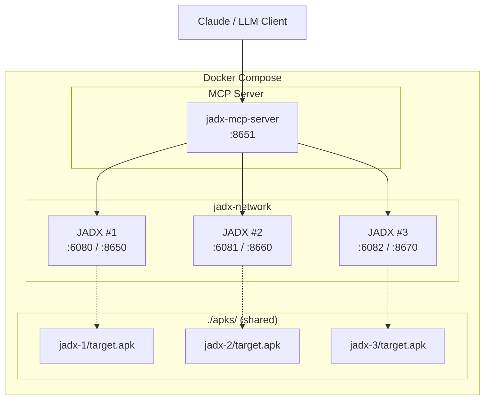

# JADX-AI-MCP Docker Compose Quick Start

English | [简体中文](QUICK_START.zh-cn.md)

## 📦 One-Click Start

```bash
# 1. Enter docker directory
cd docker

# 2. Start all services
docker compose up -d

# 3. Check service status
docker compose ps
```

## 🌐 Access URLs

| Service | URL | Description |
|:--------|:----|:------------|
| **MCP Server** | http://localhost:8651/mcp | Connect Claude/LLM |
| **JADX #1** | http://localhost:6080 | noVNC Desktop |
| **JADX #2** | http://localhost:6081 | noVNC Desktop |
| **JADX #3** | http://localhost:6082 | noVNC Desktop |

## 📱 Load APK

### Method 1: Auto-load (Recommended)

Name your APK as `target.apk` and place it in the corresponding directory. JADX will load it automatically on startup:

```bash
apks/jadx-1/target.apk  → JADX #1 auto-opens
apks/jadx-2/target.apk  → JADX #2 auto-opens
apks/jadx-3/target.apk  → JADX #3 auto-opens
```

### Method 2: Manual Load

1. Access JADX's noVNC page
2. In JADX GUI: File → Open → `/apks/your-app.apk`

## 🤖 Connect Claude

```bash
# Claude CLI
claude mcp add --transport http jadx http://localhost:8651/mcp
```

Or add to `claude_desktop_config.json`:

```json
{
  "mcpServers": {
    "jadx": {
      "type": "http",
      "url": "http://localhost:8651/mcp"
    }
  }
}
```

## 📊 Architecture



## 🎯 Use Cases

### Scenario 1: Compare APP Versions
```
Open app-v1.apk in JADX #1
Open app-v2.apk in JADX #2
Ask AI: "Compare MainActivity differences between jadx-1 and jadx-2"
```

### Scenario 2: Team Collaboration
```
Alice uses JADX #1 for login module
Bob uses JADX #2 for payment module
Admin uses JADX #3 for overall audit
```

## 🛑 Stop Services

```bash
# Stop all services
docker compose down

# Stop and remove volumes (clear cache)
docker compose down -v
```

## ⚙️ Custom Configuration

Edit `config/jadx-config.toml` to:
- Add user authentication
- Modify timeout settings
- Add more JADX instances
