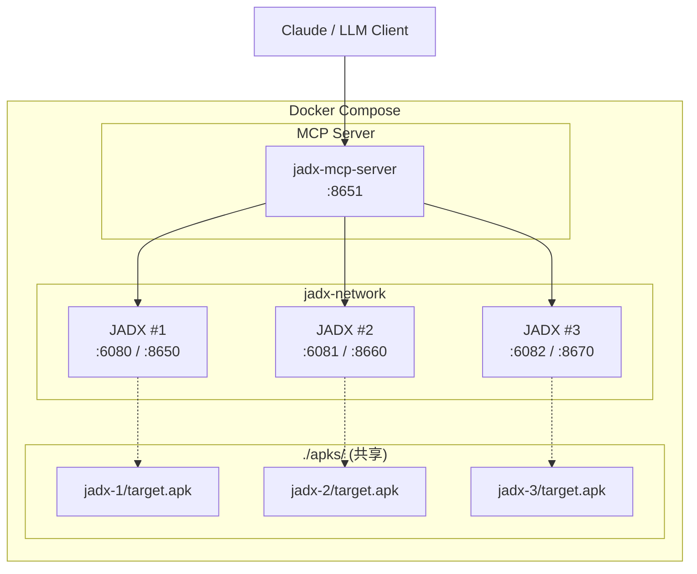

# JADX-AI-MCP Docker Compose 快速开始

**简体中文** | [English](QUICK_START.md)

## 📦 一键启动

```bash
# 1. 进入 docker 目录
cd docker

# 2. 启动所有服务
docker compose up -d

# 3. 查看服务状态
docker compose ps
```

## 🌐 访问地址

| 服务 | 地址 | 说明 |
|:-----|:-----|:-----|
| **MCP Server** | http://localhost:8651/mcp | 连接 Claude/LLM |
| **JADX #1** | http://localhost:6080 | noVNC 桌面 |
| **JADX #2** | http://localhost:6081 | noVNC 桌面 |
| **JADX #3** | http://localhost:6082 | noVNC 桌面 |

## 📱 加载 APK

### 方式 1: 自动加载（推荐）

将文件命名为 `target.jar`、`target.apk`、`target.aar` 或 `target.dex` 放入对应目录，JADX 启动时自动加载。

**支持格式**（优先级：JAR > APK > AAR > DEX）：

```bash
apks/jadx-1/target.jar  → JADX #1 自动打开（最高优先级）
apks/jadx-1/target.apk  → JADX #1 自动打开
apks/jadx-1/target.aar  → JADX #1 自动打开
apks/jadx-1/target.dex  → JADX #1 自动打开（最低优先级）
```

### 方式 2: 手动加载

1. 访问 JADX 的 noVNC 页面
2. 在 JADX GUI 中: File → Open → `/apks/your-app.apk`

> **重要**：JADX 插件 API 端口 (8650) 仅在**加载文件后**才会启动。如果未加载任何文件，MCP Server 将无法连接 JADX。

## 🤖 连接 LLM 客户端

### Claude Code CLI

```bash
# 无认证
claude mcp add --transport http jadx http://localhost:8651/mcp

# 带认证
claude mcp add --transport http jadx http://localhost:8651/mcp \
  --header "Authorization: Bearer token-alice-xxxxx"
```

### Claude Desktop

添加到 `claude_desktop_config.json`：

```json
{
  "mcpServers": {
    "jadx": {
      "type": "http",
      "url": "http://localhost:8651/mcp",
      "headers": {
        "Authorization": "Bearer token-alice-xxxxx"
      }
    }
  }
}
```

> 如果未启用认证，可移除 `headers` 字段。

### OpenAI Codex

添加到 `~/.codex/config.toml`：

```toml
[mcp_servers.jadx]
url = "http://localhost:8651/mcp"
bearer_token_env_var = "JADX_MCP_TOKEN"
```

然后在运行 Codex 前设置环境变量：

```bash
export JADX_MCP_TOKEN="token-alice-xxxxx"
```

## 📊 架构图



> **Docker 网络提示**：如果 MCP Server 运行在 Docker 容器内并需要连接宿主机上的 JADX，请使用 `host.docker.internal` 替代 `127.0.0.1` 作为 JADX 地址。Linux 上需在 `docker run` 命令中添加 `--add-host=host.docker.internal:host-gateway`。

## 🎯 使用场景

### 场景 1: 比较 APP 版本
```
将 app-v1.apk 在 JADX #1 打开
将 app-v2.apk 在 JADX #2 打开
让 AI: "比较 jadx-1 和 jadx-2 中 MainActivity 的差异"
```

### 场景 2: 团队协作
```
Alice 用 JADX #1 分析登录模块
Bob 用 JADX #2 分析支付模块
Admin 用 JADX #3 做整体审计
```

## 🛑 停止服务

```bash
# 停止所有服务
docker compose down

# 停止并删除数据卷（清理缓存）
docker compose down -v
```

## ⚙️ 自定义配置

编辑 `config/jadx-config.toml` 可以:
- 添加用户认证
- 修改超时时间
- 添加更多 JADX 实例

> **管理员用户**：设置了 `is_admin = true` 的用户可通过 AI 工具动态添加/移除 JADX 实例。详见 [README.zh-cn.md](README.zh-cn.md#权限与安全) 说明。
