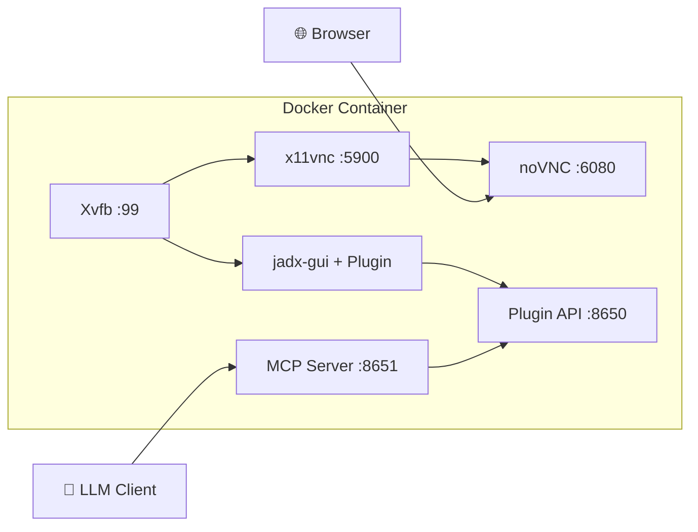

# JADX-AI-MCP Docker Deployment

Two Docker images are available for different use cases.

## Images

| Image | Description | Size |
|-------|-------------|------|
| `xjoker/jadx-ai-mcp` | All-in-One (JADX GUI + noVNC + MCP Server) | ~800MB |
| `xjoker/jadx-mcp-server` | Standalone MCP Server only | ~100MB |

## Architecture (All-in-One)



## Quick Start

### All-in-One Image

```bash
# Pull and run
docker pull xjoker/jadx-ai-mcp:latest
docker run -d --name jadx-ai-mcp \
  -p 6080:6080 \
  -p 8650:8650 \
  -p 8651:8651 \
  -v $(pwd)/apks:/apks \
  xjoker/jadx-ai-mcp

# Access
# - noVNC: http://localhost:6080
# - Plugin API: http://localhost:8650
# - MCP Server: http://localhost:8651
```

### Standalone MCP Server

```bash
# For production: run MCP Server separately
docker run -d --name jadx-mcp-server \
  -p 8651:8651 \
  -v $(pwd)/config:/app/data/config \
  xjoker/jadx-mcp-server

# Connect to remote JADX instances via config or AI commands
```

## Ports

| Port | Service | Description |
|------|---------|-------------|
| 6080 | noVNC | Web-based VNC desktop (All-in-One only) |
| 8650 | Plugin API | JADX plugin HTTP API |
| 8651 | MCP Server | LLM client connection endpoint |

## Configuration

### Multi-user Authentication

Create `config/jadx-config.toml`:

```toml
[server]
host = "0.0.0.0"
port = 8651

[[users]]
name = "alice"
token = "token-alice-xxxxx"

[[users]]
name = "admin"
token = "token-admin-zzzzz"
is_admin = true

[defaults]
jadx_token = ""

[[jadx_instances]]
name = "local"
host = "127.0.0.1"
port = 8650
```

Run with config:

```bash
docker run -d -p 8651:8651 \
  -v $(pwd)/config:/app/data/config \
  xjoker/jadx-mcp-server \
  uv run jadx_mcp_server --http --host 0.0.0.0 --config /app/data/config/jadx-config.toml
```

## Build from Source

```bash
# All-in-One
docker build -t jadx-ai-mcp -f docker/Dockerfile .

# MCP Server only
docker build -t jadx-mcp-server -f docker/Dockerfile.mcp .
```

## Troubleshooting

```bash
# Check logs
docker logs jadx-ai-mcp

# Access shell
docker exec -it jadx-ai-mcp bash

# Check services (All-in-One)
docker exec jadx-ai-mcp supervisorctl status
```

