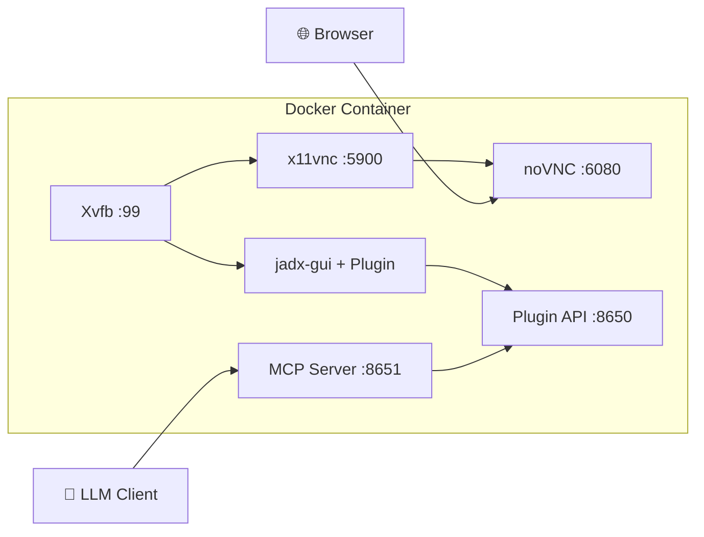
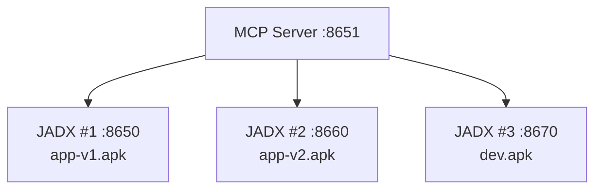

# JADX-AI-MCP Docker Deployment

English | [简体中文](README.zh-cn.md)

Two Docker images are available for different use cases.

## Images

| Image | Description | Size |
|-------|-------------|------|
| `xjoker/jadx-ai-mcp` | All-in-One (JADX GUI + noVNC + MCP Server) | ~800MB |
| `xjoker/jadx-mcp-server` | Standalone MCP Server only | ~100MB |

## Architecture (All-in-One)



## Quick Start

### All-in-One Image

**Standard Mode (GUI + AI) - Recommended:**

```bash
docker pull xjoker/jadx-ai-mcp:latest
docker run -d --name jadx-ai-mcp \
  -p 6080:6080 \
  -p 8651:8651 \
  -v $(pwd)/apks:/apks \
  -v jadx-cache:/root/.cache \
  xjoker/jadx-ai-mcp

# Access
# - noVNC GUI: http://localhost:6080
# - MCP Server: http://localhost:8651/mcp
```

> **Prerequisite**: The JADX plugin API port (8650) only starts after a file is loaded. Load an APK/JAR via auto-load or the GUI before connecting the MCP Server.

**Headless Mode (AI only, no GUI):**

```bash
docker run -d --name jadx-ai-mcp \
  -p 8651:8651 \
  -v $(pwd)/apks:/apks \
  -v jadx-cache:/root/.cache \
  xjoker/jadx-ai-mcp

# Access
# - MCP Server: http://localhost:8651/mcp
```

**Development / Multi-Container (all ports + config):**

```bash
docker run -d --name jadx-ai-mcp \
  -p 6080:6080 \
  -p 8650:8650 \
  -p 8651:8651 \
  -v $(pwd)/apks:/apks \
  -v $(pwd)/config:/app/data/config \
  -v jadx-cache:/root/.cache \
  -v jadx-gui-cache:/root/.jadx-gui \
  xjoker/jadx-ai-mcp

# Access
# - noVNC GUI: http://localhost:6080
# - Plugin API: http://localhost:8650
# - MCP Server: http://localhost:8651/mcp
```

### Volume Reference

| Volume | Path | Purpose |
|--------|------|---------|
| APK Files | `/apks` | Mount APK files for analysis |
| Config | `/app/data/config` | Configuration files (jadx-config.toml) |
| Cache | `/root/.cache` | JADX decompilation cache (10-50x faster) |
| GUI Settings | `/root/.jadx-gui` | GUI preferences persistence |

> **Tip**: First code search on large APK triggers decompilation (slow). Subsequent searches are fast due to cache.

### Environment Variables Reference

#### JADX Plugin (Java)

| Variable | Description | Default |
|:---------|:------------|:--------|
| `JADX_MCP_BIND_ADDRESS` | HTTP server bind address | `127.0.0.1` |
| `JADX_MCP_PORT` | HTTP server port | `8650` |
| `JADX_MCP_AUTH_TOKEN` | Authentication token | (none) |
| `JADX_MCP_AUTH_ENABLED` | Enable authentication | `false` |

> **Important**: Set `JADX_MCP_BIND_ADDRESS=0.0.0.0` for Docker multi-container deployments.

#### MCP Server (Python)

| Variable | Description | Default |
|:---------|:------------|:--------|
| `JADX_MCP_HOST` | MCP Server bind address | `0.0.0.0` |
| `JADX_HOST` | Default JADX plugin host | `127.0.0.1` |
| `JADX_PORT` | Default JADX plugin port | `8650` |

### Standalone MCP Server

For production environments connecting to external JADX instances:

**Option 1: With Config File**

```bash
# Create config
mkdir -p config
cat > config/jadx-config.toml << 'EOF'
[server]
host = "0.0.0.0"
port = 8651

[[jadx_instances]]
name = "jadx-1"
host = "192.168.1.10"
port = 8650
enabled = true
EOF

# Run
docker run -d --name jadx-mcp-server \
  -p 8651:8651 \
  -v $(pwd)/config:/app/data/config \
  xjoker/jadx-mcp-server
```

> **Docker Networking**: When the MCP Server container connects to JADX on the host, use `host.docker.internal` as the host address. On Linux, add `--add-host=host.docker.internal:host-gateway` to the `docker run` command. Within `docker-compose.yaml`, add `extra_hosts: ["host.docker.internal:host-gateway"]`.

**Option 2: With Environment Variables**

```bash
docker run -d --name jadx-mcp-server \
  -p 8651:8651 \
  -e JADX_HOST=192.168.1.10 \
  -e JADX_PORT=8650 \
  -e JADX_MCP_AUTH_TOKEN=your-token \
  xjoker/jadx-mcp-server
```

**Option 3: CLI Arguments**

```bash
docker run -d --name jadx-mcp-server \
  -p 8651:8651 \
  xjoker/jadx-mcp-server \
  jadx_mcp_server --http --host 0.0.0.0 \
    --jadx-instances "192.168.1.10:8650:app-v1,192.168.1.11:8650:app-v2"
```

## Ports

| Port | Service | Required? | Access From | Description |
|:----:|:--------|:---------:|:------------|:------------|
| **6080** | noVNC | Optional | Browser | Web-based VNC desktop (All-in-One only). Omit for headless mode. |
| **8650** | Plugin API | No* | Container Internal | JADX plugin HTTP API. Only expose for multi-container or debugging. |
| **8651** | MCP Server | **Yes** | AI Clients | **Main endpoint** for LLM clients (Claude, ChatGPT, etc.). |

> **\* Port 8650** is only needed for multi-container deployments where MCP Server runs in a separate container. In single-container mode (All-in-One), MCP Server connects internally via `localhost:8650`.

## Configuration

### Multi-user Authentication

Create `config/jadx-config.toml`:

```toml
[server]
host = "0.0.0.0"
port = 8651

[[users]]
name = "alice"
token = "token-alice-xxxxx"

[[users]]
name = "admin"
token = "token-admin-zzzzz"
is_admin = true

[defaults]
jadx_token = ""

[[jadx_instances]]
name = "local"
host = "127.0.0.1"
port = 8650
```

Run with config:

```bash
docker run -d -p 8651:8651 \
  -v $(pwd)/config:/app/data/config \
  xjoker/jadx-mcp-server \
  uv run jadx_mcp_server --http --host 0.0.0.0 --config /app/data/config/jadx-config.toml
```

### Permissions and Security

Users with `is_admin = true` have elevated privileges:

| Capability | Admin | Regular User |
|------------|-------|--------------|
| Use all analysis tools | Yes | Yes |
| View own JADX instances | Yes | Yes |
| View all JADX instances | Yes | No |
| Dynamically add/remove instances via AI | Yes | Requires `can_add_instances` |

To allow regular users to dynamically manage instances, add to the config:

```toml
[security]
allow_dynamic_instances = true

[[users]]
name = "alice"
token = "token-alice-xxxxx"
can_add_instances = true
```

> **SSRF Warning**: Enabling `allow_dynamic_instances` allows users to instruct the AI to connect to arbitrary hosts. Only enable this in trusted environments. Admin users can always manage instances regardless of this setting.

### Client Connection with Authentication

When `[[users]]` is configured, clients must include a Bearer token.

**Claude Code CLI:**

```bash
claude mcp add --transport http jadx http://localhost:8651/mcp \
  --header "Authorization: Bearer token-alice-xxxxx"
```

**Claude Desktop** (`claude_desktop_config.json`):

```json
{
  "mcpServers": {
    "jadx": {
      "type": "http",
      "url": "http://localhost:8651/mcp",
      "headers": {
        "Authorization": "Bearer token-alice-xxxxx"
      }
    }
  }
}
```

**OpenAI Codex** (`~/.codex/config.toml`):

```toml
[mcp_servers.jadx]
url = "http://localhost:8651/mcp"
bearer_token_env_var = "JADX_MCP_TOKEN"
```

> Codex does not support inline tokens. Use `bearer_token_env_var` to reference an environment variable:
> ```bash
> export JADX_MCP_TOKEN="token-alice-xxxxx"
> ```

## Build from Source

### Base Image (System Dependencies)

The All-in-One image uses a pre-built base image for faster CI builds:

```bash
# Build base image (only needed when system deps change)
docker build -t xjoker/jadx-ai-mcp-base:1.0 -f docker/Dockerfile.base .

# Push to registry (maintainers only)
docker push xjoker/jadx-ai-mcp-base:1.0
```

### Application Images

```bash
# All-in-One (uses base image)
docker build -t jadx-ai-mcp -f docker/Dockerfile .

# MCP Server only (standalone, no base image needed)
docker build -t jadx-mcp-server -f docker/Dockerfile.mcp .
```

---

## Multi-Instance Deployment

Deploy multiple JADX instances for parallel APK analysis:



### Example Setup

```bash
# Terminal 1: JADX instance for app-v1
docker run -d --name jadx-v1 -p 8650:8650 -p 6080:6080 \
  -v $(pwd)/app-v1.apk:/apks/app.apk \
  xjoker/jadx-ai-mcp

# Terminal 2: JADX instance for app-v2  
docker run -d --name jadx-v2 -p 8660:8650 -p 6081:6080 \
  -v $(pwd)/app-v2.apk:/apks/app.apk \
  xjoker/jadx-ai-mcp

# Terminal 3: MCP Server connecting both
docker run -d --name mcp -p 8651:8651 \
  -v $(pwd)/config:/app/data/config \
  xjoker/jadx-mcp-server

# Configure instances in config/jadx-config.toml
```

**config/jadx-config.toml:**

```toml
[[jadx_instances]]
name = "app-v1"
host = "host.docker.internal"  # or container IP
port = 8650

[[jadx_instances]]
name = "app-v2"
host = "host.docker.internal"
port = 8660
```

## Troubleshooting

```bash
# Check logs
docker logs jadx-ai-mcp

# Access shell
docker exec -it jadx-ai-mcp bash

# Check services (All-in-One)
docker exec jadx-ai-mcp supervisorctl status
```

### Common Issues

| Symptom | Cause | Solution |
|---------|-------|----------|
| MCP Server cannot connect to JADX | No file loaded in JADX | Open an APK/JAR in JADX GUI first |
| Connection refused from Docker container | Using `127.0.0.1` for host JADX | Use `host.docker.internal` instead |
| 401 Unauthorized | Token missing or incorrect | Check `[[users]]` token in config |
| Plugin API port not responding | JADX GUI not fully started | Wait for JADX GUI to finish loading |

