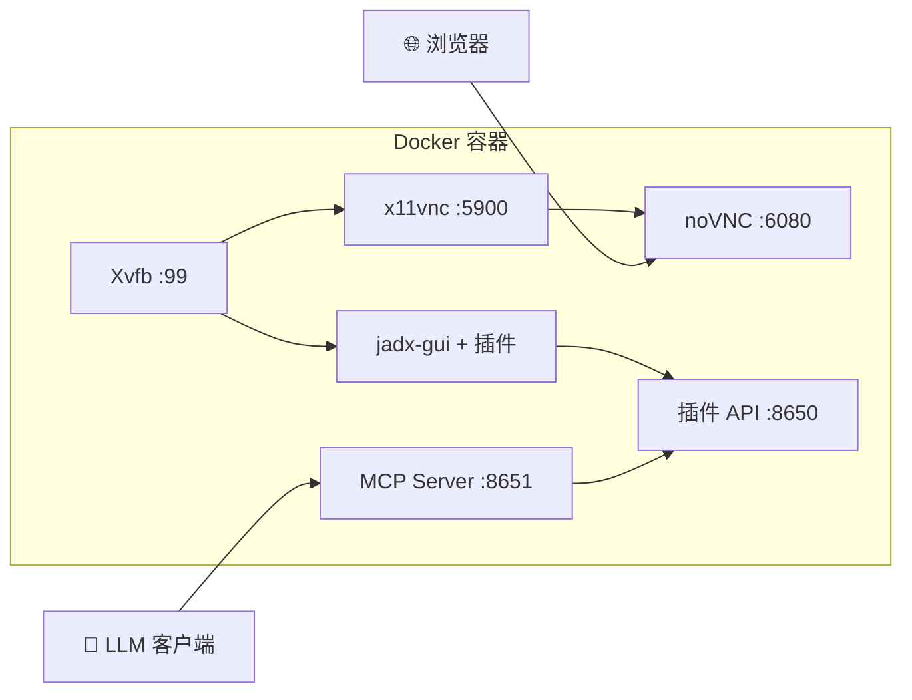
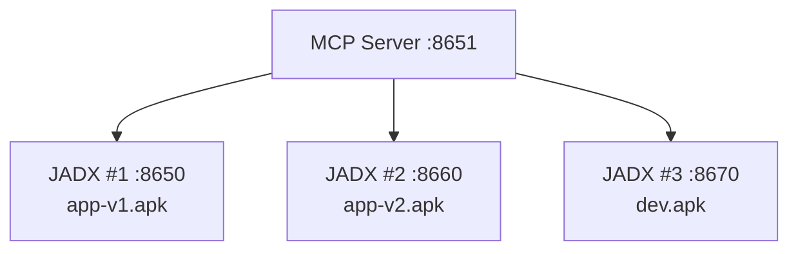

# JADX-AI-MCP Docker 部署

提供两种 Docker 镜像以满足不同使用场景。

## 镜像

| 镜像 | 描述 | 大小 |
|------|------|------|
| `xjoker/jadx-ai-mcp` | 一体化（JADX GUI + noVNC + MCP Server）| ~800MB |
| `xjoker/jadx-mcp-server` | 仅 MCP Server | ~100MB |

## 架构（一体化镜像）



## 快速开始

### 一体化镜像

**基本用法：**

```bash
docker pull xjoker/jadx-ai-mcp:latest
docker run -d --name jadx-ai-mcp \
  -p 6080:6080 \
  -p 8650:8650 \
  -p 8651:8651 \
  -v $(pwd)/apks:/apks \
  xjoker/jadx-ai-mcp

# 访问
# - noVNC: http://localhost:6080
# - 插件 API: http://localhost:8650
# - MCP Server: http://localhost:8651
```

**推荐配置（含缓存和配置文件）：**

```bash
docker run -d --name jadx-ai-mcp \
  -p 6080:6080 \
  -p 8650:8650 \
  -p 8651:8651 \
  -v $(pwd)/apks:/apks \
  -v $(pwd)/config:/app/data/config \
  -v jadx-cache:/root/.cache \
  -v jadx-gui-cache:/root/.jadx-gui \
  xjoker/jadx-ai-mcp
```

### 卷参考

| 卷 | 路径 | 用途 |
|----|------|------|
| APK 文件 | `/apks` | 挂载待分析的 APK 文件 |
| 配置 | `/app/data/config` | 配置文件（jadx-config.toml）|
| 缓存 | `/root/.cache` | JADX 反编译缓存（提速 10-50 倍）|
| GUI 设置 | `/root/.jadx-gui` | GUI 偏好持久化 |

> **提示**：大型 APK 首次代码搜索会触发反编译（较慢），后续搜索因缓存而非常快。

### 独立 MCP Server

用于生产环境连接外部 JADX 实例：

**方式 1：使用配置文件**

```bash
# 创建配置
mkdir -p config
cat > config/jadx-config.toml << 'EOF'
[server]
host = "0.0.0.0"
port = 8651

[[jadx_instances]]
name = "jadx-1"
host = "192.168.1.10"
port = 8650
enabled = true
EOF

# 运行
docker run -d --name jadx-mcp-server \
  -p 8651:8651 \
  -v $(pwd)/config:/app/data/config \
  xjoker/jadx-mcp-server
```

**方式 2：使用环境变量**

```bash
docker run -d --name jadx-mcp-server \
  -p 8651:8651 \
  -e JADX_HOST=192.168.1.10 \
  -e JADX_PORT=8650 \
  -e JADX_MCP_AUTH_TOKEN=your-token \
  xjoker/jadx-mcp-server
```

**方式 3：命令行参数**

```bash
docker run -d --name jadx-mcp-server \
  -p 8651:8651 \
  xjoker/jadx-mcp-server \
  jadx_mcp_server --http --host 0.0.0.0 \
    --jadx-instances "192.168.1.10:8650:app-v1,192.168.1.11:8650:app-v2"
```

## 端口

| 端口 | 服务 | 描述 |
|------|------|------|
| 6080 | noVNC | 基于 Web 的 VNC 桌面（仅一体化镜像）|
| 8650 | 插件 API | JADX 插件 HTTP API |
| 8651 | MCP Server | LLM 客户端连接端点 |

## 配置

### 多用户认证

创建 `config/jadx-config.toml`：

```toml
[server]
host = "0.0.0.0"
port = 8651

[[users]]
name = "alice"
token = "token-alice-xxxxx"

[[users]]
name = "admin"
token = "token-admin-zzzzz"
is_admin = true

[defaults]
jadx_token = ""

[[jadx_instances]]
name = "local"
host = "127.0.0.1"
port = 8650
```

使用配置运行：

```bash
docker run -d -p 8651:8651 \
  -v $(pwd)/config:/app/data/config \
  xjoker/jadx-mcp-server \
  uv run jadx_mcp_server --http --host 0.0.0.0 --config /app/data/config/jadx-config.toml
```

## 从源码构建

### 基础镜像（系统依赖）

一体化镜像使用预构建的基础镜像以加速 CI 构建：

```bash
# 构建基础镜像（仅在系统依赖变更时需要）
docker build -t xjoker/jadx-ai-mcp-base:1.0 -f docker/Dockerfile.base .

# 推送到仓库（仅维护者）
docker push xjoker/jadx-ai-mcp-base:1.0
```

### 应用镜像

```bash
# 一体化（使用基础镜像）
docker build -t jadx-ai-mcp -f docker/Dockerfile .

# 仅 MCP Server（独立，无需基础镜像）
docker build -t jadx-mcp-server -f docker/Dockerfile.mcp .
```

---

## 多实例部署

部署多个 JADX 实例进行并行 APK 分析：



### 示例配置

```bash
# 终端 1: app-v1 的 JADX 实例
docker run -d --name jadx-v1 -p 8650:8650 -p 6080:6080 \
  -v $(pwd)/app-v1.apk:/apks/app.apk \
  xjoker/jadx-ai-mcp

# 终端 2: app-v2 的 JADX 实例
docker run -d --name jadx-v2 -p 8660:8650 -p 6081:6080 \
  -v $(pwd)/app-v2.apk:/apks/app.apk \
  xjoker/jadx-ai-mcp

# 终端 3: 连接两者的 MCP Server
docker run -d --name mcp -p 8651:8651 \
  -v $(pwd)/config:/app/data/config \
  xjoker/jadx-mcp-server

# 在 config/jadx-config.toml 中配置实例
```

**config/jadx-config.toml:**

```toml
[[jadx_instances]]
name = "app-v1"
host = "host.docker.internal"  # 或容器 IP
port = 8650

[[jadx_instances]]
name = "app-v2"
host = "host.docker.internal"
port = 8660
```

## 故障排查

```bash
# 查看日志
docker logs jadx-ai-mcp

# 进入容器 shell
docker exec -it jadx-ai-mcp bash

# 检查服务（一体化镜像）
docker exec jadx-ai-mcp supervisorctl status
```
