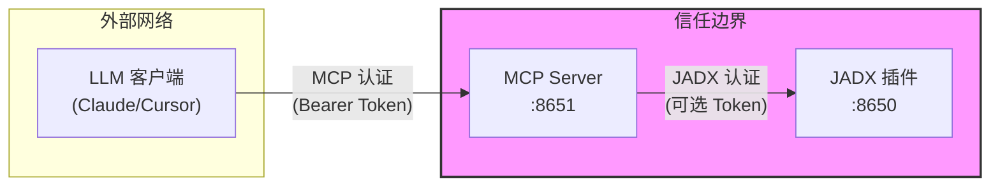

# 安全策略

## 🔒 安全注意事项

JADX-AI-MCP 设计用于**内部/开发环境**的可信网络。请在部署前仔细阅读以下安全注意事项。

---

## 🏗️ 架构与信任边界



| 组件 | 认证方式 | 网络暴露 |
|:-----|:---------|:---------|
| MCP Server | Bearer Token（可配置）| 可对外暴露 |
| JADX 插件 | 可选 Token | 应仅限内网 |

---

## 🔐 认证

### Token 管理

| 方面 | 当前实现 |
|:-----|:---------|
| **存储** | 静态存储在 `jadx-config.toml` |
| **轮换** | 手动（编辑配置，重启服务）|
| **复杂度** | 无强制要求，用户自定义 |
| **过期** | 无 |

**建议：**
- 使用强随机生成的 Token（32+ 字符）
- 定期轮换 Token（至少每月一次）
- 容器化部署时将 Token 存储在环境变量中

### 默认安全姿势

```toml
[security]
allow_dynamic_instances = false  # 默认：禁用
```

- 默认情况下，用户**无法**通过 AI 命令动态添加 JADX 实例
- 仅在需要时启用，且仅限可信用户

---

## 🛡️ 用户隔离

### 已隔离的资源

| 资源 | 隔离级别 |
|:-----|:---------|
| 动态实例可见性 | ✅ 按用户（owner 字段）|
| 实例访问控制 | ✅ 仅所有者或管理员 |

### 未隔离的资源

| 资源 | 用户间共享 |
|:-----|:-----------|
| 类缓存（ClassCacheManager）| ⚠️ 按 JADX 实例共享 |
| JADX GUI 状态 | ⚠️ 共享（单进程）|
| 文件系统 | ⚠️ 共享容器卷 |
| 日志 | ⚠️ 共享 stdout |
| 配置实例 | ⚠️ 所有用户可见 |

---

## ⚠️ 已知风险

### 1. `add_jadx_instance` 的 SSRF 风险

**风险等级：** 中（当 `allow_dynamic_instances=true` 时）

**描述：** 用户可以指定任意 `host:port` 组合，可能访问内部服务。

**缓解措施：**
- 保持 `allow_dynamic_instances = false`（默认）
- 如需启用，使用网络策略限制出站连接
- 仅向可信用户授予 `can_add_instances` 权限

### 2. 无请求速率限制

**风险等级：** 低

**描述：** MCP 工具调用无内置速率限制。

**缓解措施：**
- 部署在带速率限制的反向代理后面
- 监控异常 API 模式

### 3. Token 可能暴露在日志中

**风险等级：** 低

**描述：** 调试日志可能包含认证 Token。

**缓解措施：**
- 生产环境使用 `INFO` 或更高日志级别
- 避免向不可信方暴露日志

---

## 🚀 安全部署清单

- [ ] 使用 HTTPS（通过反向代理）对外暴露
- [ ] 为每个用户设置强唯一 Token
- [ ] 除非需要，保持 `allow_dynamic_instances = false`
- [ ] 仅在内网运行 JADX 实例
- [ ] 使用网络策略限制容器出站流量
- [ ] 为 JADX 插件启用认证（`JADX_MCP_AUTH_TOKEN`）
- [ ] 定期审查和轮换 Token

---

## 📋 报告安全问题

如果您发现安全漏洞，请：

1. **不要**公开提交 Issue
2. 直接邮件联系维护者或使用 GitHub 的私有漏洞报告功能
3. 包含重现步骤和潜在影响

我们将在 48 小时内响应并尽快解决问题。

---

## 📜 许可证

本安全策略是 JADX-AI-MCP 的一部分，采用 Apache 2.0 许可证。
