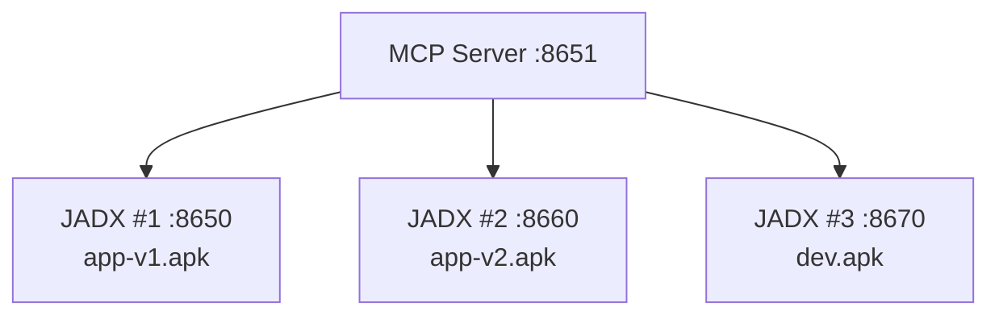

# Docker Compose Deployment

**English** | [简体中文](docker-compose.zh-cn.md)

---

> 🏗️ Multi-instance JADX deployment for parallel analysis

## Overview

Docker Compose enables:
- **Parallel APK analysis**: Analyze multiple APKs simultaneously
- **Team collaboration**: Each member has dedicated instance
- **Version comparison**: Compare different app versions

---

## Architecture



---

## Quick Start

```bash
# Clone and navigate
git clone https://github.com/xjoker/jadx-ai-mcp.git
cd jadx-ai-mcp/docker

# Create APK directories
mkdir -p apks/jadx-1 apks/jadx-2 apks/jadx-3
mkdir -p config

# Start all services
docker compose up -d
```

---

## Access Points

| Service | URL |
|:--------|:----|
| **JADX #1** | http://localhost:6080 |
| **JADX #2** | http://localhost:6081 |
| **JADX #3** | http://localhost:6082 |
| **MCP Server** | http://localhost:8651/mcp |

---

## Configuration

Create `config/jadx-config.toml`:

```toml
[[jadx_instances]]
name = "jadx-1"
host = "jadx-1"  # Docker container name
port = 8650
default = true

[[jadx_instances]]
name = "jadx-2"
host = "jadx-2"
port = 8650

[[jadx_instances]]
name = "jadx-3"
host = "jadx-3"
port = 8650
```

---

## Port Reference

| Component | noVNC | Plugin API |
|:----------|:------|:-----------|
| JADX #1 | 6080 | 8650 |
| JADX #2 | 6081 | 8660 |
| JADX #3 | 6082 | 8670 |
| MCP Server | - | 8651 |

---

## Common Commands

```bash
# View all logs
docker compose logs -f

# View specific service
docker compose logs -f mcp-server

# Restart all
docker compose restart

# Stop all
docker compose down

# Stop and remove volumes
docker compose down -v
```

---

## Scaling

Add more JADX instances by copying the service definition:

```yaml
jadx-4:
  image: xjoker/jadx-ai-mcp:latest
  ports:
    - "6083:6080"
    - "8680:8650"
  volumes:
    - ./apks/jadx-4:/apks:ro
    - jadx-4-cache:/root/.cache
```

---

## 🔗 Related

- [Configuration Reference](../reference/configuration.md)
- [Tools Reference](../reference/tools.md)
