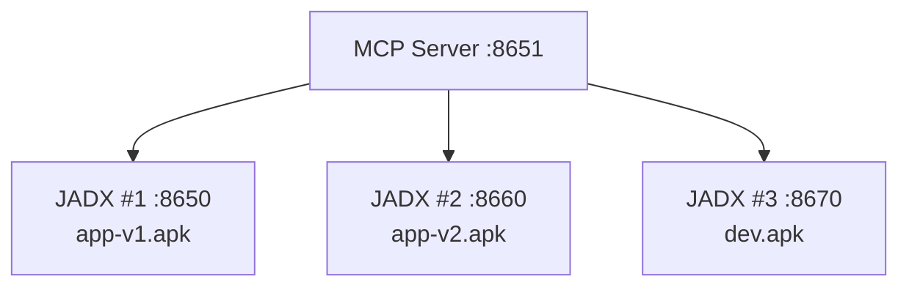

# Docker Compose 多实例部署

[English](docker-compose.md) | **简体中文**

---

> 🏗️ 多实例 JADX 部署，支持并行分析

## 概述

Docker Compose 支持：
- **并行 APK 分析**：同时分析多个 APK
- **团队协作**：每个成员有专用实例
- **版本对比**：比较不同版本的应用

---

## 架构



---

## 快速开始

```bash
# 克隆并进入目录
git clone https://github.com/xjoker/jadx-ai-mcp.git
cd jadx-ai-mcp/docker

# 创建 compose 默认使用的 APK 挂载目录
mkdir -p ../temp
mkdir -p config

# （可选）复制并自定义环境变量
cp .env.example .env

# 启动所有服务
docker compose up -d
```

仓库内自带的 `docker/docker-compose.yaml` 默认会把项目根目录的 `temp/` 挂载到 3 个 JADX 实例的 `/apks`。如果你希望 3 个实例都自动加载同一个测试 APK，只需要把 `target.apk` 放到 `../temp/`。

### 环境变量

项目包含 `.env.example` 文件，复制到 `.env` 后自定义：

```bash
# 时区（默认 UTC）
TZ=Asia/Shanghai

# 内存：每个 JADX 实例容器限制（默认 4g）
JADX_MEM_LIMIT=4g

# JVM 堆大小（默认 -Xmx2560m，需小于容器限制）
JADX_JAVA_OPTS=-Xmx2560m
```

如果你希望每个实例使用不同的 APK 目录，可以用环境变量覆盖：

```bash
mkdir -p apks/jadx-1 apks/jadx-2 apks/jadx-3
JADX1_APK_DIR=./apks/jadx-1 \
JADX2_APK_DIR=./apks/jadx-2 \
JADX3_APK_DIR=./apks/jadx-3 \
docker compose up -d
```

---

## 访问地址

| 服务 | 地址 |
|:-----|:-----|
| **JADX #1** | http://localhost:6080 |
| **JADX #2** | http://localhost:6081 |
| **JADX #3** | http://localhost:6082 |
| **MCP Server** | http://localhost:8651/mcp |
| **健康检查** | http://localhost:8651/health |
| **状态页** | http://localhost:8651/status |

---

## 配置

创建 `config/jadx-config.toml`:

```toml
[[jadx_instances]]
name = "jadx-1"
host = "jadx-1"  # Docker 容器名
port = 8650
enabled = true

[[jadx_instances]]
name = "jadx-2"
host = "jadx-2"
port = 8650

[[jadx_instances]]
name = "jadx-3"
host = "jadx-3"
port = 8650
```

仓库自带的 `docker/config/jadx-config.toml` 现在已经预注册了这 3 个实例。由于 MCP Server 采用纯 pull 模式，不会自动发现 Docker 网络中的容器，所以这一步是必须的。

---

## 端口参考

| 组件 | noVNC | 插件 API |
|:-----|:------|:---------|
| JADX #1 | 6080 | 8650 |
| JADX #2 | 6081 | 8660 |
| JADX #3 | 6082 | 8670 |
| MCP Server | - | 8651 |

---

## 常用命令

```bash
# 查看所有日志
docker compose logs -f

# 查看特定服务
docker compose logs -f mcp-server

# 重启所有
docker compose restart

# 停止所有
docker compose down

# 停止并删除卷
docker compose down -v
```

---

## 扩展实例

添加更多 JADX 实例：

```yaml
jadx-4:
  image: xjoker/jadx-ai-mcp:latest
  ports:
    - "6083:6080"
    - "8680:8650"
  volumes:
    - ./apks/jadx-4:/apks:ro
    - jadx-4-cache:/root/.cache
```

---

## 🔗 相关文档

- [配置参考](../reference/configuration.zh-cn.md)
- [工具参考](../reference/tools.zh-cn.md)
