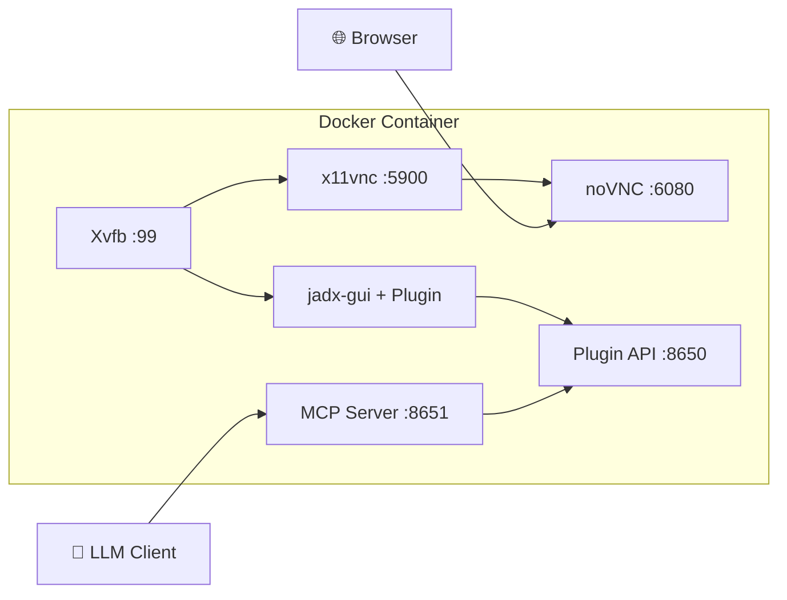

# Docker Complete Guide

**English** | [简体中文](docker.zh-cn.md)

---

> 🐳 This guide covers all Docker deployment scenarios, including single container, multi-container, standalone MCP Server, etc.

## Images

| Image | Description | Size |
|-------|-------------|------|
| `xjoker/jadx-ai-mcp` | All-in-One (JADX GUI + noVNC + MCP Server) | ~800MB |
| `xjoker/jadx-mcp-server` | Standalone MCP Server only | ~100MB |

---

## Quick Start

### Standard Mode (GUI + AI) - Recommended

```bash
docker run -d --name jadx \
  -p 6080:6080 -p 8651:8651 \
  -v ~/apks:/apks \
  -v jadx-cache:/root/.cache \
  xjoker/jadx-ai-mcp:latest
```

**Access:**
- JADX GUI: http://localhost:6080
- AI endpoint: http://localhost:8651/mcp

> 📦 Cache volume speeds up subsequent analysis by 10-50x.

---

### AI-Only Mode (No GUI Port Exposed)

```bash
docker run -d --name jadx \
  -p 8651:8651 \
  -v ~/apks:/apks \
  -v jadx-cache:/root/.cache \
  xjoker/jadx-ai-mcp:latest
```

**Access:**
- AI endpoint: http://localhost:8651/mcp

> 💡 **Note**: JADX GUI still runs inside the container (on Xvfb virtual display), just without exposing the noVNC port 6080.

---

### Development / Multi-Container (all ports)

```bash
docker run -d --name jadx \
  -p 6080:6080 -p 8650:8650 -p 8651:8651 \
  -v ~/apks:/apks \
  -v $(pwd)/config:/app/data/config \
  -v jadx-cache:/root/.cache \
  -v jadx-gui-cache:/root/.jadx-gui \
  xjoker/jadx-ai-mcp:latest
```

**Access:**
- JADX GUI: http://localhost:6080
- JADX Plugin API: http://localhost:8650
- AI endpoint: http://localhost:8651/mcp

---

## Port Reference

For detailed port explanations, see [System Architecture - Port Reference](../overview/architecture.md#port-reference).

**Quick Reference:**

| Port | Service | Required? |
|:----:|:--------|:---------:|
| **6080** | noVNC | Optional |
| **8650** | JADX Plugin API | No* |
| **8651** | MCP Server | **Yes** |

> **\* Port 8650** is only needed for multi-container deployments where MCP Server runs in a separate container. In single-container mode, MCP Server connects internally via `localhost:8650`.

---

## Volume Reference

| Volume | Path | Purpose |
|--------|------|---------|
| APK Files | `/apks` | Mount APK/JAR files for analysis |
| Config | `/app/data/config` | Configuration files (jadx-config.toml) |
| Cache | `/root/.cache` | JADX decompilation cache (10-50x faster) |
| GUI Settings | `/root/.jadx-gui` | GUI preferences persistence |

> **Tip**: First code search on large APK triggers decompilation (slow). Subsequent searches are fast due to cache.

---

## Platform-Specific Commands

### macOS / Linux

```bash
mkdir -p ~/apks
docker run -d --name jadx \
  -p 6080:6080 -p 8651:8651 \
  -v ~/apks:/apks \
  -v jadx-cache:/root/.cache \
  xjoker/jadx-ai-mcp:latest
```

### Windows PowerShell

```powershell
mkdir $HOME\apks -Force
docker run -d --name jadx `
  -p 6080:6080 -p 8651:8651 `
  -v $HOME\apks:/apks `
  -v jadx-cache:/root/.cache `
  xjoker/jadx-ai-mcp:latest
```

### Windows CMD

```cmd
mkdir %USERPROFILE%\apks
docker run -d --name jadx ^
  -p 6080:6080 -p 8651:8651 ^
  -v %USERPROFILE%\apks:/apks ^
  -v jadx-cache:/root/.cache ^
  xjoker/jadx-ai-mcp:latest
```

---

## Environment Variables Reference

### JADX Plugin (Java)

| Variable | Description | Default |
|:---------|:------------|:--------|
| `JADX_MCP_BIND_ADDRESS` | HTTP server bind address | `127.0.0.1` |
| `JADX_MCP_PORT` | HTTP server port | `8650` |
| `JADX_MCP_AUTH_TOKEN` | Authentication token | (none) |
| `JADX_MCP_AUTH_ENABLED` | Enable authentication | `false` |

> **Important**: Set `JADX_MCP_BIND_ADDRESS=0.0.0.0` for multi-container deployments.

### MCP Server (Python)

| Variable | Description | Default |
|:---------|:------------|:--------|
| `JADX_MCP_HOST` | MCP Server bind address | `0.0.0.0` |
| `JADX_HOST` | Default JADX plugin host | `127.0.0.1` |
| `JADX_PORT` | Default JADX plugin port | `8650` |

For complete environment variables list, see [Configuration Reference](../reference/configuration.md).

---

## AI Client Configuration

For complete client configuration guide (Claude Desktop, Cursor, Continue, with authentication, etc.), see:
**[AI Client Configuration Guide](../guides/ai-clients.md)**

**Quick Claude Desktop setup (no auth):**

```json
{
  "mcpServers": {
    "jadx": {
      "type": "http",
      "url": "http://localhost:8651/mcp"
    }
  }
}
```

---

## Standalone MCP Server

For production environments connecting to external JADX instances:

### Option 1: With Config File

```bash
# Create config
mkdir -p config
cat > config/jadx-config.toml << 'EOF'
[server]
host = "0.0.0.0"
port = 8651

[[jadx_instances]]
name = "jadx-1"
host = "192.168.1.10"
port = 8650
enabled = true
EOF

# Run
docker run -d --name jadx-mcp-server \
  -p 8651:8651 \
  -v $(pwd)/config:/app/data/config \
  xjoker/jadx-mcp-server
```

> **Docker Networking**: When the MCP Server container connects to JADX on the host, use `host.docker.internal` as the host address. On Linux, add `--add-host=host.docker.internal:host-gateway` to the `docker run` command.

### Option 2: With Environment Variables

```bash
docker run -d --name jadx-mcp-server \
  -p 8651:8651 \
  -e JADX_HOST=192.168.1.10 \
  -e JADX_PORT=8650 \
  -e JADX_MCP_AUTH_TOKEN=your-token \
  xjoker/jadx-mcp-server
```

### Option 3: CLI Arguments

```bash
docker run -d --name jadx-mcp-server \
  -p 8651:8651 \
  xjoker/jadx-mcp-server \
  jadx_mcp_server --http --host 0.0.0.0 \
    --jadx-instances "192.168.1.10:8650:app-v1,192.168.1.11:8650:app-v2"
```

---

## Multi-user Authentication

Create `config/jadx-config.toml`:

```toml
[server]
host = "0.0.0.0"
port = 8651

[[users]]
name = "alice"
token = "token-alice-xxxxx"

[[users]]
name = "admin"
token = "token-admin-zzzzz"
is_admin = true

[defaults]
jadx_token = ""

[[jadx_instances]]
name = "local"
host = "127.0.0.1"
port = 8650
```

Run with config:

```bash
docker run -d -p 8651:8651 \
  -v $(pwd)/config:/app/data/config \
  xjoker/jadx-mcp-server \
  uv run jadx_mcp_server --http --host 0.0.0.0 --config /app/data/config/jadx-config.toml
```

### Permissions and Security

Users with `is_admin = true` have elevated privileges:

| Capability | Admin | Regular User |
|------------|-------|--------------|
| Use all analysis tools | Yes | Yes |
| View own JADX instances | Yes | Yes |
| View all JADX instances | Yes | No |
| Dynamically add/remove instances via AI | Yes | Requires `can_add_instances` |

See [Security Policy](../security/security.md) for details.

---

## Common Operations

```bash
# View logs
docker logs -f jadx

# Stop container
docker stop jadx

# Start container
docker start jadx

# Remove container
docker rm -f jadx

# Access shell
docker exec -it jadx bash

# Check services (All-in-One)
docker exec jadx supervisorctl status

# Update to latest
docker pull xjoker/jadx-ai-mcp:latest
docker rm -f jadx
# Then run again
```

---

## Build from Source

### Base Image (System Dependencies)

The All-in-One image uses a pre-built base image for faster CI builds:

```bash
# Build base image (only needed when system deps change)
docker build -t xjoker/jadx-ai-mcp-base:1.0 -f docker/Dockerfile.base .

# Push to registry (maintainers only)
docker push xjoker/jadx-ai-mcp-base:1.0
```

### Application Images

```bash
# All-in-One (uses base image)
docker build -t jadx-ai-mcp -f docker/Dockerfile .

# MCP Server only (standalone, no base image needed)
docker build -t jadx-mcp-server -f docker/Dockerfile.mcp .
```

---

## Troubleshooting

### Common Issues

| Symptom | Cause | Solution |
|---------|-------|----------|
| MCP Server cannot connect to JADX | No file loaded in JADX | Open an APK/JAR in JADX GUI first |
| Connection refused from Docker container | Using `127.0.0.1` for host JADX | Use `host.docker.internal` instead |
| 401 Unauthorized | Token missing or incorrect | Check `[[users]]` token in config |
| Plugin API port not responding | JADX GUI not fully started | Wait for JADX GUI to finish loading |

For more troubleshooting tips, see [Common Issues](../troubleshooting/common-issues.md).

---

## Architecture Diagram



For detailed architecture explanation, see [System Architecture](../overview/architecture.md).

---

## Next Steps

- [System Architecture](../overview/architecture.md) - Understand ports and component communication
- [Docker Compose](docker-compose.md) - Multi-instance deployment
- [AI Client Configuration](../guides/ai-clients.md) - Complete client setup
- [Configuration Reference](../reference/configuration.md) - All configuration options
- [Common Issues](../troubleshooting/common-issues.md) - Troubleshooting
