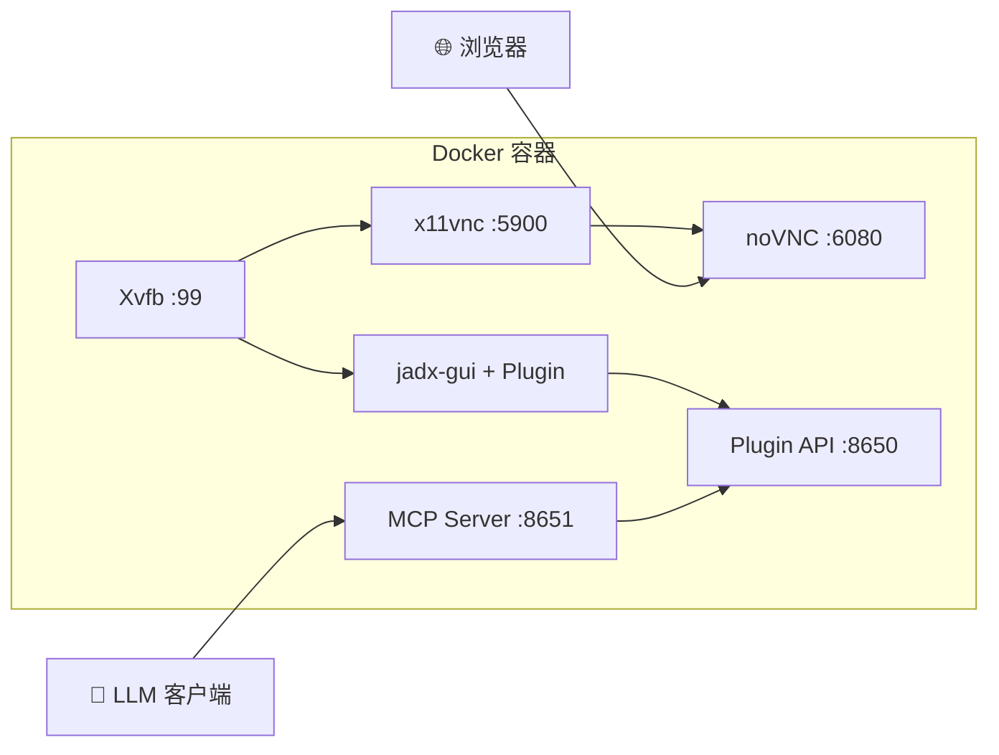

# Docker 完全指南

[English](docker.md) | **简体中文**

---

> 🐳 本指南涵盖所有 Docker 部署场景，包括单容器、多容器、独立 MCP Server 等。

## 镜像说明

| 镜像 | 描述 | 大小 |
|------|------|------|
| `xjoker/jadx-ai-mcp` | All-in-One (JADX GUI + noVNC + MCP Server) | ~800MB |
| `xjoker/jadx-mcp-server` | 独立 MCP Server | ~100MB |

---

## 快速开始

### 标准模式（图形界面 + AI）- 推荐

```bash
docker run -d --name jadx \
  -p 6080:6080 -p 8651:8651 \
  -v ~/apks:/apks \
  -v jadx-cache:/root/.cache \
  xjoker/jadx-ai-mcp:latest
```

**访问地址：**
- JADX 图形界面：http://localhost:6080
- AI 端点：http://localhost:8651/mcp

> 📦 缓存卷可将后续分析速度提升 10-50 倍。

---

### 仅 AI 模式（不暴露 GUI 端口）

```bash
docker run -d --name jadx \
  -p 8651:8651 \
  -v ~/apks:/apks \
  -v jadx-cache:/root/.cache \
  xjoker/jadx-ai-mcp:latest
```

**访问地址：**
- AI 端点：http://localhost:8651/mcp

> 💡 **说明**：JADX GUI 仍在容器内运行（Xvfb 虚拟显示器），只是不暴露 noVNC 的 6080 端口。

---

### 开发 / 多容器模式（所有端口）

```bash
docker run -d --name jadx \
  -p 6080:6080 -p 8650:8650 -p 8651:8651 \
  -v ~/apks:/apks \
  -v $(pwd)/config:/app/data/config \
  -v jadx-cache:/root/.cache \
  -v jadx-gui-cache:/root/.jadx-gui \
  xjoker/jadx-ai-mcp:latest
```

**访问地址：**
- JADX 图形界面：http://localhost:6080
- JADX 插件 API：http://localhost:8650
- AI 端点：http://localhost:8651/mcp

---

## 端口说明

端口的详细说明请参阅 [系统架构 - 端口职责详解](../overview/architecture.zh-cn.md#端口职责详解)。

**简要参考：**

| 端口 | 服务 | 是否必需？ |
|:----:|:-----|:---------:|
| **6080** | noVNC | 可选 |
| **8650** | JADX Plugin API | 否* |
| **8651** | MCP Server | **必需** |

> **\* 端口 8650** 仅在 MCP Server 独立容器运行时需要。单容器模式中，MCP Server 通过内部 `localhost:8650` 连接。

---

## 卷挂载说明

| 卷 | 路径 | 用途 |
|----|------|------|
| APK 文件 | `/apks` | 挂载待分析的 APK/JAR 文件 |
| 配置 | `/app/data/config` | 配置文件 (jadx-config.toml) |
| 缓存 | `/root/.cache` | JADX 反编译缓存（提速 10-50 倍） |
| GUI 设置 | `/root/.jadx-gui` | GUI 偏好设置持久化 |

> **提示**：首次对大型 APK 进行代码搜索会触发反编译（较慢），后续搜索会利用缓存快速响应。

---

## 平台专用命令

### macOS / Linux

```bash
mkdir -p ~/apks
docker run -d --name jadx \
  -p 6080:6080 -p 8651:8651 \
  -v ~/apks:/apks \
  -v jadx-cache:/root/.cache \
  xjoker/jadx-ai-mcp:latest
```

### Windows PowerShell

```powershell
mkdir $HOME\apks -Force
docker run -d --name jadx `
  -p 6080:6080 -p 8651:8651 `
  -v $HOME\apks:/apks `
  -v jadx-cache:/root/.cache `
  xjoker/jadx-ai-mcp:latest
```

### Windows CMD

```cmd
mkdir %USERPROFILE%\apks
docker run -d --name jadx ^
  -p 6080:6080 -p 8651:8651 ^
  -v %USERPROFILE%\apks:/apks ^
  -v jadx-cache:/root/.cache ^
  xjoker/jadx-ai-mcp:latest
```

---

## 环境变量参考

### JADX 插件 (Java)

| 变量 | 说明 | 默认值 |
|:-----|:-----|:-------|
| `JADX_MCP_BIND_ADDRESS` | HTTP 服务绑定地址 | `127.0.0.1` |
| `JADX_MCP_PORT` | HTTP 服务端口 | `8650` |
| `JADX_MCP_AUTH_TOKEN` | 认证 Token | (无) |
| `JADX_MCP_AUTH_ENABLED` | 启用认证 | `false` |

> **重要**：多容器部署时需设置 `JADX_MCP_BIND_ADDRESS=0.0.0.0`。

### MCP Server (Python)

| 变量 | 说明 | 默认值 |
|:-----|:-----|:-------|
| `JADX_MCP_HOST` | MCP Server 绑定地址 | `0.0.0.0` |
| `JADX_HOST` | 默认 JADX 插件主机 | `127.0.0.1` |
| `JADX_PORT` | 默认 JADX 插件端口 | `8650` |

完整的环境变量列表请参阅 [配置参考](../reference/configuration.zh-cn.md)。

---

## AI 客户端配置

完整的客户端配置指南（Claude Desktop、Cursor、Continue、带认证等）请参阅：
**[AI 客户端配置指南](../guides/ai-clients.zh-cn.md)**

**快速配置 Claude Desktop（无认证）：**

```json
{
  "mcpServers": {
    "jadx": {
      "type": "http",
      "url": "http://localhost:8651/mcp"
    }
  }
}
```

---

## 独立 MCP Server 部署

用于生产环境连接外部 JADX 实例：

### 方式 1：使用配置文件

```bash
# 创建配置
mkdir -p config
cat > config/jadx-config.toml << 'EOF'
[server]
host = "0.0.0.0"
port = 8651

[[jadx_instances]]
name = "jadx-1"
host = "192.168.1.10"
port = 8650
enabled = true
EOF

# 运行
docker run -d --name jadx-mcp-server \
  -p 8651:8651 \
  -v $(pwd)/config:/app/data/config \
  xjoker/jadx-mcp-server
```

> **Docker 网络说明**：当 MCP Server 容器需要连接宿主机上的 JADX 时，使用 `host.docker.internal` 作为主机地址。Linux 上需在 `docker run` 命令中添加 `--add-host=host.docker.internal:host-gateway`。

### 方式 2：使用环境变量

```bash
docker run -d --name jadx-mcp-server \
  -p 8651:8651 \
  -e JADX_HOST=192.168.1.10 \
  -e JADX_PORT=8650 \
  -e JADX_MCP_AUTH_TOKEN=your-token \
  xjoker/jadx-mcp-server
```

### 方式 3：命令行参数

```bash
docker run -d --name jadx-mcp-server \
  -p 8651:8651 \
  xjoker/jadx-mcp-server \
  jadx_mcp_server --http --host 0.0.0.0 \
    --jadx-instances "192.168.1.10:8650:app-v1,192.168.1.11:8650:app-v2"
```

---

## 多用户认证

创建 `config/jadx-config.toml`：

```toml
[server]
host = "0.0.0.0"
port = 8651

[[users]]
name = "alice"
token = "token-alice-xxxxx"

[[users]]
name = "admin"
token = "token-admin-zzzzz"
is_admin = true

[defaults]
jadx_token = ""

[[jadx_instances]]
name = "local"
host = "127.0.0.1"
port = 8650
```

运行：

```bash
docker run -d -p 8651:8651 \
  -v $(pwd)/config:/app/data/config \
  xjoker/jadx-mcp-server \
  uv run jadx_mcp_server --http --host 0.0.0.0 --config /app/data/config/jadx-config.toml
```

### 权限与安全

设置了 `is_admin = true` 的用户拥有更高权限：

| 能力 | 管理员 | 普通用户 |
|------|--------|----------|
| 使用所有分析工具 | 是 | 是 |
| 查看自己的 JADX 实例 | 是 | 是 |
| 查看所有 JADX 实例 | 是 | 否 |
| 通过 AI 动态添加/移除实例 | 是 | 需要 `can_add_instances` |

详见 [安全策略](../security/security.zh-cn.md)。

---

## 常用操作

```bash
# 查看日志
docker logs -f jadx

# 停止容器
docker stop jadx

# 启动容器
docker start jadx

# 删除容器
docker rm -f jadx

# 进入容器
docker exec -it jadx bash

# 检查服务状态 (All-in-One)
docker exec jadx supervisorctl status

# 更新到最新版
docker pull xjoker/jadx-ai-mcp:latest
docker rm -f jadx
# 然后重新运行
```

---

## 从源码构建

### 基础镜像（系统依赖）

All-in-One 镜像使用预构建的基础镜像以加速 CI 构建：

```bash
# 构建基础镜像（仅在系统依赖变更时需要）
docker build -t xjoker/jadx-ai-mcp-base:1.0 -f docker/Dockerfile.base .

# 推送到仓库（仅维护者）
docker push xjoker/jadx-ai-mcp-base:1.0
```

### 应用镜像

```bash
# All-in-One（使用基础镜像）
docker build -t jadx-ai-mcp -f docker/Dockerfile .

# 仅 MCP Server（独立构建，不需要基础镜像）
docker build -t jadx-mcp-server -f docker/Dockerfile.mcp .
```

---

## 故障排查

### 常见问题

| 症状 | 原因 | 解决方案 |
|------|------|----------|
| MCP Server 无法连接 JADX | JADX 未加载文件 | 先在 JADX GUI 中打开 APK/JAR |
| Docker 容器连接被拒绝 | 使用了 `127.0.0.1` 连接宿主机 JADX | 改用 `host.docker.internal` |
| 401 未授权 | Token 缺失或错误 | 检查配置中 `[[users]]` 的 token |
| 插件 API 端口无响应 | JADX GUI 尚未完全启动 | 等待 JADX GUI 完成加载 |

更多故障排查技巧请参阅 [常见问题](../troubleshooting/common-issues.zh-cn.md)。

---

## 架构图



详细的架构说明请参阅 [系统架构](../overview/architecture.zh-cn.md)。

---

## 下一步

- [系统架构](../overview/architecture.zh-cn.md) - 理解端口和组件通信
- [Docker Compose](docker-compose.zh-cn.md) - 多实例部署
- [AI 客户端配置](../guides/ai-clients.zh-cn.md) - 完整客户端配置
- [配置参考](../reference/configuration.zh-cn.md) - 所有配置项
- [常见问题](../troubleshooting/common-issues.zh-cn.md) - 故障排查
