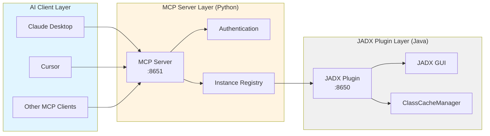
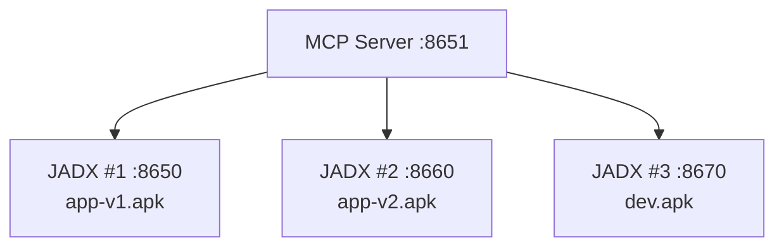
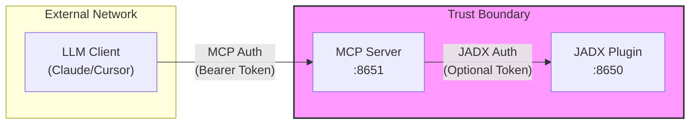

# System Architecture

**English** | [简体中文](architecture.zh-cn.md)

---

## Architecture Overview

JADX-AI-MCP employs a three-tier architecture design, enabling seamless integration between the JADX decompiler and AI clients.



---

## Layer 1: JADX Plugin (Port 8650)

### Plugin Integration Mechanism

The JADX Plugin embeds into JADX GUI via the plugin system (`JadxPlugin` interface):

1. **Lifecycle**:
   - JADX starts → scans plugin directory
   - User opens APK/JAR → plugin lazy initialization
   - File loading completes → Javalin HTTP service starts (port 8650)

2. **Why must a file be loaded first?**
   - Plugin API depends on JADX's `JadxDecompiler` instance
   - Without a loaded file, `JadxDecompiler` is `null`
   - HTTP service only starts after a valid decompiler instance exists

### ClassCacheManager Caching Mechanism

**Core Optimization**: Background caching + auto-invalidation strategy

| Feature | Description |
|:--------|:------------|
| **Cache Object** | Decompiled Java source code (`ClassNode` → String) |
| **Cache Strategy** | LRU (Least Recently Used) + 30-second global cooldown |
| **Auto-Invalidation** | Automatically clears related cache after rename operations |
| **Performance Gain** | 10-50x faster (large APK repeated analysis) |

**Workflow**:
```
First search → triggers decompilation (30-60s) → writes to cache
Subsequent searches → cache hit (<1s) → returns immediately
```

---

## Layer 2: MCP Server (Port 8651)

### Role

**Protocol Translation Middleware**: Converts JADX's HTTP API to MCP standard protocol

| Module | Responsibility |
|:-------|:---------------|
| **Protocol Adaptation** | HTTP API → MCP Tools |
| **Instance Management** | Multiple JADX instance registration and routing |
| **User Authentication** | Bearer Token + permission model |
| **Batch Optimization** | Smart chunking + Transfer API |

### Multi-Instance Management (InstanceRegistry)



**Instance Isolation**:
- Static instances (defined in config file): visible to all users
- Dynamic instances (added via AI tools): isolated per user (`owner` field)

### User Authentication and Permission Model

| Permission | Regular User | Admin (`is_admin=true`) |
|:-----------|:-------------|:------------------------|
| Use all tools | ✅ | ✅ |
| View own instances | ✅ | ✅ |
| View all instances | ❌ | ✅ |
| Dynamically add instances | Requires `can_add_instances` | ✅ |

---

## Layer 3: AI Client Layer

### MCP Protocol Overview

**Model Context Protocol (MCP)**: A standard protocol proposed by Anthropic for AI-to-external-tool communication.

**Core Concepts**:
- **Tools**: Functions callable by AI (this project provides 45 tools)
- **Resources**: Data sources AI can read (e.g., files, databases)
- **Prompts**: Predefined prompt templates

### Supported Clients

| Client | Connection Type | Status |
|:-------|:----------------|:------:|
| **Claude Desktop** | HTTP/MCP | ✅ Recommended |
| **Claude Code CLI** | HTTP/MCP | ✅ Recommended |
| **Cursor** | HTTP/MCP | ✅ Supported |
| **Continue** | HTTP/MCP | ✅ Supported |
| **OpenAI Codex** | HTTP | ✅ Supported |

---

## Port Reference

**This is the single source of truth** - other documents should link here.

| Port | Service | Required? | Access From | Description |
|:----:|:--------|:---------:|:------------|:------------|
| **6080** | noVNC | Optional | Browser | JADX GUI web interface. Skip `-p 6080:6080` if GUI access not needed (GUI still runs inside container). |
| **8650** | JADX Plugin API | No* | Container Internal | Internal HTTP API. Only expose for multi-container setup or debugging. |
| **8651** | MCP Server | **Yes** | AI Clients | **Main endpoint** for Claude, ChatGPT, etc. Always required. |

> **\* Port 8650** is only needed when running MCP Server in a separate container. For single-container deployment (default), MCP Server connects to JADX Plugin via internal `localhost:8650`.

---

## Data Flow Example

### Typical Request Path

```
User question: "Find all encryption-related classes"
    ↓
Claude Desktop → MCP Server (HTTP)
    ↓
MCP Server → JADX Plugin :8650 (HTTP)
    ↓
JADX Plugin → ClassCacheManager (check cache)
    ↓
Cache miss → JadxDecompiler (trigger decompilation)
    ↓
Decompilation complete → write to cache → return result
    ↓
MCP Server ← JSON response
    ↓
Claude Desktop ← MCP format response
    ↓
User ← natural language answer
```

### Authenticated Request

```
Claude → MCP Server :8651
         Header: Authorization: Bearer token-alice-xxxxx
    ↓
MCP Server validates token (lookup in jadx-config.toml)
    ↓
Token valid → forward request to JADX :8650
         Header: Authorization: Bearer jadx-plugin-token (optional)
    ↓
JADX Plugin validates → execute operation → return result
```

---

## Deployment Modes Comparison

### Single Container Mode (All-in-One)

**Characteristics**: One Docker container contains all components

```
Docker Container
├── JADX GUI (Xvfb + x11vnc + noVNC)
├── JADX Plugin :8650 (localhost)
└── MCP Server :8651
```

**Advantages**:
- One-command start, simple configuration
- Internal communication, no network setup
- Ideal for personal development and quick testing

**Disadvantages**:
- Cannot scale horizontally
- JADX GUI crash affects entire service

**Recommended for**: Local development, personal use

---

### Multi-Container Mode (Docker Compose)

**Characteristics**: Each JADX instance in separate container

```
MCP Server Container :8651
    ↓
JADX Container #1 :8650 (app-v1.apk)
JADX Container #2 :8660 (app-v2.apk)
JADX Container #3 :8670 (dev.apk)
```

**Advantages**:
- Parallel analysis of multiple APKs
- Good isolation (crashes don't affect others)
- Easy to scale horizontally

**Disadvantages**:
- Slightly more complex configuration
- Need to manage multiple containers

**Recommended for**: Team collaboration, version comparison, production

---

## Security Boundaries



**Key Points**:
- MCP Server can be exposed externally (requires authentication)
- JADX plugin should be internal-only
- Multi-layer auth: MCP Token + JADX Token (optional)

---

## Related Documentation

- [Introduction](introduction.md) - Understand core concepts
- [Quick Start](../getting-started/quickstart.md) - 5-minute deployment
- [Docker Deployment](../deployment/docker.md) - Detailed deployment guide
- [Security Policy](../security/security.md) - Authentication and permissions

---

*Last updated: 2026-02-10*
