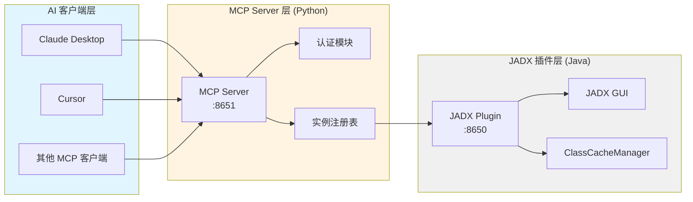
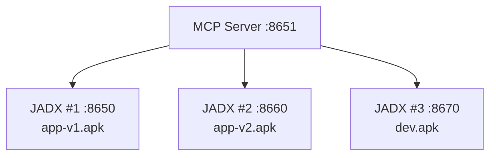
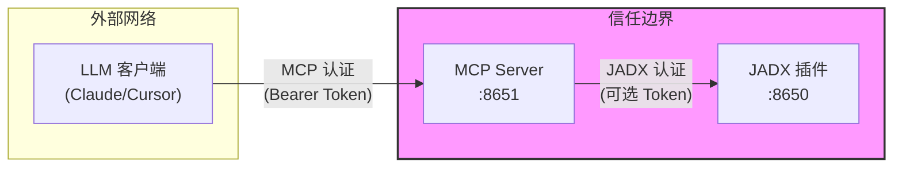

# 系统架构

[English](architecture.md) | **简体中文**

---

## 架构总览

JADX-AI-MCP 采用三层架构设计，实现了 JADX 反编译器与 AI 客户端之间的无缝集成。



---

## 第一层：JADX Plugin 层（端口 8650）

### 插件集成机制

JADX Plugin 通过 JADX 的插件系统 (`JadxPlugin` 接口) 嵌入 JADX GUI：

1. **生命周期**：
   - JADX 启动 → 扫描插件目录
   - 用户打开 APK/JAR → 插件延迟初始化
   - 文件加载完成 → Javalin HTTP 服务启动（端口 8650）

2. **为什么必须先加载文件？**
   - 插件 API 依赖 JADX 的 `JadxDecompiler` 实例
   - 未加载文件时，`JadxDecompiler` 为 `null`
   - HTTP 服务仅在有效的反编译器实例后启动

### ClassCacheManager 缓存机制

**核心优化**：后台缓存 + 自动失效策略

| 特性 | 说明 |
|:-----|:-----|
| **缓存对象** | 反编译后的 Java 源码（`ClassNode` → String） |
| **缓存策略** | LRU（最近最少使用）+ 30 秒全局冷却 |
| **自动失效** | 重命名操作后自动清除相关缓存 |
| **性能提升** | 10-50 倍（大型 APK 重复分析） |

**工作流程**：
```
首次搜索 → 触发反编译 (30-60s) → 写入缓存
后续搜索 → 缓存命中 (<1s) → 直接返回
```

---

## 第二层：MCP Server 层（端口 8651）

### 角色定位

**协议转换中间件**：将 JADX 的 HTTP API 转换为 MCP 标准协议

| 功能模块 | 职责 |
|:---------|:-----|
| **协议适配** | HTTP API → MCP Tools |
| **实例管理** | 多 JADX 实例注册与路由 |
| **用户认证** | Bearer Token + 权限模型 |
| **批量优化** | 智能分块 + Transfer API |

### 多实例管理（InstanceRegistry）



**实例隔离**：
- 静态实例（配置文件定义）：所有用户可见
- 动态实例（AI 工具添加）：按用户隔离（`owner` 字段）

### 用户认证与权限模型

| 权限 | 普通用户 | 管理员 (`is_admin=true`) |
|:-----|:---------|:-------------------------|
| 使用所有工具 | ✅ | ✅ |
| 查看自己的实例 | ✅ | ✅ |
| 查看所有实例 | ❌ | ✅ |
| 动态添加实例 | 需要 `can_add_instances` | ✅ |

---

## 第三层：AI Client 层

### MCP 协议简介

**Model Context Protocol (MCP)**：Anthropic 提出的标准协议，用于 AI 与外部工具通信。

**核心概念**：
- **Tools**：AI 可调用的函数（本项目提供 45 个工具）
- **Resources**：AI 可读取的数据源（如文件、数据库）
- **Prompts**：预定义的提示词模板

### 支持的客户端

| 客户端 | 连接方式 | 状态 |
|:-------|:---------|:----:|
| **Claude Desktop** | HTTP/MCP | ✅ 推荐 |
| **Claude Code CLI** | HTTP/MCP | ✅ 推荐 |
| **Cursor** | HTTP/MCP | ✅ 支持 |
| **Continue** | HTTP/MCP | ✅ 支持 |
| **OpenAI Codex** | HTTP | ✅ 支持 |

---

## 端口职责详解

**这是信息的唯一权威来源**，其他文档应链接到此处。

| 端口 | 服务 | 是否必需？ | 访问来源 | 描述 |
|:----:|:-----|:---------:|:---------|:-----|
| **6080** | noVNC | 可选 | 浏览器 | JADX GUI 网页访问。无头模式可省略 `-p 6080:6080`。 |
| **8650** | JADX Plugin API | 否* | 容器内部 | 内部 HTTP API。仅在多容器部署或调试时需要暴露。 |
| **8651** | MCP Server | **必需** | AI 客户端 | **主要端点**，供 Claude、ChatGPT 等 AI 访问。始终需要。 |

> **\* 端口 8650** 仅在 MCP Server 独立容器运行时需要。单容器部署（默认）时，MCP Server 通过内部 `localhost:8650` 连接 JADX 插件。

---

## 数据流示例

### 典型请求路径

```
用户提问: "找到所有加密相关的类"
    ↓
Claude Desktop → MCP Server (HTTP)
    ↓
MCP Server → JADX Plugin :8650 (HTTP)
    ↓
JADX Plugin → ClassCacheManager (检查缓存)
    ↓
缓存未命中 → JadxDecompiler (触发反编译)
    ↓
反编译完成 → 写入缓存 → 返回结果
    ↓
MCP Server ← JSON 响应
    ↓
Claude Desktop ← MCP 格式响应
    ↓
用户 ← 自然语言回答
```

### 带认证的请求

```
Claude → MCP Server :8651
         Header: Authorization: Bearer token-alice-xxxxx
    ↓
MCP Server 验证 token（查找 jadx-config.toml）
    ↓
token 有效 → 转发请求到 JADX :8650
         Header: Authorization: Bearer jadx-plugin-token (可选)
    ↓
JADX Plugin 验证 → 执行操作 → 返回结果
```

---

## 部署模式对比

### 单容器模式（All-in-One）

**特点**：一个 Docker 容器包含所有组件

```
Docker 容器
├── JADX GUI (Xvfb + x11vnc + noVNC)
├── JADX Plugin :8650 (localhost)
└── MCP Server :8651
```

**优点**：
- 一键启动，配置简单
- 内部通信，无需网络配置
- 适合个人开发和快速测试

**缺点**：
- 无法水平扩展
- JADX GUI 崩溃影响整个服务

**推荐场景**：本地开发、个人使用

---

### 多容器模式（Docker Compose）

**特点**：每个 JADX 实例独立容器

```
MCP Server 容器 :8651
    ↓
JADX 容器 #1 :8650 (app-v1.apk)
JADX 容器 #2 :8660 (app-v2.apk)
JADX 容器 #3 :8670 (dev.apk)
```

**优点**：
- 并行分析多个 APK
- 隔离性好（崩溃不影响其他）
- 易于水平扩展

**缺点**：
- 配置稍复杂
- 需要管理多个容器

**推荐场景**：团队协作、版本对比、生产环境

---

## 安全边界



**关键点**：
- MCP Server 可对外暴露（需认证）
- JADX 插件应仅限内网访问
- 多层认证：MCP Token + JADX Token（可选）

---

## 相关文档

- [项目介绍](introduction.zh-cn.md) - 了解项目核心概念
- [快速开始](../getting-started/quickstart.zh-cn.md) - 5 分钟部署
- [Docker 部署](../deployment/docker.zh-cn.md) - 详细部署指南
- [安全策略](../security/security.zh-cn.md) - 认证与权限配置

---

*最后更新：2026-02-10*
