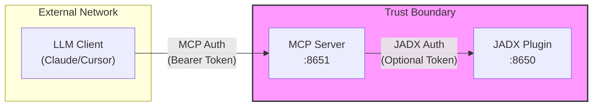

# Security Policy

**English** | [简体中文](security.zh-cn.md)

---

## 🔒 Security Considerations

JADX-AI-MCP is designed for **internal/development use** in trusted network environments. Please review the following security considerations before deployment.

---

## 🏗️ Architecture & Trust Boundaries



| Component | Authentication | Network Exposure |
|:----------|:---------------|:-----------------|
| MCP Server | Bearer Token (configurable) | Can be exposed externally |
| JADX Plugin | Optional Token | Should be internal only |

---

## 🔐 Authentication

### Token Management

| Aspect | Current Implementation |
|:-------|:-----------------------|
| **Storage** | Static in `jadx-config.toml` |
| **Rotation** | Manual (edit config, restart server) |
| **Complexity** | No enforcement, user-defined |
| **Expiration** | None |

**Recommendations:**
- Use strong, randomly generated tokens (32+ characters)
- Rotate tokens periodically (monthly minimum)
- Store tokens in environment variables for containerized deployments

### Default Security Posture

```toml
[security]
allow_dynamic_instances = false  # Default: DISABLED
```

- By default, users **cannot** dynamically add JADX instances via AI commands
- Enable only when needed and with trusted users

---

## 🛡️ User Isolation

### What IS Isolated

| Resource | Isolation Level |
|:---------|:----------------|
| Dynamic Instance Visibility | ✅ Per-user (owner field) |
| Instance Access Control | ✅ Owner or Admin only |

### What is NOT Isolated

| Resource | Shared Between Users |
|:---------|:--------------------|
| Class Cache (ClassCacheManager) | ⚠️ Shared per JADX instance |
| JADX GUI State | ⚠️ Shared (single process) |
| File System | ⚠️ Shared container volume |
| Logs | ⚠️ Shared stdout |
| Config Instances | ⚠️ Visible to all users |

---

## ⚠️ Known Risks

### 1. SSRF via `add_jadx_instance`

**Risk Level:** Medium (when `allow_dynamic_instances=true`)

**Description:** Users can specify arbitrary `host:port` combinations, potentially accessing internal services.

**Mitigation:**
- Keep `allow_dynamic_instances = false` (default)
- If enabled, use network policies to restrict outbound connections
- Grant `can_add_instances` permission only to trusted users

### 2. No Request Rate Limiting

**Risk Level:** Low

**Description:** No built-in rate limiting for MCP tool calls.

**Mitigation:**
- Deploy behind a reverse proxy with rate limiting
- Monitor for unusual API patterns

### 3. Token Exposure in Logs

**Risk Level:** ~~Low~~ **FIXED** ✅

**Description:** ~~Debug logging may include authentication tokens.~~

**Status (v6.1.0+):** Token values are no longer logged. Only "Authentication token configured" or "Authentication disabled" messages appear in logs.

**Previous Mitigation (obsolete):**
- ~~Use `INFO` or higher log level in production~~
- ~~Avoid exposing logs to untrusted parties~~

---

## 🚀 Secure Deployment Checklist

- [ ] Use HTTPS (via reverse proxy) for external access
- [ ] Set strong, unique tokens for each user
- [ ] Keep `allow_dynamic_instances = false` unless required
- [ ] Run JADX instances on internal network only
- [ ] Use network policies to restrict container egress
- [ ] Enable authentication for JADX plugin (`JADX_MCP_AUTH_TOKEN`)
- [ ] Review and rotate tokens periodically

---

## 📋 Reporting Security Issues

If you discover a security vulnerability, please:

1. **Do NOT** open a public issue
2. Email the maintainer directly or use GitHub's private vulnerability reporting
3. Include steps to reproduce and potential impact

We will respond within 48 hours and work to address the issue promptly.

---

## 📜 License

This security policy is part of JADX-AI-MCP, licensed under Apache 2.0.
